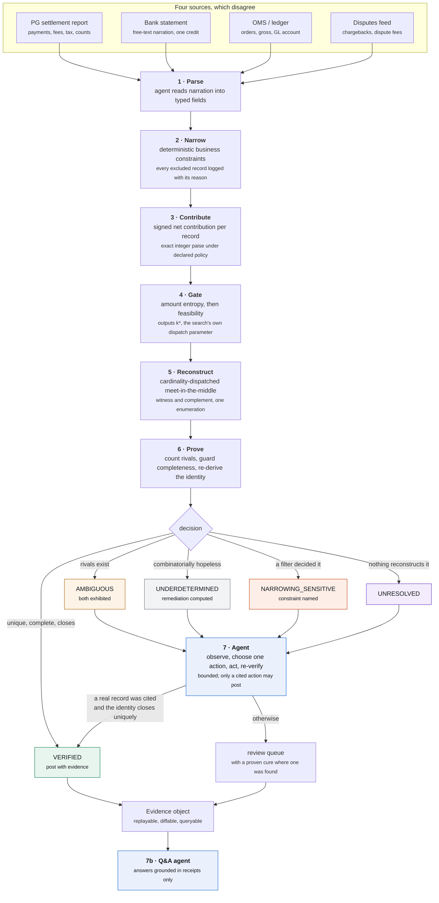

# Manhattan

**An agent that proves settlements instead of guessing them.**

Razorpay AI Buildathon · Track 04, AI Finance Controller · Multi-source reconciliation

Manhattan reconciles payment settlements. It never guesses about money, because the instrument it reconciles with is a solver rather than a similarity score. It either produces an exact, auditable reconstruction under declared accounting rules together with a proof that no rival reconstruction exists, or it names precisely which property it could not establish and routes the settlement to review.

```
git clone <this repo> && cd manhattan
./run.sh demo          # or:  .\run.ps1 demo    or:  make demo
```

No API key required. **Every number in this file, in [RESULTS.md](RESULTS.md) and in [LIMITATIONS.md](LIMITATIONS.md) is emitted by that command.** None of the three is typed by hand; all three are rendered from the same run, in the same command, so they cannot drift apart. This one is generated from run `run_20260903_0358`, seed `20260826`.

### Track compliance, stated first

The brief asks for one finance-ops loop closed across a batch of 50 or more synthetic records, reporting match rate and the exceptions it could not resolve.

| requirement | what this run did |
|---|---|
| 50+ record batch | **22,150 records** across **498 settlements**, pools reaching **3,809 records** before narrowing and **49** after |
| one loop, closed | bank credit to posted ledger entry, or to a named exception, end to end |
| match rate reported | **161 of 498** auto-posted, 32%, with **0 wrong** |
| exceptions it could not resolve | **337**, each with a named cause, a computed remedy and a price. [The list is below.](#the-exception-list-is-the-deliverable) |
| throughput | **97,002 settlements per hour**, 13.4 ms median, peak 119 MB |

---

## First question first: doesn't the settlement report already tell you?

It is the first thing anyone at a payments company asks, so it goes at the top.

For Razorpay's own settlements it largely does: each `settlement_id` maps to its payments, and Optimizer's Single View Recon surfaces that mapping even for externally processed transactions. Where it is present and trusted, this leg is a lookup and the solver is unnecessary. The solver earns its place where that mapping is absent or unverified: a bank credit whose narration carries no usable settlement reference; a merchant reconciling their own OMS against a lump credit; multi-gateway merchants where one aggregator ships a transaction-level mapping and another ships only a net figure; historical backfill, migrations and disputed periods.

And one more, which is the strongest framing. *The settlement report is a claim. Manhattan verifies the claim independently, from the merchant's own records.* A reconciliation system that trusts its input is not reconciling, it is transcribing.

The demo posture reflects that: per-payment fee rows are retained and the `settlement_id` mapping is **withheld**, so the system is not handed the answer it is meant to derive.

---

## The problem, in one number

A gateway settlement lands as a single bank credit:

```
48638155 paise     value date 2026-08-26     NEFT-RAZORPAY SOFTWARE PVT LTD-UTR3491-CR
```

That figure is the net of hundreds of gross payments, minus MDR, minus GST on that MDR, minus refunds that cleared this cycle, minus chargeback debits, plus rounding. Amount matching finds nothing, because no single transaction equals the credit. Fuzzy matching and LLM adjudication produce plausible pairings with no evidence they account for the money.

> **Similarity generates candidates. It does not constitute accounting proof.**

Finding one subset that sums correctly is easy and nearly worthless: subsets grow exponentially while reachable sums do not, so many hit the target and picking one is arbitrary. Manhattan asks the harder question, *can I prove no other reconstruction exists*, and four things follow. **All money is integer paise**, so exact verification is available and no floating point exists in the verification path. **Contributions are signed**, because a chargeback debit is negative and so is a fully refunded payment whose fee was retained. **The decision is not a confidence score** but one of five states, four of which stop the money. **The failure mode is a refusal, not a bad posting**, so every heuristic is placed such that being wrong costs recall and never precision.

[docs/EXPLAIN.md](docs/EXPLAIN.md) builds all of this from first principles in plain language.

---

## The measured result

498 settlements across 6 merchant archetypes. B0 is a deliberately competent confidence matcher given identical inputs and identical narrowing; it is what most tooling in this space reduces to once the marketing is removed.

| 498 settlements | Manhattan | B0 |
|---|---:|---:|
| `VERIFIED` | **161** | |
| `AMBIGUOUS` | 109 | |
| `UNDERDETERMINED` | 208 | |
| `NARROWING_SENSITIVE` | 3 | |
| `UNRESOLVED` | 17 | 114 |
| | | |
| **auto-posted** | **161** (32%) | **384** (77%) |
| **auto-posted WRONG** | **0** | **226** (59% of its postings) |
| held for review | 337 | 114 |
| median latency | 13.4 ms | 3.6 ms |
| throughput | 97,002 / hour | |
| input tokens per 1k | 0.79 M | 1.58 M |
| cost per 1k settlements | 497 INR | 959 INR |

The five statuses are above the headline on purpose. `AMBIGUOUS` at 109 and `UNDERDETERMINED` at 208 are real, sized populations rather than rhetoric: 317 settlements where rivals were found or proved to exist. A tool reporting those as matches is reporting a coin flip.

**Manhattan posts fewer, and that is an operating point rather than a concession.** B0's 384 postings contain 226 errors nobody can identify, so all 384 have to be checked and the coverage was worth nothing. 161 postings with 0 errors is 161 a finance team never touches.

**Throughput** is measured end to end: 498 settlements in 18.5 seconds of wall clock, including the agent loop, B0 running alongside, and receipt serialisation. That divides to 37.1 ms per settlement against a 13.4 ms median, and the gap is not an error: the median is *pipeline* time for one settlement, while wall clock also carries generation, the baseline, the agent's re-verification passes and I/O. Both are printed rather than the flattering one.

<details>
<summary><b>The cost row, derived</b></summary>

Priced at published `claude-opus-5` rates, `modelled: no model was billed on this run, so measured token counts are priced at what the live path would have cost`.

| | |
|---|---:|
| input, uncached | 395,088 tok @ $5.00/Mtok |
| input, cache reads | 0 tok @ $0.50/Mtok |
| cache writes | 0 tok @ $6.25/Mtok |
| output | 33,512 tok @ $25.00/Mtok |
| model calls | 794 over 498 settlements |
| cache hit rate | 0.0% |
| USD to INR | 88 |
| **Manhattan** | **$5.65 = 497 INR per 1k** |
| **B0** | **$10.90 = 959 INR per 1k** |

The cache hit rate is 0.0% because a replay run reports no cache reads, so every input token here is priced at the **uncached** rate. A live run caches the parse system block, byte-identical across every settlement, so the real figure is below the one published. The claim is made against Manhattan deliberately.

**B0's token model, since it decides the comparison.** 200 tokens of instruction plus 40 per candidate record, over a mean narrowed pool of 34.5, giving 1,580 input tokens per settlement against Manhattan's 793. Forty tokens covers one candidate rendered as an id, an amount, a timestamp, an instrument and a kind.

That is low on purpose. **B0 is handed Manhattan's narrowing for free**, so it reads a few dozen records rather than the 3678.4 in the mean unnarrowed universe. Without that narrowing it would pay roughly 147,335 tokens per settlement and the gap reported here would be several times wider. A cost advantage argued from a handicapped baseline is not an advantage.

</details>

### The baseline, published so it can be attacked

226 wrong out of 384 posted is 59%, and nobody who has built a fuzzy matcher should accept that on assertion. So here is everything B0 scores on:

- exact integer hit on the target contribution sum (confidence 0.90)
- near hit within 1 basis point of the target (0.72)
- near hit within 1 per cent of the target (0.45)
- no hit found within the node budget (0.15)
- cardinality agrees with the settlement report's declared count (+0.05)

It posts above a threshold of 0.80, the value such tools typically ship with. **[RESULTS.md](RESULTS.md#the-baseline-across-every-threshold) sweeps that threshold across the same 498 decisions.** Two points from it:

| | threshold | posted | wrong | precision | F1 |
|---|---:|---:|---:|---:|---:|
| shipped | 0.80 | 384 | 226 | 41% | 0.36 |
| best F1, where a team tuning it would land | 0.95 | 289 | 143 | 51% | 0.37 |

The curve is the argument, not the operating point. **Tuned to its own best F1, B0 still posts 143 wrong out of 289.** Its precision never exceeds 51% anywhere on the curve, because the confidence score measures *how good the match looks*, not *whether it is the only one*, and those come apart exactly where the money is. Raising the threshold does not find the rivals; it posts fewer things without knowing which.

And one number falls out of the sweep that settles the comparison:

> **At no threshold does B0 produce more correct postings than Manhattan.** Its maximum is 158 right answers, at threshold 0.10, against Manhattan's 161. Every extra posting the baseline appears to offer is a wrong one, and it cannot tell you which.

That is why Manhattan's 0 means something. The baseline is not trading accuracy for coverage; it has no more coverage of the truth to trade.

### The rate is predictable before integration

| merchant type | expected regime | spread sigma (paise) | twin mass | auto-post | wrong | B0 posts | B0 wrong |
|---|---|---:|---:|---:|---:|---:|---:|
| travel | wide ticket spread; amounts separate cleanly | 3.32e+06 | 0.00 | **77%** | 0 | 71% | 4% |
| marketplace | amounts separate; a disputes feed is unjoined | 7.59e+05 | 0.00 | **48%** | 0 | 69% | 28% |
| d2c_ecommerce | narrow spread; narrowing decides | 1.74e+05 | 0.00 | **47%** | 0 | 90% | 31% |
| utility_billpay | repeated price points; entropy gate refuses | 4.29e+04 | 0.78 | **0%** | 0 | 75% | 73% |
| subscription_saas | three price points; entropy gate refuses | 6.52e+04 | 0.95 | **0%** | 0 | 73% | 72% |
| quick_commerce | tight spread; a disputes feed is unjoined | 1.89e+04 | 0.00 | **22%** | 0 | 84% | 64% |

Read the right-hand columns against the left. Where amounts genuinely fail to distinguish transactions, Manhattan's auto-post rate falls to zero and B0's wrong-posting rate climbs. Both systems see the same data. One reacts to it.

This is also the commercial claim: one pass over a merchant's historical settlement amounts yields the spread and the twin mass, which yield the collision index, which yields the expected status mix, before any integration.

**[RESULTS.md](RESULTS.md) carries the calibration that backs it**: the collision-index band table, the two-estimator comparison, and the full 96-configuration sweep. That section answers the track's measured-accuracy bar and is the thing separating this from a solver demo, because it says whether the system knows in advance when it is about to be wrong.

### Two cross-checks nobody arranged

Counters incremented in different packages, for different reasons, that agree anyway. `RESOLVED_BY_HYPOTHESIS` is **18** and the agent repaired **18** settlements, matching exactly as they must, since every repair carries that flag and nothing else sets it. `AMOUNT_ENTROPY_INSUFFICIENT` is **166**, exactly the 2 zero-auto-post archetypes at 83 settlements each. Free evidence that the instrumentation agrees with itself, and it would have caught a miscount in either direction.

---

## Architecture



*(Rendered SVGs of every diagram are in [docs/diagrams/](docs/diagrams/), in case the judging surface does not render Mermaid.)*

One property is easy to miss: **the gate runs before the solver, not after it.** Because the gate's output `k*` is the parameter the solver is dispatched on, triage is not a pre-check bolted onto the front of the search, it is what configures the search. The derivations behind the solver, the gate and the completeness probe are in [docs/DESIGN.md](docs/DESIGN.md).

### The dashboard

`./run.sh demo` builds the frontend, runs the batch and serves it on
`localhost:8080`.

| | |
|---|---|
|  | **Head to head.** One credit, identical inputs to both systems. B0 proposes six records at 0.95 confidence and posts, and is wrong. Manhattan finds a witness, closes the identity to zero, then widens the pool and finds a rival, so it holds. |
|  | **Calibration.** Outcome mix against the collision index predicted *before* any search ran. Verified gives way to ambiguous and then to refusal as the index climbs, and the wrong-posting rate stays at zero across every band while B0's reaches 41%. |
|  | **A receipt.** The full derivation for one settlement: the narrowing waterfall with a reason per dropped record, both collision-index estimators plotted against the refusal threshold, the witness, the completeness checks and the identity. |
|  | **At 390px.** Every view is usable on a phone. Wide tables scroll inside their own panel rather than compressing to nothing. |

---

## The five outcomes

| Status | Meaning | Action |
|---|---|---|
| `VERIFIED` | Exactly one explanation exists in the region searched, uniqueness was counted exhaustively, and the accounting identity closes | Auto-post with evidence |
| `AMBIGUOUS` | Two or more distinct explanations reconstruct the credit, and both are exhibited | Review, alternatives shown |
| `UNDERDETERMINED` | The combinatorics guarantee a large population of explanations, so showing one would misrepresent it | Review, with the remedy computed |
| `NARROWING_SENSITIVE` | The answer depended on a filtering decision rather than on the arithmetic | Review, with the constraint named |
| `UNRESOLVED` | Nothing reconstructs the credit within the declared tolerance | Exception queue, with the exact residual |

`AMBIGUOUS` and `UNDERDETERMINED` are genuinely different and merging them would be dishonest. The first means two concrete rivals were found and can be put in front of an analyst who may choose between them on grounds the arithmetic cannot see. The second means the combinatorics guarantee thousands exist, so exhibiting two is pointless and the remedy is more data rather than more thinking.

Flags are **orthogonal** to status: a settlement can be `VERIFIED` and carry `FEE_ANOMALY`, because whether the money is accounted for and whether the fee applied to it was right are different questions.

| flag | settlements |
|---|---:|
| `SIGNED_ITEMS_PRESENT` | 222 |
| `AMOUNT_ENTROPY_INSUFFICIENT` | 166 |
| `LATTICE_CORRECTED` | 68 |
| `RESOLVED_BY_HYPOTHESIS` | 18 |


---

## The agent

The track asks for an agent. What distinguishes this one is not that a model is in the loop, it is *where* the model sits relative to the decision.

*(The loop as a diagram is in [docs/DESIGN.md](docs/DESIGN.md); the shape is: triage, observe, choose one action, apply it as an overlay, re-run the entire stack, keep the result only if it improved.)*

```

### What it did, as a flow

The counts do not read as a partition and a reader who tries will conclude something is broken, so here they are in the order they happen:

```
355  settlements entered the loop as unresolved
203  settled by deterministic triage, with no model call        (57%)
152  reached the agent                                          (43%)
296  actions taken
 18  repaired into a posting, each citing a real record
  5  given a proven cure: verified remedy, deliberately not posted
337  remain held for review
  0  wrong postings caused
```

355 in, 18 out as postings, 337 held. That is where the missing 18 went.

**57% of the queue is settled without a model call at all**, because a cheap deterministic check establishes that no action in the vocabulary could change the outcome: the amounts do not distinguish the transactions, or a rival already appears when the pool is widened, or there is nothing left to search or tighten. Paying a model to conclude that nothing can help, across most of a queue, is the same mistake as paying it to add up a column.

### The action space is closed

| Action | What it does | May post? |
|---|---|---|
| `SEARCH_FEED` | looks in a source nobody joined, for a named class of record | **yes, with the citation** |
| `TIGHTEN_WINDOW` | narrows the value-date window | no |
| `WIDEN_WINDOW` | loosens it, for a batch partly cut out | no |
| `SPLIT_BY_INSTRUMENT` | restricts to the payout's own payment method | no |
| `RELAX_RECONCILED` | admits records posted in a prior cycle | no |
| `PROPOSE_ADJUSTMENT` | asserts an unmodelled event | no |
| `ESCALATE` | stops, deliberately, with everything tried recorded | no |

**Only a corroborated action may post, and that rule was learned rather than designed.** The first version let narrowing changes post if the identity closed, and produced **two wrong postings in three hundred settlements**: the agent tightened a window, the pool fell from 44 records to 40, an `AMBIGUOUS` settlement became `VERIFIED`, every check passed, and the answer was wrong because the tightening had cut real records out of the batch.

> Removing candidates cannot make the survivor unique. It makes it **unexamined**.

So narrowing actions are assertions about a merchant's settlement behaviour, and assertions need corroboration. A second rule has the same shape: if the feed holds more candidates of the named class than the agent can afford to test and exactly one of the tested ones verifies, **that still does not post**, because an untested record might have verified too.

### The loop closed, end to end

This is adversarial case 9 and it is what the 18 repairs look like. A chargeback exists in a disputes feed nobody wired into the candidate pool, so nothing reconstructs the credit.

The verifier searches under `k(S)` at most 7 and finds nothing, with the nearest achievable sum 1038851 paise away. It hands the agent the exact residual, its sign and its cardinality. The agent answers `CHARGEBACK_DEBIT, add_item`, typed, from a closed vocabulary. The verifier searches the unjoined feed itself, finds `cbk_000223`, applies it, and re-runs the entire stack unmodified. It closes exactly and uniquely, and the hypothesis cites a real record, so it posts as `VERIFIED / RESOLVED_BY_HYPOTHESIS / cites cbk_000223`.

The division of labour is the point. The agent contributes the judgement about *what kind* of event to look for. The system contributes the evidence that one occurred, and it tries **every** candidate of that class against the verifier rather than only the one whose amount the model guessed.

The eleven-case suite passes on a deliberately unintelligent offline stub proposing from a fixed list in a fixed order. The quality of the proposer changes how often an exception clears; it cannot change whether a posting is correct.

**Adversarial cases: 11 of 11 expectations met, Manhattan wrong postings 0, B0 wrong postings 2.** Full table in [RESULTS.md](RESULTS.md).

---

## The exception list is the deliverable

Most systems treat the exception list as an apology. Every entry here carries a status distinguishing *two answers exist and here they both are* from *ten million answers exist* from *a filter decided this*; a named cause traceable to a specific gate, constraint or residual; a **computed** remediation; and a price. Which means the queue can be sorted by cost and worked in the order that clears the most money per hour.

The head of the queue, sorted by cost, as an operations lead would work it. **[The full top 15 is in RESULTS.md](RESULTS.md#the-exception-queue); all 337 are in `out/receipts.ndjson`.**

| settlement | merchant | status | cost | cause | computed remedy |
|---|---|---|---:|---|---|
| `bank_credit_2026_08_02_1000` | quick_commerce | `UNDERDETERMINED` | 333 | the pool holds 17 distinct contribution values across 38... | supply the settlement reference |
| `bank_credit_2026_08_03_1000` | subscription_saas | `UNDERDETERMINED` | 333 | the pool holds 6 distinct contribution values across 48... | supply the settlement reference |
| `bank_credit_2026_08_03_1001` | quick_commerce | `UNDERDETERMINED` | 333 | the pool holds 18 distinct contribution values across 48... | supply the settlement reference |
| `bank_credit_2026_08_03_1001` | quick_commerce | `UNDERDETERMINED` | 333 | this batch is claimed to be 7 records of a 45-record... | supply the settlement reference, or the... |
| `bank_credit_2026_08_04_1001` | subscription_saas | `UNRESOLVED` | 333 | a completeness guard failed: the report declares 9... | none available |
| `bank_credit_2026_08_04_1001` | subscription_saas | `AMBIGUOUS` | 333 | 2 distinct reconstructions of this credit exist within... | none available |

### What refusing is worth

| | |
|---|---:|
| the whole held queue, at configured analyst handling time | **112,221 INR** |
| B0's 226 wrong postings, at 2,400 INR each to unwind | **542,400 INR** |
| difference | **430,179 INR in Manhattan's favour, per 498 settlements** |

The 2,400 INR is an assumption, printed so it can be replaced. It is roughly two hours of a mid-level finance analyst at Indian metro rates: noticing the error, usually at month end and from a reconciliation difference rather than from the posting itself; finding which credit it belonged to; reversing the journal; re-posting; explaining the movement to whoever signs the accounts. It excludes any case that reaches an auditor.

Substitute your own figure; the arithmetic is one multiplication. The conclusion survives a wide range, because B0 only comes out ahead if unwinding a wrong posting costs under 497 INR, which is well under an hour of analyst time for an error nobody knows about yet.

So 32% is not a philosophical position. It is the cheaper one.

---

## Ask the receipts

The receipt store is queryable, and the Q&A agent answers only from stored evidence. Three exchanges from this run, verbatim:


> **Q. which constraint dropped the most records?**
>
> outside the value-date window removed the most, at 1,413,512 records across 498 settlements, which is 77.2% of everything narrowing looked at.
> 
> The full breakdown:
>   outside the value-date window       1,413,512  (77.2%)
>   a different merchant                  245,680  (13.4%)
>   already posted in a prior cycle       155,625  (8.5%)
>   nets to exactly zero                       52  (0.0%)
> 
> This matters more than it...
>
> `deterministic, no model call`
> `aggregated across the store · narrowing.dropped.outside_settlement_window = 1,413,512`
> `aggregated across the store · narrowing.dropped.mid_mismatch = 245,680`

> **Q. what is the backlog costing us?**
>
> The queue holds 337 settlements worth ₹75,53,147.36, and clearing it costs about INR 112,221 at the configured analyst handling time.
> 
> By cause, most expensive first:
>   UNDERDETERMINED         208 settlements   INR   69,264
>   AMBIGUOUS               109 settlements   INR   36,297
>   UNRESOLVED               17 settlements   INR    5,661
>   NARROWING_SENSITIVE       3 settlements   INR      999
> 
> Every row carries a...
>
> `deterministic, no model call`
> `aggregated across the store · exception_cost_inr = 112,221`

> **Q. which analyst approved settlement 5502?**
>
> The receipts do not record this and I will not infer it.
> 
> There is no approval, reviewer or assignee field on a receipt, because there is no human step in this pipeline to record. A settlement is decided by an integer identity and an exhaustive uniqueness count, and the receipt carries the evidence for that decision rather than a person's name.
> 
> What a receipt does record, and what I can answer from: the status and...
>
> `deterministic, no model call`
> `schema · no approval, reviewer or assignee field exists`

The third is why any of them are shown. **An agent that answers every question is not grounded in anything.** The receipts record what the system decided and why. They do not record who approved anything, because no human approval step exists in this pipeline, so declining is the correct answer and it is the whole thesis in one exchange.

---

## The receipt

Every decision emits one, including every refusal. It carries the target, the witness, the pool statistics, both collision-index estimators, the uniqueness method and its **scope in words**, every completeness check with its verdict, the rival reconstructions where they exist, the agent's decision trace, the computed remediation, and the exception price.

A full annotated `VERIFIED` receipt and the `UNRESOLVED` and `NARROWING_SENSITIVE` shapes are in [docs/DESIGN.md](docs/DESIGN.md). Every receipt from this run is in `out/receipts.ndjson`, one JSON object per line.

---

## Where the model sits

The boundary is one interface that speaks only in schemas. No method on it returns free text into a decision path, so the trust boundary is enforced by the type system rather than by discipline.

The model reads unstructured bank narrations, names the class of event behind a residual, orders which constraints to relax first, answers a finance lead's question from receipts, and explains a result in English. **None of those five is arithmetic, and none is available to a solver.** The verifier owns the entropy gate, the feasibility gate, the exhaustive enumeration and its uniqueness count, the completeness guards, and the independent re-derivation of the identity. It owns all of them regardless of what the model proposed.

Structured output uses **strict forced tool use**: the schema is the only tool, `additionalProperties` is closed, every field is required, and the model must call it. Three providers ship: the live Anthropic API when `ANTHROPIC_API_KEY` is set, recording to a cassette; cassette replay with no network, byte for byte; and a deterministic offline stub when neither is available.

**This run used `offline-stub` (parse=replay resolve=replay answer=replay).** Live-path parity is not yet demonstrated at batch scale; see [LIMITATIONS.md](LIMITATIONS.md#no-live-model-run-at-batch-scale). To run it:

```bash
export ANTHROPIC_API_KEY=sk-ant-...
./run.sh bench
```

---

## What this cannot do

The full list is in [LIMITATIONS.md](LIMITATIONS.md). The four that matter most:

**The verification regime is narrow.** Uniqueness is attainable only when free cardinality is roughly 3 to 7 for realistic pool sizes and amount spread. Outside that, `UNDERDETERMINED` is the honest answer, and no solver improvement changes it.

**Uniqueness is proved within a cardinality scope, not absolutely.** Meet-in-the-middle at `k_max` searches `{S : k(S) <= k_max}` completely and nothing beyond. The receipt prints the scope.

**A declared-count dispatch scopes the proof by the counterparty's own claim.** It is cheaper and often the only route to `VERIFIED` at all. It also borrows from the artifact it is meant to be validating. The receipt records `scope_source` so the two claims are never confused.

**The drift monitor catches drift, not original error.** A narrowing constraint wrong since the first run has no baseline to deviate from and is stable under relaxation, so neither the run-level monitor nor the per-settlement probe fires. This is the sharpest remaining hole in the completeness argument.

Benchmarked on synthetic data throughout. The pathology mix reflects documented Razorpay settlement mechanics (paise-denominated amounts, T+2 cycles, MDR with 18% GST, netted refunds, chargeback debits, zero-MDR UPI), but real merchant data will contain things the generator does not model.

---

## For a judge, in four minutes

1. **This page**, to the end of the measured result. Two minutes.
2. **[RESULTS.md](RESULTS.md)**, the calibration section, which answers whether the system knows in advance when it is about to be wrong. One minute.
3. **`./run.sh demo`**, which opens on adversarial case 10: narrowing drops a real record, a coincidental subset closes the identity, and the guard catches it. One minute.

Longer: [docs/EXPLAIN.md](docs/EXPLAIN.md) is the whole system from first principles in plain language; [docs/DESIGN.md](docs/DESIGN.md) has every derivation. The sixty-second walkthrough is scripted in [docs/DEMO-SCRIPT.md](docs/DEMO-SCRIPT.md).

---

## Repository

```
cmd/manhattan/     CLI: bench, cases, recon, ask, serve, docs
internal/
  money/           integer paise; the only numeric type for value
  model/           domain types across the four sources
  accounting/      signed contributions, fee policy, the identity
  narrow/          business constraints, with a full drop log
  entropy/         twin classes, twin mass, lattice gcd, zero contributions
  feasibility/     the collision index, k*, both estimators, the ceiling
  solver/          cardinality-dispatched meet-in-the-middle
  guards/          neighbourhood probe, cross-checks, run-level drift
  evidence/        the receipt, the run object, the store
  pipeline/        the seven stages, and the decision
  llm/             the model boundary: Anthropic, cassette, offline stub
  agent/           narration parser, action space, controller, Q&A
  baseline/        B0, built honestly
  bench/           the benchmark, the calibration sweep, the envelope
  server/          HTTP API and the live run stream
web/               the dashboard: Vite, React, TypeScript, Tailwind
docs/DESIGN.md     the design, the derivations, what was cut and why
docs/EXPLAIN.md    the system from first principles, in plain language
docs/*.tmpl.md     the sources of this file and LIMITATIONS.md
docs/DEMO-SCRIPT.md  the sixty-second walkthrough, shot by shot
docs/diagrams/     rendered SVGs of every Mermaid diagram
RESULTS.md         generated; never typed
```

**Two tests worth reading.** `internal/solver/solve_test.go` verifies 400 randomised configurations against a 2ⁿ brute-force oracle and caught two real bugs before anything was built on it. `internal/bench/cases_test.go` runs all eleven adversarial cases and **fails if B0 posts nothing wrong**, because a suite the baseline survives is not adversarial enough to demonstrate anything.

---

Traditional reconciliation asks: *how confident are we that these records match?* Manhattan asks: *can we prove these records explain the settlement under the accounting rules, and if we cannot, do we know that before we act?*

**No guessed matches. No arbitrary confidence threshold. Proof, exhibited alternatives, or a named and priced reason the proof is unavailable.**

---

Built by **Rishi0507** for the Razorpay AI Buildathon, Track 04. Licensed under the MIT License; see [LICENSE](LICENSE).
