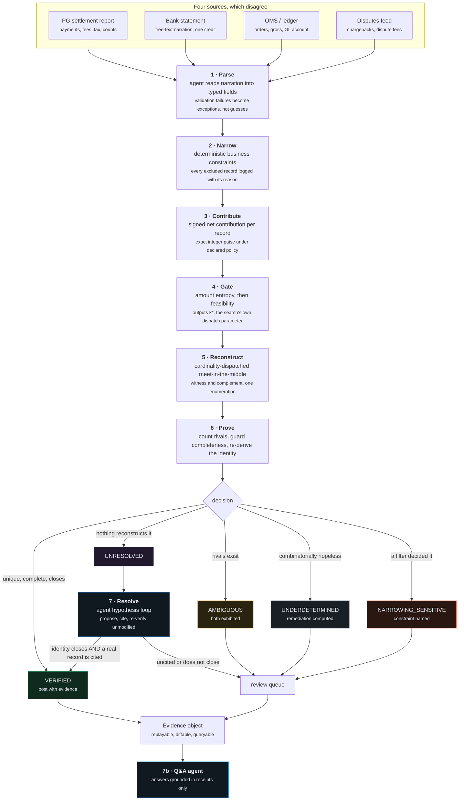
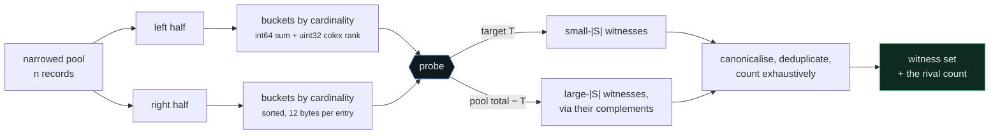
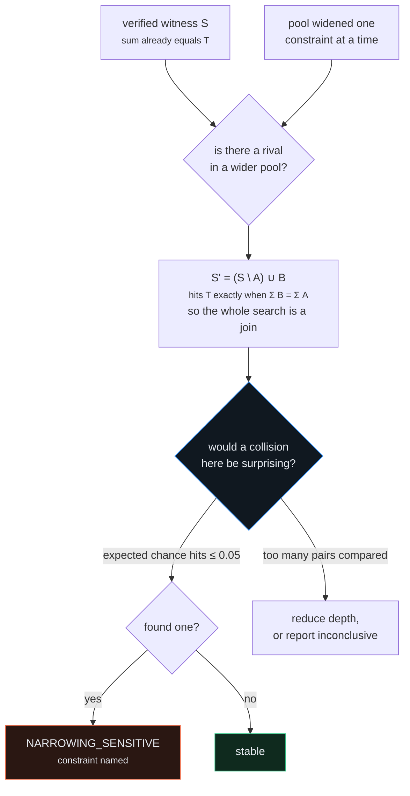

# Manhattan

**An agent that proves settlements instead of guessing them.**

Razorpay AI Buildathon · Track 04, AI Finance Controller · Multi-source reconciliation

Manhattan reconciles payment settlements. It never guesses about money, because the instrument it reconciles with is a solver rather than a similarity score. It either produces an exact, auditable reconstruction under declared accounting rules, together with a proof that no rival reconstruction exists, or it names precisely which property it could not establish and routes the settlement to review.

```
git clone <this repo> && cd manhattan
./run.sh demo          # or:  .\run.ps1 demo    or:  make demo
```

No API key required. Everything below is reproduced by that one command, seeded and deterministic.

---

## The problem, in one number

A gateway settlement lands in a merchant's bank account as a single credit:

```
₹4,86,381.55        value date 2026-08-26        NEFT-RAZORPAY SOFTWARE PVT LTD-UTR3491-CR
```

That one figure is the net of hundreds of gross payments, minus MDR, minus GST on that MDR, minus refunds that cleared this cycle, minus chargeback debits, plus or minus adjustments, plus per-transaction rounding. To post it to the general ledger correctly, someone has to run the arrow backwards and recover which transactions produced it and what was deducted.

Amount matching finds nothing, because no single transaction equals the credit. Fuzzy matching and LLM adjudication produce plausible pairings with no evidence that they actually account for the money.

> **Similarity generates candidates. It does not constitute accounting proof.**

That distinction is the entire product. A language model is genuinely useful for reading a messy bank narration and proposing what might be going on. It is not a basis for moving money.

---

## What it does differently

Instead of asking *which transactions look like this settlement*, Manhattan asks:

> Can I reconstruct this credit exactly from the underlying records, under the declared accounting rules, and can I prove that no other reconstruction exists?

The second clause is where all the difficulty lives. Finding one subset that sums correctly is easy and nearly worthless: the number of subsets grows exponentially while the space of reachable sums does not, so on a real batch a great many subsets hit the target and picking one is arbitrary.

Four consequences follow, and they define the system.

**All money is integer paise.** Razorpay reports settlement amounts in the smallest currency unit, so exact arithmetic is available and therefore exact verification is available. There is no floating point anywhere in the verification path.

**Contributions are signed.** A chargeback debit is negative. So is a payment refunded in full whose fee was retained. That is an accounting fact, and the system models it explicitly.

**The decision is not a confidence score.** It is one of five states, and four of them stop the money.

**The failure mode is a refusal, not a bad posting.** A missed auto-match costs an analyst twenty minutes. A false auto-match moves money wrongly and is found at audit months later. Every heuristic in the system is placed so that being wrong costs recall and never precision.

---

## The measured result

500 settlements across six merchant archetypes. B0 is a deliberately competent confidence matcher given identical inputs and identical narrowing; it is what most tooling in this space reduces to once the marketing is removed.

| 500 settlements | Manhattan | B0 |
|---|---:|---:|
| auto-posted | 74 | 405 |
| **auto-posted WRONG** | **0** | **218** |
| held for review | 424 | 93 |
| median latency | 14.0 ms | 4.8 ms |
| input tokens per 1k settlements | 0.42 M | 1.59 M |
| cost per 1k settlements | ₹326 | ₹962 |

The wrong-posting row is the only one that matters, and it means something only because the baseline sits beside it on the same data. Manhattan reporting zero on its own would be close to tautological, since it posts only when an integer identity closes and nothing rivals it. Manhattan reporting zero next to 218 is a result.

Manhattan posts fewer. That is the trade, and it is deliberate: [§ What this cannot do](#what-this-cannot-do).

### The rate is predictable before integration

| merchant type | spread σ | twin mass | auto-post | wrong | B0 wrong |
|---|---:|---:|---:|---:|---:|
| travel | ₹33,100 | 0.00 | **41%** | 0 | 4% |
| d2c ecommerce | ₹1,730 | 0.00 | **18%** | 0 | 31% |
| marketplace | ₹7,750 | 0.00 | **17%** | 0 | 19% |
| quick commerce | ₹214 | 0.00 | **13%** | 0 | 63% |
| utility billpay | ₹429 | 0.78 | **0%** | 0 | 73% |
| subscription SaaS | ₹652 | 0.95 | **0%** | 0 | 72% |

Read the last two columns against the first two. Where amounts genuinely fail to distinguish transactions, Manhattan's auto-post rate falls to zero and B0's wrong-posting rate climbs to 73%. Both systems are looking at exactly the same data. One of them is reacting to it.

This is also the commercial claim. One pass over a merchant's historical settlement amounts yields the contribution spread and the twin mass, which yield the collision index, which yields the expected status mix. Manhattan can tell a merchant roughly what fraction of their settlements it will auto-post before any integration, before a single file is exchanged, because it knows exactly what makes it fail.

---

## Architecture



The ordering has one property that is easy to miss: **the gate runs before the solver, not after it.** Because the gate's output `k*` is the parameter the solver is dispatched on, triage is not a pre-check bolted onto the front of the search. It is what configures the search.

---

## Where the model sits

The track asks for an agent that closes a finance-ops loop. What distinguishes this one is not that a model is in the loop, it is *where* the model sits relative to the decision.

```mermaid
flowchart LR
    subgraph M["What the model does<br/><small>open-ended judgement</small>"]
        direction TB
        M1["read an unstructured<br/>bank narration"]
        M2["name the class of event<br/>behind a residual"]
        M3["order which constraints<br/>to relax first"]
        M4["answer a finance lead's<br/>question from receipts"]
        M5["explain a result<br/>in plain English"]
    end

    subgraph V["What the verifier does<br/><small>arithmetic, unmodified</small>"]
        direction TB
        V1["entropy gate"]
        V2["feasibility gate"]
        V3["exhaustive enumeration<br/>with a uniqueness count"]
        V4["completeness guards"]
        V5["independent re-derivation<br/>of the identity"]
    end

    M -->|"typed, schema-validated<br/>executable assertions"| V
    V -->|"accept, or reject and say why"| OUT["the decision"]

    style M fill:#101820,stroke:#3395ff,color:#e6eaf0
    style V fill:#0f2a1e,stroke:#35c88a,color:#e6eaf0
```



Note what the five model jobs have in common: **none of them is arithmetic, and none is available to a solver.** A subset-sum verifier cannot read `NEFT-RAZORPAY SOFTWARE PVT LTD-UTR3491-CR`. It cannot look at an unexplained ₹1,240 and know that a chargeback debit is the kind of thing that produces that shape. Those are exactly the moves that turn a solver into a system that closes a loop.

The one move the agent cannot make is **decide**. Whether the money is accounted for is settled by an integer identity and an exhaustive count, both of which run unmodified regardless of what the model proposed.

This is testable rather than merely claimed, and the repository tests it: **the entire eleven-case suite passes on a deliberately unintelligent offline stub** that proposes hypotheses from a fixed list in a fixed order. The quality of the proposer changes how often an exception can be cleared. It cannot change whether a posting is correct, because the model is never asked whether it was right.

---

## The five outcomes

| Status | Meaning | Action |
|---|---|---|
| `VERIFIED` | Exactly one explanation exists in the region searched, uniqueness was counted exhaustively, and the accounting identity closes | Auto-post with evidence |
| `AMBIGUOUS` | Two or more distinct explanations reconstruct the credit, and both are exhibited | Review, alternatives shown |
| `UNDERDETERMINED` | The combinatorics guarantee a large population of explanations, so showing one would misrepresent it | Review, with the remedy computed |
| `NARROWING_SENSITIVE` | The answer depended on a filtering decision rather than on the arithmetic | Review, with the constraint named |
| `UNRESOLVED` | Nothing reconstructs the credit within the declared tolerance | Exception queue, with the exact residual |

`AMBIGUOUS` and `UNDERDETERMINED` are genuinely different and merging them would be dishonest. The first means two concrete rivals were found and can be put in front of an analyst who may be able to choose between them on non-arithmetic grounds. The second means the combinatorics guarantee thousands of rivals exist, so exhibiting two is pointless and the remedy is more data rather than more thinking.

Flags are **orthogonal** to status. A settlement can be `VERIFIED` and simultaneously carry `FEE_ANOMALY`: the money is accounted for, and the fee policy applied to it looks wrong. Different questions, and conflating them is a modelling error.

---

## Why the solver is the shape it is

Reconstruction is subset sum, which is NP-complete in the number of items, so everything depends on which escape hatch is taken.

The binding constraint here is not the value range. It is the **cardinality**. Define free cardinality:

```
k(S) = min(|S|, n − |S|)
```

A 312-transaction batch drawn from a 315-record pool is almost the entire pool, so `k = 3`. A 6-transaction batch from a 52-record pool has `k = 6`. The feasibility gate establishes that uniqueness is only attainable when `k` is small, roughly 3 to 7 for realistic pools.

A pseudopolynomial dynamic program over the value range is indifferent to `k`. It costs the same whether the answer has 3 items or 300, which means it spends its entire budget in a dimension the problem does not vary along and none in the dimension that decides everything.

**Manhattan dispatches on `k` and uses cardinality-restricted meet-in-the-middle.** Split the pool, enumerate every subset of each half up to cardinality `k*`, bucket by cardinality, sort each bucket, then range-query.



Four properties follow, and together they are why this is the right primitive.

**Uniqueness is the search, not a sweep after it.** The probe returns every match, so `count == 1` *is* the proof. There is no exclusion sweep, no forced-inclusion sweep, no re-solve budget, and therefore no way for the proof to be abandoned half-finished. `count >= 2` is `AMBIGUOUS` with both rivals already in hand.

**Sign is irrelevant.** Sums are integers and integers sort. Chargebacks need no special case, no window derivation, no positivity certificate. A truncating bitset DP needs all three, and the standard uniqueness shortcut ("a proper superset of S would exceed T") is simply false once an item is negative, so any uniqueness procedure that tests only exclusions reports a false unique on exactly the batches that contain a chargeback. The sign model stays *accountingly* essential while becoming *computationally* irrelevant.

**Cardinality is native.** The inferred-mode rounding band, the declared-count cross-check and the complement's size all read straight off the enumeration.

**Witness and complement come from one enumeration.** Probing for `T` finds small-`|S|` answers; probing for `Σpool − T` finds large-`|S|` ones as their complements. Both sides for about 1.1× the cost of one, with no need to guess in advance which is smaller.

### Measured envelope

Predicted from the cost model, measured on the same run. Every timing **includes the uniqueness proof**; these are not solve times with a proof still owed.

| pool | k | entries predicted | entries observed | MB | solve and prove |
|---:|---:|---:|---:|---:|---:|
| 52 | 7 | 1,943,424 | 1,943,424 | 30 | 222 ms |
| 52 | 6 | 627,824 | 627,824 | 10 | 56 ms |
| 100 | 5 | 4,739,872 | 4,739,872 | 78 | 461 ms |
| 320 | 3 | 1,365,602 | 1,365,602 | 23 | 107 ms |
| 1000 | 3 | 41,667,502 | 41,667,502 | 714 | 4,303 ms |

Cost tracks `k`, not `n`. A 100-record pool is more expensive than a 320-record pool, because the gate permits `k = 5` at 100 and only `k = 3` at 320. That inversion is the signature of an algorithm matched to the constraint that actually binds.

**Not implemented, and why.** Bringmann's Õ(n+t) and Koiliaris and Xu's deterministic Õ(√n·t) both beat this asymptotically. Both are also indifferent to `k`, both need gigabyte-scale padded arrays at paise granularity, and both compute *reachability*, so uniqueness would still have to be bolted on afterwards. The constraint that makes this problem solvable is the cardinality, not the value range, and choosing the primitive that exploits the constraint you actually proved is a better decision than importing the one with the better headline complexity.

---

## The gate that keeps it honest

Uniqueness is not something to hope for. It is a function of how many candidate subsets exist relative to how many distinct sums they can produce, and both are computable from the pool before any search.

The number of subsets at free cardinality `k` is `C(n, k)`. Their sums concentrate into a distribution with some local density near the target. The expected number of subsets colliding at any one target is the **collision index**:

```
E  ≈  C(n, k) · d / (σ · √(2πk))          d = lattice spacing, σ = contribution spread
```

Read the values honestly and they say something uncomfortable: **verification by reconstruction is only decisive when narrowing leaves an excess of roughly three to seven records over the true batch.** Beyond that, uniqueness is not merely expensive to establish, it does not exist. So the gate does not pretend, and it does not merely triage: `k*`, the largest cardinality still inside the threshold, is the parameter the solver is dispatched on. **The boundary the gate accepts and the region the solver searches are the same boundary.**

### Two estimators, and a finding

The closed form assumes subset sums are locally uniform near the target, with a density read off a moment-matched normal. On realistic data that is measurably wrong.

Real ticket amounts are close to lognormal: most transactions small, a thin tail very large. A sum of three of those is nothing like a normal distribution in its body. Measured on a 313-record travel pool at `k = 3`, the closed form predicted **0.38** rival reconstructions; brute-force enumeration found **three**, on every one of sixty seeds tried. That is not sampling noise, it is the wrong model.

The direction of the error is the saving grace and it was designed for: an index that is too low makes the gate accept a slightly larger region, and the exhaustive count inside that region finds the rivals anyway. Precision is untouched; the cost is recall. But a gate off by an order of magnitude is a poor gate, so Manhattan now **measures** the density by sampling subset sums from the actual pool instead of assuming it. Validated against exhaustive enumeration on a lognormal pool:

| estimator | mean absolute log-ratio against the true count |
|---|---:|
| measured, by sampling the pool | **0.09** |
| analytic, moment-matched normal | 0.72 |

Both numbers are carried on every receipt. Where the published model and the actual pool disagree, the receipt shows the disagreement rather than quietly picking a winner.

### Before the index: structural refusals

Two properties make uniqueness impossible outright, and both are detectable in `O(n log n)`, which is less time than it takes to allocate the enumeration they would have wasted.

**Twin classes.** If a witness contains a proper subset of a class of identical contributions, swapping a member in for a member out produces a distinct witness with an identical sum. Ambiguity is then *proved by construction*, in linear time, with the rival exhibited. Above 30% twin mass the pool is refused before anything is enumerated. This is the honest answer for a subscription merchant with two hundred identical ₹499 charges: those settlements are genuinely not reconstructable from amounts, and saying so in eleven milliseconds is more useful than saying so slowly.

**Zero-contribution records.** A UPI payment carries zero MDR under Indian regulation, so a UPI payment refunded in full before settlement nets to *precisely nothing*: gross in, gross out, no fee retained. A single such record destroys uniqueness outright, because any witness plus or minus a zero has the same sum. Two give four reconstructions, three give eight, every one arithmetically perfect and differing only in membership, which is exactly what a ledger posting cares about. They are removed before the search, named individually on the receipt, and reconciled against the declared count as *witness plus zeros*.

This one was not in the original design. It was found by running the thing.

---

## The failure nobody demos

Suppose narrowing is slightly too aggressive and drops a record that genuinely belonged to the batch. The true witness is now unavailable, but the surviving pool happens to contain some *other* subset that sums to the target. The system returns a unique witness, the identity closes, and it posts a confidently wrong answer **with a proof attached**. That is strictly worse than an exception, because the audit trail lends it credibility.

This is adversarial case 10, and it is what the demo opens with.



Two things about this guard are worth stating.

**It is indexed by substitution depth, not by cardinality.** Re-running the solver over the widened pool at a reduced cardinality bound does not work, and the reason is easy to get wrong: a rival differing from `S` by a single record still has free cardinality `min(|S'|, |P'| − |S'|)`, which for a six-record witness in a fifty-six-record pool is six, not one. A cardinality-restricted probe never reaches it, so the guard would be silently unable to fire on precisely the case it exists for.

**It estimates its own false-positive rate first.** The probe searches for a coincidence, so it has a multiple-comparisons problem, and a severe one. At depth two, a witness of size `|S|` against `m` spare records compares roughly `|S|²m²/4` pairs. For a six-record witness that is about forty thousand and a chance collision is negligible; for a 138-record witness it is over 10⁸ and a chance collision is a near certainty. A guard that fires on a coincidence it was always going to find is not a guard, it is a false-alarm generator, and it would hold every large batch for review forever. So the probe computes its expected chance collisions, reduces depth until that is small, and reports itself **inconclusive** rather than *stable* when even depth one cannot distinguish. Same honesty standard as the gate.

This was also found by running it: before the fix, the probe was firing on every large batch.

---

## The agent loop, closed end to end

Adversarial case 9. A chargeback exists in a disputes feed nobody wired into the candidate pool, so nothing reconstructs the credit.

```mermaid
sequenceDiagram
    participant V as Verifier
    participant A as Agent
    participant F as Unjoined feeds

    V->>V: exhaustive search over k(S) ≤ 7
    Note over V: no reconstruction.<br/>nearest achievable sum is<br/>₹10,388.51 away
    V->>A: here is the exact residual,<br/>its sign and its cardinality
    A->>A: what class of event<br/>produces a gap of this shape?
    A-->>V: CHARGEBACK_DEBIT, add_item<br/><small>typed, from a closed vocabulary</small>
    V->>F: search for records of that class<br/><small>deterministic; not the model's to do</small>
    F-->>V: cbk_000223, disputes feed
    V->>V: apply it, re-run the ENTIRE stack unmodified<br/>entropy · feasibility · enumeration · guards · identity
    Note over V: closes exactly, uniquely,<br/>and the hypothesis cites a real record
    V->>V: VERIFIED · RESOLVED_BY_HYPOTHESIS · cites cbk_000223
```

The division of labour is the point. The agent contributes the judgement about *what kind* of event to look for. The system contributes the evidence that such an event actually occurred, and it tries every candidate of that class against the verifier rather than only the one whose amount the model happened to guess. Letting the model supply the citation too would collapse the two and produce exactly the confident, unfalsifiable answer this design exists to avoid.

**The posting rule is the whole safety argument.** A hypothesis citing a real record in a real feed can yield `VERIFIED` with the citation attached. A hypothesis with no source reference is speculative and **can never produce a posting under any circumstances**, however well the arithmetic closes. Its best outcome is an exception routed to review with a named, arithmetically consistent suggestion, which is a real improvement over a bare residual and still not a decision.

The loop is bounded at four iterations, three hypotheses each, five citation candidates apiece. There is no unbounded agent loop anywhere in this system.

---

## The exception list is a deliverable

The track's bar is throughput, measured accuracy, **and an honest exception list**. Most systems treat the third as an apology: things that failed, in arrival order, for someone else to sort out.

Every entry here carries a status that distinguishes *two answers exist and here they both are* from *ten million answers exist* from *a filter decided this, not the arithmetic*; a named cause traceable to a specific gate, constraint or residual; a **computed** remediation rather than "needs review"; and a price at the configured analyst handling time.

Which means the queue can be sorted by cost, grouped by cause, and worked in the order that clears the most money per hour. A finance lead can answer *what is our exception backlog costing us, and which single configuration change would cut it most* from the receipt store alone.

---

## The receipt

Every decision emits one. It is the audit trail, it is replayable, and it is what the question-answering agent reads.

<details>
<summary>An abridged <code>VERIFIED</code> receipt</summary>

```json
{
  "settlement_ref": "bank_credit_2026_08_26_1042",
  "status": "VERIFIED",
  "flags": ["SIGNED_ITEMS_PRESENT"],
  "data_mode": "report_present_mapping_withheld",
  "target_paise": 48638155,

  "pool": { "n": 34, "contribution_sigma_paise": 3310000, "signed_items": 1 },

  "amount_entropy": {
    "distinct_contribution_values": 34, "twin_classes": 0,
    "twin_mass": 0.0, "twin_mass_threshold": 0.30,
    "lattice_gcd_paise": 1, "pass": true
  },

  "feasibility": {
    "k_star": 7,
    "collision_index_at_k_star": 0.087,
    "collision_index_estimator": "empirical_subset_sampling",
    "collision_index_analytic_at_k_star": 0.61,
    "threshold_underdetermined": 10.0,
    "decision": "enumerate"
  },

  "solver": {
    "method": "cardinality_restricted_meet_in_the_middle",
    "k_max": 6, "k_max_source": "declared_txn_count",
    "entry_encoding": "int64 sum + uint32 colex rank, 12 bytes",
    "probed_targets": ["T", "pool_total_minus_T"],
    "solve_side": "witness", "dedup_applied": false
  },

  "uniqueness": {
    "method": "exhaustive_enumeration_count",
    "scope": "all subsets with k(S) <= 6",
    "scope_source": "declared_txn_count",
    "k_max_if_gate_derived": 7,
    "scope_note": "the region was bounded by the report's declared transaction count, not by the gate; the gate would have searched k(S) <= 7",
    "scope_complete": true, "matches_found": 1, "rivals_found": 0
  },

  "witness": ["pay_000141","pay_000155","pay_000162","pay_000170","cbk_000091"],
  "accounting": { "reconstructed_paise": 48638155, "residual_paise": 0, "closes": true },

  "narrowing": {
    "pool_before": 1184, "pool_after": 34,
    "dropped": { "mid_mismatch": 898, "outside_settlement_window": 198, "already_reconciled": 31, "zero_net_contribution": 1 },
    "zero_contribution_records": ["pay_000188"],
    "neighbourhood_probe": {
      "stable": true, "max_substitution_depth": 2,
      "expected_spurious_collisions": 0.003,
      "note": "no alternative reconstruction exists at substitution depth 2 over a pool widened to 56 records"
    },
    "completeness_checks": [
      { "name": "cardinality_cross_check", "state": "pass",
        "detail": "declared 6, reconciled as 5 reconstructed records plus 1 that nets to exactly zero" },
      { "name": "gross_ratio_sanity", "state": "pass",
        "detail": "effective rate 198 bps against 197 bps across the pool, within the 27 bps band" }
    ]
  },

  "fee_check": { "mode": "observed", "circular": false, "delta_bps": 0, "band_bps": 2, "within_band": true },
  "agent": { "invoked": false },
  "policy_version": "fees_2026_08",
  "replay_seed": 20260826
}
```

</details>

Read `scope_source` against `k_max_if_gate_derived`. This receipt says `VERIFIED`, and it also says the region it searched was bounded by a number the counterparty's own report supplied rather than by the gate. Both are true, and a `VERIFIED` that concealed the second would be claiming more than it established. **Two receipts both reading `VERIFIED` are not necessarily making the same statement, and the system is the thing that tells you so.**

Refusals carry the same weight of evidence, including a remediation that computes what the collision index would *become*:

```json
{
  "status": "UNDERDETERMINED",
  "claim": "this batch is claimed to be 257 records of a 318-record pool, a free cardinality of 61, at which the pool admits an estimated 1e+18 distinct reconstructions of this target; no arithmetic procedure can single one out",
  "note": "no witness is exhibited by design: displaying one arbitrary member of a population this large would misrepresent it as an answer",
  "remediation": [
    { "action": "supply the settlement reference, or the settlement_id to payment_id mapping",
      "effect": "collapses this reconciliation leg from a search to a lookup" },
    { "action": "tighten the value-date window so the pool falls to about 159 candidates",
      "effect": "takes the collision index at k=3 from 1e+18 to 0.041",
      "projected_collision_index": 0.041, "projected_pool_n": 159 }
  ],
  "exception_cost_inr": 333
}
```

---

## Anticipated question: doesn't the settlement report already tell you?

For Razorpay's own settlements it largely does. Each `settlement_id` maps to its constituent payments, and Optimizer's Single View Recon surfaces that mapping even for externally-processed transactions. Where the mapping is present and trusted, this leg is a lookup and the solver is unnecessary.

The solver earns its place where that mapping is absent or unverified:

- a bank credit whose narration carries no usable settlement reference, so you have an amount, a date and a counterparty string
- a merchant reconciling their own OMS against a lump credit without the gateway report in hand
- multi-gateway merchants where one aggregator ships a transaction-level mapping and another ships only a net figure
- historical backfill, migrations and disputed periods
- **validating the report rather than trusting it**

That last is the strongest framing. *The settlement report is a claim. Manhattan verifies the claim independently, from the merchant's own records.* A reconciliation system that trusts its input is not reconciling, it is transcribing.

The demo posture reflects this. Per-payment fee rows are retained, and the `settlement_id` mapping is **withheld** to simulate the multi-source condition. Without that, the system would be solving a problem it was handed the answer to.

---

## Fee anomaly detection, and its honest limits

A settlement can reconcile perfectly while the fee policy applied to it is wrong. Manhattan answers those separately, computing the expected fee per transaction from the policy and summing, so instrument mix is handled exactly rather than absorbed into a tolerance.

Three things are stated plainly rather than glossed.

**It identifies an effective rate, not a schedule.** Real fee structures contain slabs, floors and caps, per-network rates, promotional pricing and negotiated overrides, and several schedules can produce the same aggregate. "The observed effective rate is 8 bps outside the configured band" is a fact. "The fee schedule is 2.06%" is a claim a payments professional would correct.

**In lump-credit mode it is circular.** With no independent fee rows, the observed fee derives from the same policy that built the contributions, so agreement is guaranteed and means nothing. Manhattan emits `FEE_CHECK_CIRCULAR` and **makes no anomaly claim at all**. Reporting a check that cannot fail is worse than reporting no check, because it looks like assurance.

**Detection alone does not require the solver.** With per-payment fee rows and a policy config, a `GROUP BY` gets you the effective-rate delta. What the solver adds is **attribution**: which settlement, which cycle, which instrument mix the drift lives in, which is the difference between noticing a discrepancy and being able to raise it with a counterparty.

---

## Repository

```
cmd/manhattan/          CLI: bench, cases, recon, ask, serve (dashboard embedded)
internal/
  money/                integer paise; the only numeric type for value
  model/                domain types across the four sources
  accounting/           signed contributions, fee policy, the identity
  narrow/               business constraints, with a full drop log
  entropy/              twin classes, twin mass, lattice gcd, zero contributions
  feasibility/          the collision index, k*, both estimators, the resource ceiling
  solver/               cardinality-dispatched meet-in-the-middle
  guards/               neighbourhood probe, cross-checks, run-level drift
  evidence/             the receipt, the run object, the store
  pipeline/             the seven stages, and the decision
  llm/                  the model boundary: Anthropic, cassette replay, offline stub
  agent/                narration parser, resolution loop, Q&A
  baseline/             B0, built honestly
  bench/                the benchmark, the calibration sweep, the envelope
  server/               HTTP API and the live run stream
web/                    the dashboard: Vite, React, TypeScript, Tailwind
docs/DESIGN.md          the full design, including what was cut and why
LIMITATIONS.md          what this cannot do
RESULTS.md              generated by `run.sh bench`, never typed
```

### Tests worth reading

- `internal/solver/solve_test.go` verifies 400 randomised configurations against a **2ⁿ brute-force oracle**, including signed items and inferred-mode tolerances. It caught two real bugs before anything was built on top: bucket bounds, and the inferred-mode rounding band on the complement path, which must scale with the settlement subset's cardinality rather than the excluded set's. The wrong version fails as a clean `UNRESOLVED` rather than as a visible crash.
- `internal/solver/bench_test.go` is the performance gate. Every published timing assumes the flat, array-shaped enumeration; an object-per-entry version is correct and one to two orders of magnitude slower, at which point the whole envelope becomes fiction.
- `internal/feasibility/empirical_test.go` checks the sampled estimator against **exhaustive enumeration** of every 3-subset of a lognormal pool.
- `internal/bench/cases_test.go` runs all eleven adversarial cases, and fails if B0 posts nothing wrong, because a suite the baseline survives is not adversarial enough to demonstrate anything.

---

## The language model

The boundary is a single interface that speaks only in schemas. There is no method on it that returns free text into a decision path, so the trust boundary is enforced by the type system rather than by discipline.

Three providers ship:

| provider | when | what it gives you |
|---|---|---|
| Anthropic API | `ANTHROPIC_API_KEY` is set | the live path, on `claude-opus-5`, with every answer recorded to a cassette |
| cassette replay | a recording exists, no key | the same run reproduced with no network, byte for byte |
| offline stub | neither | a deterministic, deliberately unintelligent proposer |

Structured output uses **strict forced tool use**: the schema is the only tool, `additionalProperties` is closed, every field is required, and the model must call it. The API validates arguments before returning them, so a malformed answer surfaces as a transport failure rather than as something the pipeline has to guess at. The system block is cached, and it is byte-identical across every settlement in a run, so a 500-settlement batch pays for the instructions once.

**Recording matters more here than in most systems.** If a receipt says a settlement verified because the agent cited a particular dispute record, an auditor has to be able to re-run that and get the same receipt. A live model call in the middle of that chain makes the run unreproducible by construction.

To use the live path:

```bash
export ANTHROPIC_API_KEY=sk-ant-...
./run.sh bench
```

---

## What this cannot do

The full list is in [LIMITATIONS.md](LIMITATIONS.md). The four that matter most:

**The verification regime is narrow.** Uniqueness is attainable only when free cardinality is roughly 3 to 7 for realistic pool sizes and amount spread. Outside that, `UNDERDETERMINED` is the honest answer. This is a property of the combinatorics, not of the implementation, and no solver improvement changes it.

**Uniqueness is proved within a cardinality scope, not absolutely.** Meet-in-the-middle at `k_max` searches `{S : k(S) ≤ k_max}` completely and nothing beyond. The receipt prints the scope. Where `k_max = k*`, the justification is that above `k*` the collision index shows rivals are near-certain, so a `VERIFIED` up there would be wrong anyway. That justification is a heuristic, and it is where the seam is.

**A declared-count dispatch scopes the proof by the counterparty's own claim.** It is cheaper and often the only route to `VERIFIED` at all. It is also weaker in exactly the direction that matters: it borrows from the artifact it is meant to be validating. The receipt records `scope_source` and the `k*` it declined to use, so the two claims are never confused, but the weaker one is still weaker.

**The drift monitor catches drift, not original error.** A narrowing constraint that has been wrong since the first run has no baseline to deviate from and is stable under relaxation, so neither the run-level monitor nor the per-settlement probe fires. This is the sharpest remaining hole in the completeness argument, and it is stated rather than papered over.

Benchmarked on synthetic data throughout. The pathology mix reflects documented Razorpay settlement mechanics (paise-denominated amounts, T+2 cycles, MDR with 18% GST, netted refunds, chargeback debits, zero-MDR UPI), but real merchant data will contain things the generator does not model.

---

## Positioning

Traditional reconciliation asks: *how confident are we that these records match?*

Manhattan asks: *can we prove these records explain the settlement under the accounting rules, and if we cannot, do we know that before we act?*

Four things follow that no confidence-threshold system can offer. It exhibits rival explanations instead of picking one. It knows before it starts whether the problem it was handed is decidable at all, and uses that same estimate to tell a merchant in advance whether it will work for them. Its exception list is a work queue with named causes, computed cures and prices attached. And its wrong-posting rate is not a tuning parameter.

The agent is not decoration on top of that. It is what reads the narration a solver cannot parse, names the class of event behind a residual a solver cannot interpret, and answers the question a finance lead actually asks. It gets to do all of that precisely because it is holding an instrument that will not agree with it out of politeness.

**No guessed matches. No arbitrary confidence threshold. Proof, exhibited alternatives, or a named and priced reason the proof is unavailable.**

---

## References

1. Horowitz, E. and Sahni, S. (1974). *Computing Partitions with Applications to the Knapsack Problem.* JACM 21(2), 277–292. The meet-in-the-middle construction. **This is the primitive shipped here**, restricted by cardinality and extended to exhaustive match counting.
2. Bringmann, K. (2017). *A Near-Linear Pseudopolynomial Time Algorithm for Subset Sum.* SODA 2017. Cited and deliberately not implemented; see the solver section.
3. Koiliaris, K. and Xu, C. (2019). *A Faster Pseudopolynomial Time Algorithm for Subset Sum.* ACM Trans. Algorithms 15(3). Same reasoning: it computes reachability, leaving uniqueness still owed.
4. Ye, X., Chen, Q., Dillig, I. and Durrett, G. (2023). *SatLM: Satisfiability-Aided Language Models Using Declarative Prompting.* NeurIPS 2023. Let the model parse and propose, let the solver decide. The pattern this follows.
5. Razorpay Docs, *Settlements Webhook Events* and *Settlement Recon API*. Establishes that settlement amounts are reported in paise, which is what makes exact integer arithmetic legitimate, and that the UTR is issued by the banking partner rather than by Razorpay, which is why `settlement_id` and not the UTR is the correct join key against a bank credit.
6. Razorpay Blog, *Optimizer Single View Reconciliation.* Directly relevant to the anticipated question above.

Deferred, and cited in `LIMITATIONS.md` as the intended next layer over the `UNDERDETERMINED` population: Fellegi and Sunter (1969); Winkler (1988); Bates et al. (2021), *Distribution-Free Risk-Controlling Prediction Sets*; Angelopoulos et al. (2021), *Learn then Test*.
