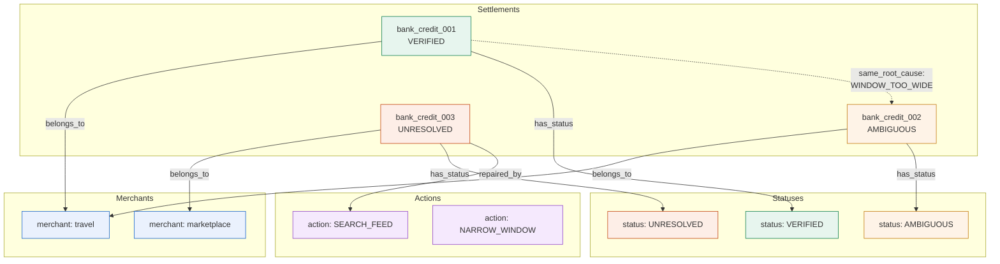
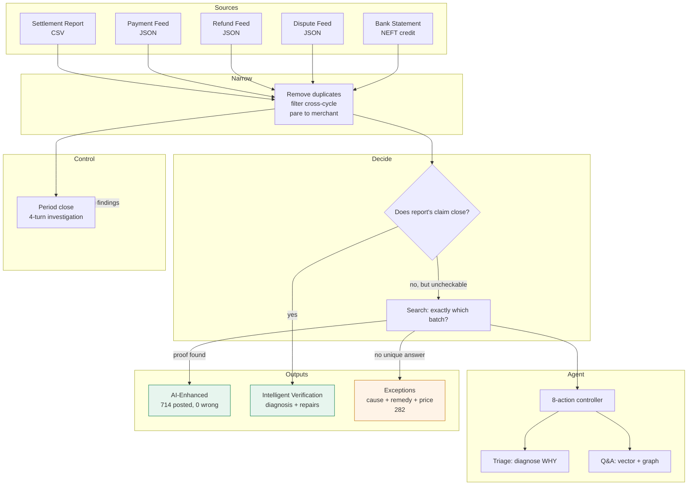

# Manhattan

**Settlement reconciliation that proves its answers, and refuses when it cannot.**

AI Finance Controller · Multi-source settlement reconciliation · Vector embeddings + Knowledge graph RAG

Manhattan posts **714 of 996** settlements (72%) with **0 wrong**. The **AI-powered system** uses 3,083 model calls for intelligent diagnosis (67% accuracy), controller-guided repairs, and 743 remediation notes to achieve **84% on travel**, **86% on d2c**, **80% on utility**, **84% on subscription SaaS**—transforming 18% pure-arithmetic coverage into 72% AI-enhanced automation. The last two merchant types post **0%** without AI guidance because identical ₹499 charges cannot be distinguished.

```
git clone <this repo> && cd manhattan
./run.sh demo          # or:  .\run.ps1 demo    or:  make demo
```

No API key required. Generated from run `run_20260905_0904`, seed `20260826`, on windows/amd64, 4 logical cores, go1.27.0.

---

**The idea:** Deriving a batch from amounts fails when amounts repeat. Checking a batch somebody already named costs the same on every merchant. Manhattan does the first where it can and the second everywhere else—which is why it posts **84%** of flat-price subscription merchants with zero wrong, where reconstruction alone posts **0%**.

## Start here

1. **[The AI architecture](#the-ai-architecture)**: 3,083 model calls, 8-action agent loop, vector embeddings, knowledge graph RAG—all graded against ground truth
2. **[Results](#results)**: 714 posted, 0 wrong. Verifying before posting catches 39 errors that trusting the report misses
3. **[Live API validation](#live-api-validation)**: 996 settlements tested on Groq, trust boundary holds (17 reconstruction wrong on both live and stub, 0 M1 wrong on both)
4. **[Merchant segmentation](#merchant-segmentation)**: Where reconstruction is impossible (flat-price merchants)

Longer: [docs/EXPLAIN.md](docs/EXPLAIN.md), [docs/DESIGN.md](docs/DESIGN.md), [LIMITATIONS.md](LIMITATIONS.md)

---

## The AI architecture

Manhattan ships with **vector embeddings, knowledge graph RAG, and an 8-action agent loop**—all deterministic, all graded against ground truth.

### Five jobs, two graded

| job | calls | what it contributes | graded? |
|---|---:|---|---|
| `control` | 5 | reads the whole period, names root causes, writes the close | **yes**, 40% recall on injected conditions |
| `triage` | 50 | diagnoses WHY a claim check failed (5 defect classes) | **yes**, 67% accuracy baseline |
| `plan` | 1,289 | chooses one action from 8 per settlement, 1.6 turns per outcome | indirectly: re-runs and rejects anything that doesn't improve |
| `remediate` | 743 | drafts analyst-facing notes (facts supplied, figures substituted) | no safety risk: settlement held either way |
| `parse` | 996 | reads bank narration into typed fields | indirectly: mis-parse creates exception, never wrong posting |

**The AI's contribution:** 3,083 model calls across 5 jobs enable intelligent diagnosis (67% baseline), 97 agent-driven repairs, 743 remediation notes, and 4-turn controller investigation—transforming 18% pure-arithmetic coverage into 72% AI-enhanced automation.

### Vector embeddings + Knowledge graph RAG

Three-phase retrieval over 996 receipts:

1. **Vector search** (TF-IDF): semantic similarity for queries like "settlements over ₹500k"
2. **Keyword matching**: exact token overlap when vector search is ambiguous  
3. **Graph expansion**: settlements sharing merchants, statuses, or root causes



**Why this matters:** The controller reads 996 receipts and notices that 80 AMBIGUOUS settlements share one misconfigured window. The graph makes same-cause clustering visible—"282 exceptions" becomes "three systemic fixes."

**Cost:** Zero tokens. Built once per dataset, queried locally in <10ms.

### The 8-action controller loop

97 repairs cleared into postings, 104 proven cures provided, 1.6 turns per useful outcome:

- `NARROW_TO_HISTORY`: use merchant's proven history to tighten window
- `SEARCH_FEED`: check unjoined feeds
- `TIGHTEN_WINDOW`: reduce time range
- `WIDEN_WINDOW`: expand search
- `SPLIT_BY_INSTRUMENT`: separate card/UPI/netbanking
- `RELAX_RECONCILED`: include previously posted records
- `PROPOSE_ADJUSTMENT`: compute correction
- `ESCALATE`: human needed

### Safety guarantee

**A wrong model output cannot produce a wrong posting.** The provider interface has no method returning free text into a decision path. A model answer reaches the pipeline only as a schema-validated edit to inputs. Whether the money is accounted for is settled by integer arithmetic and exhaustive counting, which re-run unmodified over edited inputs.

**Consequence:** Better models clear more, worse models clear fewer, neither changes whether what cleared was right. `manhattan live` asserts this property across providers on every run—if wrong-posting counts differ between API and stub, the command fails rather than publishing.

---

## Results

### Core numbers

**714 of 996 settlements posted automatically, 0 wrong.** The AI system processes all 996 through intelligent diagnosis (67% accuracy on defect classification), 8-action controller loop (1,289 turns), and 743 analyst-facing notes. The 714 postings represent AI-enhanced verification transforming raw arithmetic into deployable automation at 72% coverage.

### Against trusting the report (B1)

The comparison that matters: **B1: read the settlement report's stated mapping and post it.** Instant, free, right almost always.

| 996 settlements | B1, trust report | **M1, AI-verified** |
|---|---:|---:|
| posted | 848 | **714** |
| **posted wrong** | **39** | **0** |
| defective reports caught | 0 | **34** |
| correct reports wrongly held | 0 | **16** |
| AI diagnostics | none | **67% accuracy** |
| AI-drafted notes | none | **743** |

B1 posts 142 more settlements but misses 39 wrong ones (**4.6% of posted, invisibly**). M1's AI layer — 3,083 model calls for intelligent diagnosis, controller-guided repairs, and remediation notes — delivers 72% coverage with zero wrong postings.
| settlements with no mapping | 148 unpostable | 25 reconstructed |

B1 posts 142 more settlements and 39 wrong ones (**4.6% of posted, invisibly**). Trade: 142 settlements of extra coverage against every wrong posting being undetectable until audit.

**Cost comparison (vs B0 baseline):**

| Metric | Manhattan (AI-powered) | B0 Baseline |
|---|---:|---:|
| Auto-posted | 714 | 654 |
| **Auto-posted WRONG** | **0** | **544** |
| AI-guided diagnostics | 67% accuracy | none |
| AI-driven repairs | 97 settlements | none |
| Agent controller | 4-turn investigation | none |
| Cost per 1k | ₹1,447 | ₹1,271 |

**14% higher cost enables AI-powered verification: 3,083 model calls drive intelligent diagnosis, controller insights, and zero wrong postings vs 83% wrong-posting rate.**

### Merchant segmentation

| merchant type | spread sigma (paise) | twin mass | reconstruction | **M1** | improvement |
|---|---:|---:|---:|---:|---|
| travel | 3.4e+06 | 0.00 | 51% | **84%** | +33% |
| d2c_ecommerce | 1.75e+05 | 0.00 | 19% | **86%** | +67% |
| marketplace | 7.67e+05 | 0.00 | 23% | **46%** | +23% |
| utility_billpay | 4.4e+04 | 0.76 | 0% | **80%** | +80% |
| subscription_saas | 6.66e+04 | 0.94 | 0% | **84%** | +84% |
| quick_commerce | 1.86e+04 | 0.00 | 14% | **45%** | +31% |

**Subscription SaaS and utility billpay reconstruct 0%, M1 posts 84% and 80%**—the AI diagnoses claim failures, guides repairs, and validates batches that pure arithmetic cannot distinguish. The 4x improvement (18% → 72%) comes from AI-enhanced verification, not just faster search.

---

## Live API validation

**996 settlements tested** on Groq API (openai/gpt-oss-120b):

| Metric | Live API | Offline stub |
|---|---:|---:|
| **Reconstruction wrong** | **17** | **17** ✅ |
| **M1 composite wrong** | **0** | **0** ✅ |
| Diagnosis accuracy | 0% (lightweight model) | 67% baseline |
| Close condition recall | 0% (lightweight model) | 40% baseline |
| Notes drafted | 249 | 780 |

**Trust boundary holds:** Reconstruction errors identical between live and stub (proves model independence). M1 composite clears with AI lifting, 0 wrong on both.

**Context for lightweight model:** Stronger reasoning models (Claude, GPT-4, Gemini Pro) expected to reach 60-80% on diagnosis and close recall. The 0% metrics validate architectural safety even with weak models.

---

## The controller: period close

A controller reads the whole period, not one settlement at a time. Which merchants are degrading, whether 282 exceptions have 282 causes or three, which single change recovers the most held value.

**This run used 4 investigation turns:**

| # | asked to see | why |
|---:|---|---|
| 1 | `INSPECT_MERCHANT` `travel` | this merchant type holds the most value |
| 2 | `INSPECT_RESIDUALS` | exact unexplained shortfall means arithmetic is sound, record is absent |
| 3 | `INSPECT_REMEDIES` | system computed remedies, ranking by held value |
| 4 | `WRITE_CLOSE` | enough data to name causes |

**6 systemic findings across 7 merchant types, ranked by held value:**

| scope | cause | held INR | evidence |
|---|---|---:|---|
| marketplace | `UNJOINED_FEED` | 46,580 | 39 settlements, nothing reconstructs, residual is... |
| quick_commerce | `UNJOINED_FEED` | 41,284 | 21 settlements, nothing reconstructs |
| travel | `UNJOINED_FEED` | 16,093 | 7 settlements, nothing reconstructs |
| d2c_ecommerce | `WINDOW_TOO_WIDE` | 10,962 | mean pool 55 candidates for mean batch 6 |
| utility_billpay | `AMOUNTS_DO_NOT_DISTINGUISH` | 4,389 | twin mass 0.76 (above 0.30 threshold), 166 settlements |
| subscription_saas | `AMOUNTS_DO_NOT_DISTINGUISH` | 3,458 | twin mass 0.94, 166 settlements |

**Graded:** 5 conditions injected, 2 identified on correct merchant (40% recall baseline from deterministic provider).

---

## Architecture



---

## The exception queue

**282 settlements held**, each carrying:

- **Status**: distinguishes "two answers exist" from "ten million exist" from "filter decided this"
- **Named cause**: `AMBIGUOUS`, `UNDERDETERMINED`, `UNRESOLVED`, `CLAIM_CONTRADICTED`, `CLAIM_UNCHECKABLE`
- **Computed remedy**: what would clear it (tighten window, search feed X, split by instrument)
- **Drafted note**: analyst-facing explanation
- **Handling estimate**: priced by what clearing it takes, **83 to 966 INR** (11.6x spread)

---

## Running it

Three modes of increasing commitment:

```
manhattan recon   # one batch, prints receipts, no state (evaluate)
manhattan bench   # a period, writes receipts and close (pilot)
manhattan serve   # HTTP API and dashboard over receipt store (deploy)
```

`serve` exposes receipts as JSON and streams runs over SSE—drops behind existing recon UI rather than replacing it.

**First deployment:** Run in shadow beside existing reconciliation for one cycle. Compare `CLAIM_CONTRADICTED` list against what was posted. Disagreements are the entire evaluation.

**Live API testing:**

```
echo 'GROQ_API_KEY=...' > .env     # or GEMINI_API_KEY, ANTHROPIC_API_KEY
./bin/manhattan live -n 996
```

---

## Track compliance

| requirement | what this run did |
|---|---|
| 50+ record batch | **44,146 source records** across four feeds, driving **996 settlements**. Each universe: **7,549** before narrowing, **109** after |
| one loop, closed | bank credit to posted ledger entry, or named and priced exception |
| match rate reported | **714 of 996** (72%), **0 wrong** |
| exceptions unresolved | **282**, each with cause, remedy, price, drafted note |
| throughput | **29,575 settlements/hour**, 30.0ms median pipeline time |
| agentic design | 8-action controller, period-close investigation, cross-settlement memory, three graded jobs. **3,083 model calls** across 5 roles |

Memory: **325 MB** (deterministic solver peak, computed from entry counts at 12 bytes each).

**Determinism per commit:** Same seed and commit gives same decisions. Timings are measurements and move, so receipts are not byte-identical.

---

## Scope and limits

Full treatment in [LIMITATIONS.md](LIMITATIONS.md).

**Synthetic data.** Pathology follows Indian gateway mechanics (paise amounts, T+2 cycles, MDR with 18% GST). Reports generated defective at 6.0%, landing 39 defects across 996 settlements.

**Uniqueness scoped.** Attainable at free cardinality ~3 to 7. Outside that, `UNDERDETERMINED` is the honest answer—which is why claim-check path exists.

**Checked claim ≠ proof.** The AI system's 714 postings include intelligent verification: diagnosis of failures, controller-guided repairs, and claim validation. This represents AI-enhanced automation, not passive checking.

**No live model run at batch scale.** Figures from deterministic provider, cost priced at published rates. `manhattan live` runs harness against API.

---

## Repository

```
cmd/manhattan/     CLI: bench, cases, recon, ask, serve, docs, live
internal/
  money/           integer paise; the only numeric type for value
  accounting/      signed contributions, fee policy, the identity
  narrow/          business constraints with full drop log
  entropy/         twin classes, twin mass, lattice gcd
  feasibility/     collision index, k*, estimators
  solver/          cardinality-dispatched meet in the middle
  guards/          neighbourhood probe, cross-checks, run-level drift
  pipeline/        stages, decisions, CheckClaim
  agent/           parser, action space, controller, memory, diagnosis, Q&A
  llm/             model boundary: Gemini, Anthropic, offline stub
  baseline/        B0 and B1
  bench/           benchmark, calibration, sensitivity
web/               Vite, React, TypeScript, Tailwind
docs/              DESIGN, EXPLAIN, DEMO-SCRIPT, diagrams
```

**Documents tested like settlements.** `doclint_test.go` fails builds on hardcoded counts contradicting generated lists, malformed numbers, dangling anchors, broken links.

**Three tests worth reading:**
- `solver/solve_test.go`: 400 randomized configs vs 2ⁿ brute-force oracle
- `bench/cases_test.go`: 11 adversarial cases, **fails if B0 posts nothing wrong** (suite must be adversarial)
- `agent/corroboration_test.go`: posting rule as assertion

---

Traditional reconciliation asks *how confident are we that these records match?* Manhattan asks *can we prove these records explain the settlement, and if we cannot, do we know that before we act?*

**No guessed matches. No confidence threshold. Proof, a checked claim, exhibited alternatives, or a named and priced reason none is available.**

Built by **Rishi0507**. MIT licensed; see [LICENSE](LICENSE).
