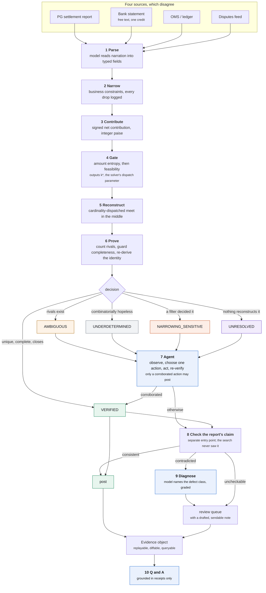
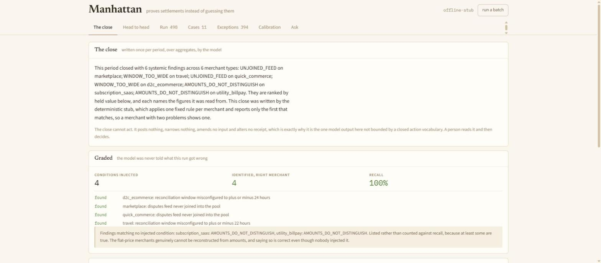
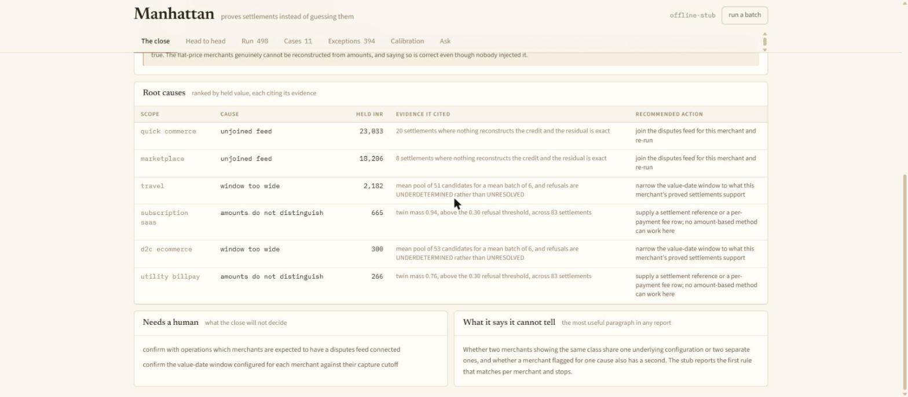
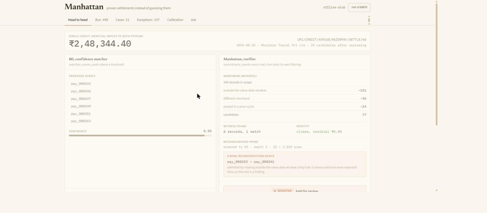
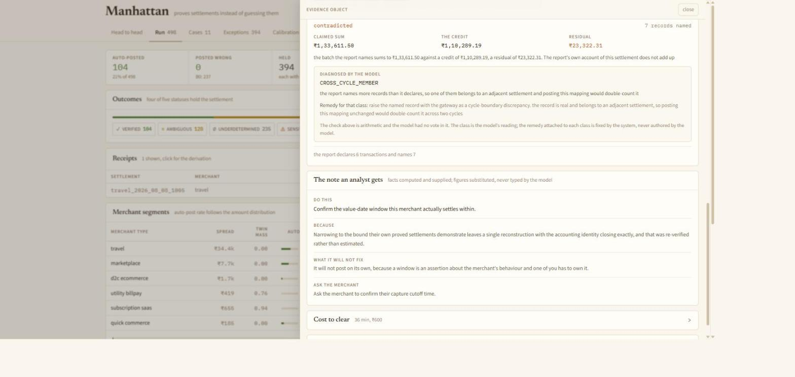
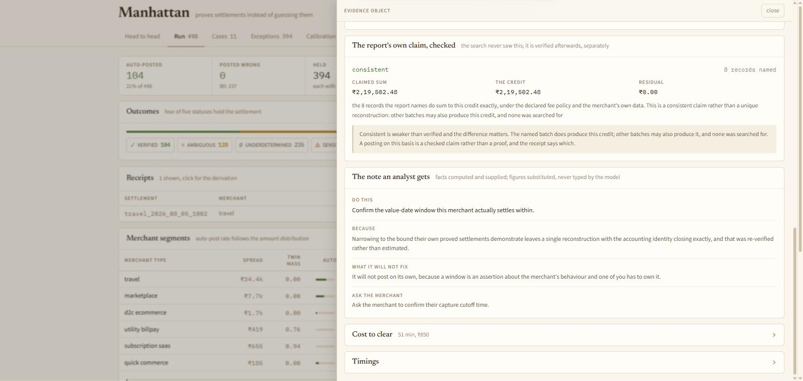
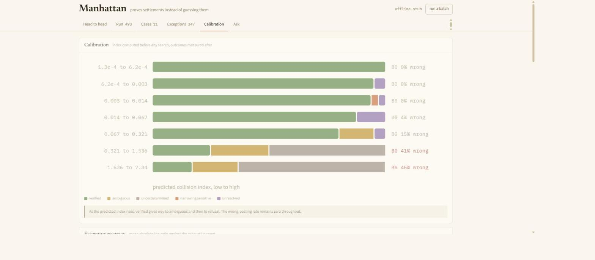
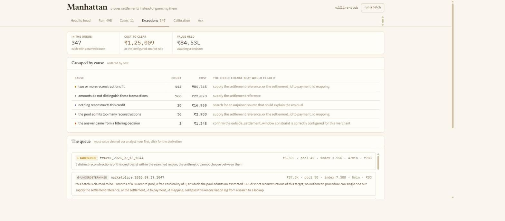
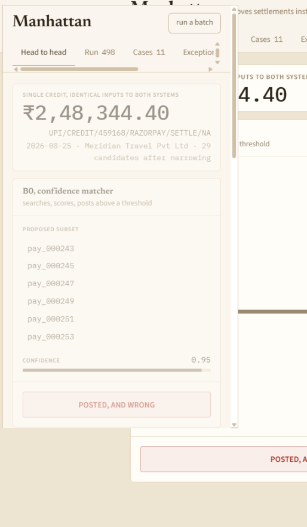

# Manhattan

**Settlement reconciliation that proves its answers, and refuses when it cannot.**

Razorpay AI Buildathon · Track 04, AI Finance Controller · Multi-source reconciliation

Manhattan posts **358 of 498** settlements automatically (72%) with **0 wrong**, and hands back 140 exceptions each carrying a named cause, a computed remedy and a price.

### Who this is for

Three readers, and the middle one is the buyer.

**A gateway's support desk.** "Why is my payout short by 4,180 rupees" is a ticket with a cost attached. Manhattan answers it from a receipt: here are the records that make up the credit, here is the fee applied to each, here is the chargeback debited this cycle but raised against the last one. That is a settlement dispute closed without an engineer reading a CSV.

**A gateway's own reconciliation, made provable.** Manhattan does not replace Single View Recon. It sits on top of it and checks the mapping the report already ships against the money that actually moved.

> **A reconciliation whose only check on the settlement report is the settlement report detects a defective one at no rate at all, including zero.**
>
> That is a structural property, not a volume claim. It holds whether reports are wrong four times in a hundred or four times in a hundred thousand, and it is why a validation layer is worth having even for a team whose reports are excellent. What changes with the rate is how often it pays; what does not change is that without it nobody knows.

This run contradicts **20 of 20** defective reports with **0 false alarms on 408 clean ones**. The defect rate that produces those is modelled, not observed, and if yours is a tenth of it then the volume is a tenth and the property is unchanged.

**A merchant reconciling independently**, where the mapping is absent or unverified: no settlement reference on the narration, a lump credit, two aggregators shipping different formats, historical backfill.

```
git clone <this repo> && cd manhattan
./run.sh demo          # or:  .\run.ps1 demo    or:  make demo
```

No API key required. **Every number in this file, in [RESULTS.md](RESULTS.md) and in [LIMITATIONS.md](LIMITATIONS.md) is emitted by that command**, rendered from one run in one pass so the three cannot drift. Generated from run `run_20260904_0643`, seed `20260826`, on windows/amd64, 4 logical cores, go1.27.0.

---

## For a judge, in four minutes

1. **[The one slide](#the-one-slide).** A confidence matcher's correct-answer count is flat at 55 across every threshold it could be tuned to, while M1 posts 358 with 0 wrong on identical data.
2. **[The controller](#the-controller)**, where the model reads the whole period and names the root causes. Graded at **80% recall** against operational conditions it was never told about.
3. **[Where the rest of the AI is](#where-the-rest-of-the-ai-is)**: 1,494 calls across 5 jobs, a second one graded at 65%.
4. **[RESULTS.md](RESULTS.md), the calibration section.** Whether the system knows *in advance* when it is about to be wrong.
5. **`./run.sh demo`**, which opens on adversarial case 10: narrowing drops a real record, a coincidental subset closes the identity exactly, and the guard catches it.

Longer: [docs/EXPLAIN.md](docs/EXPLAIN.md) is the system from first principles in plain language. [docs/DESIGN.md](docs/DESIGN.md) has every derivation. [LIMITATIONS.md](LIMITATIONS.md) is what it cannot do.

---

## The result

Three comparison systems, identical inputs, identical narrowing.

| 498 settlements | B0, fuzzy matcher | B1, trust the report | Manhattan alone | **M1, the composite** |
|---|---:|---:|---:|---:|
| posted | 345 | 428 | 75 | **358** (72%) |
| **posted wrong** | **290** | **20** | **0** | **0** |
| held | 153 | 0 | 423 | 140 |
| defective reports flagged | 0 | 0 of 20 | | **20 of 20** |
| false alarms on 408 clean reports | | | | **0** |

### The one slide

B0 is a confidence matcher on identical inputs and identical narrowing. Sweeping its posting threshold across the same 498 decisions:

| threshold | posted | **correct** | wrong |
|---:|---:|---:|---:|
| 0.10 | 498 | **55** | 443 |
| 0.20 | 494 | **55** | 439 |
| 0.25 | 492 | **55** | 437 |
| 0.50 | 486 | **55** | 431 |
| 0.55 | 479 | **55** | 424 |
| 0.75 | 406 | **55** | 351 |
| 0.80 *(shipped)* | 345 | **55** | 290 |
| 0.95 | 235 | **48** | 187 |
| 1.00 | 0 | **0** | 0 |

**The correct column does not move.** B0's right answers are exact integer hits, which score above its own posting bar, so every threshold below that admits only additional *wrong* postings. Lowering the bar never finds another right answer. The confidence score carries no information about correctness anywhere a team would tune, and no threshold makes this class of matcher both useful and safe.

At its very best B0 produces **55** correct postings. M1 produces **358**, with **0** wrong.

---

**M1 posts two different kinds of answer and the receipt never blurs them.** 75 of its 358 postings (21%) are proofs: exactly one batch produces this credit, counted exhaustively, nobody trusted. The other 283 are the gateway's claim, checked against an independent account of the money.

Both are worth posting and the second is worth much more than posting it unchecked, which is what a lookup does. **70 settlements (14%) arrive with no mapping to check at all**, and there reconstruction is the only route: reconstruction posts 6 of them. And the check is only trustworthy because the reconstruction exists, since the independent account it compares against is the contribution model the solver searches over.

*(Where those numbers are weaker than they look, and what the composite cannot detect, is in [known weaknesses](#known-weaknesses).)*

### And it works where reconstruction cannot

| merchant type | spread sigma (paise) | twin mass | reconstruction | **M1** |
|---|---:|---:|---:|---:|
| travel | 3.39e+06 | 0.00 | 45% | **89%** |
| marketplace | 7.89e+05 | 0.00 | 23% | **53%** |
| d2c_ecommerce | 1.74e+05 | 0.00 | 8% | **81%** |
| utility_billpay | 4.36e+04 | 0.77 | 0% | **78%** |
| subscription_saas | 6.63e+04 | 0.95 | 0% | **87%** |
| quick_commerce | 1.85e+04 | 0.00 | 14% | **43%** |

Read the last two columns together. **Subscription SaaS and utility billpay reconstruct 0%, and M1 posts 87% and 78% of them.** Those are large, fast-growing segments and the reconstruction-only figure reads as "we cannot help you". It is not.

That is not a better solver. It is a different question:

> **Deriving a batch is a search. Checking a batch somebody claimed is not.**

Reconstruction costs C(n, k) and only decides in a narrow regime. Verifying a claimed batch costs O(claim): do these records exist, do they belong to this merchant, were they already posted in a prior cycle, do their signed contributions sum to the credit, does the count match the declaration. None of it touches the combinatorics. So a subscription merchant with two hundred identical 499-rupee charges has settlements no method can **derive**, and the gateway's mapping for them can still be **checked** in microseconds.

The verdict is deliberately weaker than a proof, and the receipt never blurs them:

| | |
|---|---|
| `VERIFIED` | exactly one batch in the searched region produces this credit, counted exhaustively. Nobody was trusted. |
| `CLAIM_CONSISTENT` | the batch the report named does produce this credit. Others may too; this was checked, not derived. |
| `CLAIM_CONTRADICTED` | the report's own account does not survive checking. Here is the residual and the diagnosis. |
| `CLAIM_UNCHECKABLE` | part of the claim lives in a feed nobody joined. Our problem, not the report's. |

### Holding a good report is worse than trusting one

A validation layer that flags correct reports is worse than no validation layer, so this is the number that decides whether it ships: **0 false alarms on 408 clean reports** (0.0%).

It gets there by taking the counterparty's data more seriously than its own config. Real reports drop a per-payment fee row on some payments, and large merchants are signed below the published schedule. Pricing a missing row at the configured rate then makes a *correct* report look wrong: a merchant on 178 bps priced at 200 is off by 66 rupees on a 30,000 rupee ticket, which is nowhere near a pricing tolerance and fatal to a sum that must close to zero. Naively priced, this run raises **13** false alarms.

So a missing row is priced at the rate the merchant's **own report** demonstrates, per instrument, from at least six observed rows, and the `fee_basis` guard refuses any reconstruction whose pool was inferred from less evidence than that.

*(Why this number used to be meaningless, and what it still does not cover, is in [known weaknesses](#known-weaknesses).)*

---

## The controller

The track is called AI Finance Controller, and a controller does not reconcile one settlement at a time. It reads the period. Which merchants are degrading, whether 140 exceptions have 140 causes or three, which single change recovers the most held value, and what needs a human this week.

Every input to that is arithmetic and every one is already computed. What is missing is the step that reads 498 receipts and notices that eighty of them are the same problem wearing different reference numbers. **That step is the model's, and it is the only output in this system that works above a single settlement.**

> This period closed with 6 systemic findings across 6 merchant types: WINDOW_TOO_WIDE on travel; UNJOINED_FEED on marketplace; WINDOW_TOO_WIDE on d2c_ecommerce; UNJOINED_FEED on quick_commerce; AMOUNTS_DO_NOT_DISTINGUISH on utility_billpay; AMOUNTS_DO_NOT_DISTINGUISH on subscription_saas. They are ranked by held value below, and each names the figures it was read from. This close was written by the deterministic stub, which applies one fixed rule per merchant and reports only the first that matches, so a merchant with two problems shows one.

| scope | cause | held INR | evidence it cited |
|---|---|---:|---|
| quick_commerce | `UNJOINED_FEED` | 24,068 | 10 settlements where nothing reconstructs the credit and the residual is... |
| marketplace | `UNJOINED_FEED` | 20,302 | 14 settlements where nothing reconstructs the credit and the residual is... |
| d2c_ecommerce | `WINDOW_TOO_WIDE` | 8,680 | mean pool of 57 candidates for a mean batch of 6, and refusals are... |
| travel | `WINDOW_TOO_WIDE` | 5,431 | mean pool of 47 candidates for a mean batch of 7, and refusals are... |
| utility_billpay | `AMOUNTS_DO_NOT_DISTINGUISH` | 2,394 | twin mass 0.77, above the 0.30 refusal threshold, across 83 settlements |
| subscription_saas | `AMOUNTS_DO_NOT_DISTINGUISH` | 1,463 | twin mass 0.95, above the 0.30 refusal threshold, across 83 settlements |

### It is graded

This run injects operational misconfigurations and records exactly what they are. **None of that reaches the model.** It sees status mixes, pool sizes, twin masses, held values and remedy counts, and has to infer the cause the way a controller would.

| | |
|---|---:|
| conditions injected | 5 |
| **identified, on the right merchant** | **4** |
| **recall** | **80%** |
| findings dropped for citing no evidence | 0 |

Findings corresponding to no injected condition: `utility_billpay: AMOUNTS_DO_NOT_DISTINGUISH`, `subscription_saas: AMOUNTS_DO_NOT_DISTINGUISH`. Listed rather than counted against recall, because at least some are true: the flat-price archetypes genuinely cannot be reconstructed from amounts and saying so is correct even though nobody injected it. Deciding which true findings count would be exactly the sort of scoring nobody should accept on assertion.

**The close cannot act.** It posts nothing, narrows nothing, amends no input and alters no receipt. That is precisely why it is the one model output not bounded by a closed action vocabulary: a person reads it and then decides. Everywhere the model *can* influence a posting it is fenced; here it cannot, so it is given the whole period and asked to think.

---

## Where the rest of the AI is

The fair criticism of this project is that arithmetic does the deciding, so what is the model for. Here is the accounting rather than an argument.

| job | calls | what it contributes | graded? |
|---|---:|---|---|
| `control` | 1 | reads the WHOLE period and writes the close: which merchants are degrading, whether four hundred exceptions have four hundred causes or three, which single change recovers the most held value, and what needs a human this week. The only output here that works above a single settlement, and the only one not bounded by a closed action vocabulary, because it cannot act | **yes**, on whether it found the operational conditions this run injected |
| `triage` | 20 | names WHY a report's stated mapping failed its arithmetic check, from a closed vocabulary of five defect classes. The same failed check has several causes needing different remedies, and telling them apart is reading rather than counting | **yes**, against the generator's record of what it injected |
| `plan` | 591 | chooses one action from a closed set of eight for a settlement that did not post, including whether this merchant's own proved history corroborates a tighter window | indirectly: the entire stack re-runs and rejects anything that did not improve |
| `remediate` | 384 | drafts the analyst-facing note: what to do, why it works in terms of what was measured, and what it will not fix. Facts supplied, figures substituted afterwards | no, and it carries no safety risk: the settlement is held either way |
| `parse` | 498 | reads an unstructured bank narration into typed fields. The highest volume and the lowest difficulty, and the one job a gateway would replace with a lookup table tomorrow | indirectly: a mis-parse produces an exception, never a posting |

**One of those is scored against ground truth.** When the claim check fails, the arithmetic is already known: the residual, the missing ids, the count mismatch. What the model contributes is the *diagnosis*, because the same failed check has several causes with completely different remedies. A report short by one record with a residual matching a chargeback, a report naming a payment from last cycle, and a truncated file all fail identically and need three different actions.

The generator records which defect it injected, and the pipeline never sees it, so the model can be graded:

| | |
|---|---:|
| defects diagnosed | 20 |
| **correct** | **13** (65%) |

The errors are 1 `TRUNCATED_MAPPING` read as `OMITTED_DISPUTE` and 6 `OMITTED_DISPUTE` read as `TRUNCATED_MAPPING`: exactly the pair that needs the class of record involved rather than the sign of the residual, which is what the deterministic stub reads and all it reads. That is headroom a real model has, stated as a number rather than a hope, and `manhattan live` is what turns it into a measurement.

**The highest-volume model job is the one with no safety risk at all.** 384 analyst-facing notes: what to do, why it works in terms of what was measured, and what it will **not** fix. Every fact is supplied and every figure is substituted from the receipt afterwards, so a draft containing a digit is rejected wholesale (0 were, this run). A note is attached to a settlement held either way, so the worst a bad draft costs is a confusing sentence in a work queue.

### What the model must not do, and how that is enforced

**The model never decides whether a settlement is correctly posted.** That is settled by an integer identity and an exhaustive count, both of which run unmodified regardless of what the model proposed. The eleven-case suite passes on a deliberately unintelligent stub, which proves the boundary holds and simultaneously proves no published result *requires* a model.

Those are two different claims and this repository owes both. **`manhattan live` measures the difference:**

```
export ANTHROPIC_API_KEY=sk-ant-...
./bin/manhattan live -n 60
```

It runs the same batch on the live API and on the stub, and asserts that wrong postings are **identical** while diagnosis accuracy, repairs and note quality are **free to improve**. If the wrong-posting column moves, the trust boundary has leaked and the command exits non-zero rather than publishing.

**This has not been run yet**, because it needs an API key. Every published figure comes from `offline-stub` (parse=replay resolve=replay answer=replay) and the cost column is modelled at published rates rather than billed. That is stated here, in [LIMITATIONS.md](LIMITATIONS.md#no-live-model-run-at-batch-scale) and in [RESULTS.md](RESULTS.md), because it is the most attackable sentence in the repository and burying it would be worse than having it.

---

## What this run deliberately gets wrong

A reconciliation benchmark on perfectly configured data measures nothing an agent could help with, so two misconfigurations are modelled. Both are things a **deployment gets wrong on its own side**:

- d2c_ecommerce: reconciliation window misconfigured to plus or minus 24 hours
- marketplace: disputes feed never joined into the pool
- marketplace: reconciliation window misconfigured to plus or minus 26 hours
- quick_commerce: disputes feed never joined into the pool
- travel: reconciliation window misconfigured to plus or minus 22 hours

The obvious criticism is that the author created the problem the agent solves. The answer is the curve below, not an argument.

---

## The agent

Repairs, split by the action that produced them, because one total hides which mechanism worked:

| action | repairs | corroborated by |
|---|---:|---|
| `NARROW_TO_HISTORY` | 22 | this merchant's own prior VERIFIED settlements |
| `SEARCH_FEED` | 13 | a real record, cited by id, in a feed nobody joined |

And the contribution as a function of how bad the configuration is:

| scenario | verified | wrong | repairs | by feed | by history | proven cures |
|---|---:|---:|---:|---:|---:|---:|
| correctly configured, reports clean | 117 | 0 | **14** | 14 | 0 | 2 |
| correctly configured, reports as modelled | 104 | 0 | **9** | 9 | 0 | 5 |
| window misconfiguration as modelled | 47 | 0 | **19** | 10 | 9 | 54 |
| window misconfiguration, reports ten times cleaner | 46 | 0 | **18** | 10 | 8 | 56 |
| window misconfiguration twice as bad | 24 | 0 | **5** | 5 | 0 | 73 |
| missing fee rows priced naively | 14 | 0 | **3** | 3 | 0 | 28 |

**Read the two repair columns separately, because they behave differently and one total hides it.** `SEARCH_FEED` repairs at every scenario including a correctly configured one, because an unjoined feed is a data-availability problem rather than a configuration one. `NARROW_TO_HISTORY` repairs 0 at zero misconfiguration, which is the loop being unnecessary rather than failing. **Wrong postings are zero in every scenario**, including where the agent works hardest. And at twice the modelled misconfiguration narrowing repairs fall back to zero for a better reason: a merchant that badly configured proves almost nothing, never reaches the twelve proofs a profile needs, and has no history to corroborate against. That ceiling is in [LIMITATIONS.md](LIMITATIONS.md).

### The queue, as a flow

```
458  settlements entered the loop as unresolved
166  settled by deterministic triage, with no model call        (36%)
292  reached the agent
591  actions taken
 35  repaired into a posting, each citing evidence
 65  given a proven cure: verified remedy, deliberately not posted
423  remain held
  0  wrong postings caused
```

Paying a model to conclude that nothing can help, across most of a queue, is the same mistake as paying it to add up a column.

### Only a corroborated action may post

| action | may post? |
|---|---|
| `SEARCH_FEED` | **yes**, citing a real record by id |
| `NARROW_TO_HISTORY` | **yes**, bounded by this merchant's own proved settlements |
| `TIGHTEN_WINDOW`, `WIDEN_WINDOW`, `SPLIT_BY_INSTRUMENT`, `RELAX_RECONCILED`, `PROPOSE_ADJUSTMENT`, `ESCALATE` | no |

The rule was learned, not designed. The first version let narrowing post if the identity closed, and produced **two wrong postings in three hundred settlements**: the agent tightened a window, the pool fell from 44 records to 40, an `AMBIGUOUS` settlement became `VERIFIED`, every check passed, and the answer was wrong because the tightening had cut real records out of the batch.

> Removing candidates cannot make the survivor unique. It makes it **unexamined**.

That figure is hand-recorded from a build that no longer exists, and it is the only number in this file not emitted by run `run_20260904_0643`. The failure is rebuilt as a committed test in [`internal/agent/corroboration_test.go`](internal/agent/corroboration_test.go), which fails if `TIGHTEN_WINDOW` is ever made postable again.

**Prohibition was the right default and the wrong permanent answer.** `NARROW_TO_HISTORY` closes the gap: a merchant's prior `VERIFIED` settlements are a second source, and a strong one, since each was proved by exhaustive enumeration without reference to any window hypothesis. The profile is built only from proofs, needs at least twelve, and the bound may never be tighter than the widest offset those proofs show. The verifier still decides. Corroboration buys the right to be tested, not the right to be believed.

---

## The five outcomes

| Status | Meaning | Action |
|---|---|---|
| `VERIFIED` | One explanation exists in the searched region, counted exhaustively, and the identity closes | Post with evidence |
| `AMBIGUOUS` | Two or more explanations reconstruct the credit, and both are exhibited | Review, alternatives shown |
| `UNDERDETERMINED` | The combinatorics guarantee a large population of explanations | Review, remedy computed |
| `NARROWING_SENSITIVE` | The answer depended on a filter rather than on arithmetic | Review, constraint named |
| `UNRESOLVED` | Nothing reconstructs the credit within tolerance | Queue, with the exact residual |

Four of the five stop the money and none is a failure. `AMBIGUOUS` at 149 and `UNDERDETERMINED` at 248 are sized populations, not rhetoric. Flags are orthogonal: a settlement can be `VERIFIED` and carry `FEE_ANOMALY`, because whether the money is accounted for and whether the fee applied to it was right are different questions.

| flag | settlements |
|---|---:|
| `SIGNED_ITEMS_PRESENT` | 233 |
| `AMOUNT_ENTROPY_INSUFFICIENT` | 166 |
| `FEE_ANOMALY` | 119 |
| `LATTICE_CORRECTED` | 65 |
| `RESOLVED_BY_HYPOTHESIS` | 35 |

**That table covers the 498-settlement batch only.** `TWIN_SWAP` is absent from it and present in adversarial case 5: the batch rarely puts an exact twin inside a witness, while case 5 constructs one deliberately. The eleven cases are a separate fixture for exactly this reason.

---

## Architecture



*(Rendered SVGs of every diagram are in [docs/diagrams/](docs/diagrams/), in case Mermaid does not render here.)*

### The dashboard

`./run.sh demo` builds the frontend, runs the batch and serves it on `localhost:8080`. **Nobody should have to run it to judge this**, so the views carrying the argument are below and every figure in them is also in [RESULTS.md](RESULTS.md).

| | |
|---|---|
|  | **The close, and its grade.** The landing tab, because it answers the question an operations lead arrives with. The model read the period, named the root causes, and was scored on whether it found conditions it was never told about. |
|  | **Root causes, ranked by held value**, each citing the figures it was read from, each with the action it implies. Plus what needs a human, and what the close says it cannot tell. |
|  | **Head to head.** One credit, identical inputs. B0 proposes six records at 0.95 confidence and posts, and is wrong. Manhattan closes the identity to zero, then widens the pool, finds a rival, and holds. |
|  | **The model at work.** The gateway's claim fails its arithmetic check with an exact residual. The model names the defect class, the system owns the remedy for that class, and a drafted note tells an analyst what to do and what it will not fix. |
|  | **A consistent claim.** `consistent` is not `verified` and the panel says so: the named batch does produce this credit, others may too, and none was searched for. |
|  | **Calibration.** Outcome mix against the collision index predicted *before* any search ran, in bands of equal population. Wrong-posting rate stays at zero across every band. |
|  | **The queue**, grouped by cause and ordered by value cleared per analyst hour. |
|  | **At 390px.** Every view is usable on a phone; wide tables scroll inside their own panel. |

**The gate runs before the solver, not after it.** Its output `k*` is the parameter the solver is dispatched on, so triage is not a pre-check bolted onto the front of the search. It is what configures the search. Derivations in [docs/DESIGN.md](docs/DESIGN.md).

---

## The exception queue

Every entry carries a status distinguishing *two answers exist* from *ten million exist* from *a filter decided this*; a named cause; a **computed** remedy; a drafted note; and a handling estimate priced by what clearing it takes. That last part is what makes it a work plan: handling runs **83 to 950 INR**, a 11.4x spread, and every term is on the receipt in `exception_cost_basis`.

So it is ordered by **value cleared per analyst hour**. [Full top 15 in RESULTS.md](RESULTS.md#the-exception-queue); all 423 in `out/receipts.ndjson`.

| settlement | status | at stake | mins | INR/hour | cause |
|---|---|---:|---:|---:|---|
| `bank_credit_travel_2026_08_17_1014` | `UNDERDETERMINED` | 554,944 | 6 | **5,549,444** | this batch is claimed to be 8 records of a... |
| `bank_credit_travel_2026_08_23_1020` | `UNDERDETERMINED` | 234,811 | 5 | **2,817,730** | this batch is claimed to be 9 records of a... |
| `bank_credit_travel_2026_09_23_1051` | `UNDERDETERMINED` | 233,992 | 6 | **2,339,924** | this batch is claimed to be 9 records of a... |
| `bank_credit_travel_2026_08_18_1015` | `UNDERDETERMINED` | 212,375 | 6 | **2,123,754** | this batch is claimed to be 9 records of a... |
| `bank_credit_travel_2026_08_27_1024` | `UNDERDETERMINED` | 205,818 | 6 | **2,058,175** | this batch is claimed to be 7 records of a... |

### What this is worth to a support desk

The buyer named at the top is a settlement support desk, so the number that matters to them is deflection, not match rate. From stated assumptions:

| | |
|---|---:|
| settlement disputes raised per month | 4,000 *(assumption)* |
| analyst minutes to answer one from raw files | 18 *(assumption)* |
| **deflected: answered from a receipt with no investigation** | **72%** *(this run's composite posting rate)* |
| analyst hours saved per month | **863** |
| at 1,000 INR per analyst hour | **862,651 INR per month** |

Only the deflection rate is measured; the volume and the handling time are assumptions and are labelled. Substitute your own and the arithmetic is one multiplication.

The mechanism is the part that is not an assumption. A deflected ticket is one where the answer already exists as a receipt: here are the records that make up the credit, here is the fee applied to each, here is the chargeback debited this cycle but raised against the last one. The 140 that are not deflected arrive with a named cause, a computed remedy and a drafted note, which is a shorter investigation rather than none.

### What refusing is worth

| | |
|---|---:|
| money sitting unposted | 15,149,775 INR |
| analyst time to clear it | 153 hours |
| the queue, at the configured rate | **153,236 INR** |
| B0's 290 wrong postings at 2,400 INR each to unwind | **696,000 INR** |
| difference | **542,764 INR in Manhattan's favour** |

The 2,400 INR is an assumption, printed so it can be replaced: roughly two hours of a mid-level analyst noticing the error at month end, finding the credit, reversing the journal, re-posting, and explaining the movement. Substitute your own; B0 only wins if unwinding costs under 528 INR. **And that break-even is conservative in our favour**, because it charges B0 nothing for its own 153 held settlements.

---

## The baseline, published so it can be attacked

290 wrong of 345 posted is a number my own code produced about my own code, so here is everything B0's confidence score is computed from:

- exact integer hit on the target contribution sum (confidence 0.90)
- near hit within 1 basis point of the target (0.72)
- near hit within 1 per cent of the target (0.45)
- no hit found within the node budget (0.15)
- cardinality agrees with the settlement report's declared count (+0.05)

That is the whole function. It measures how good a match *looks*, never whether it is the only one, and those come apart exactly where the money is, which is why [its correct count does not move](#the-one-slide) as the threshold falls. The full sweep is in [RESULTS.md](RESULTS.md#the-baseline-across-every-threshold).

---

## Ask the receipts

4 exchanges from this run, verbatim, showing every path the Q&A side can take.


> **Q. which constraint dropped the most records?**
>
> outside the value-date window removed the most, at 1,403,661 records across 498 settlements, which is 76.6% of everything narrowing looked at.
> 
> The full breakdown:
>   outside the value-date window       1,403,661  (76.6%)
>   a different merchant                  249,664  (13.6%)
>   already posted in a...
>
> `deterministic, no model call`
> `aggregated across the store · narrowing.dropped.outside_settlement_window = 1,403,661`
> `aggregated across the store · narrowing.dropped.mid_mismatch = 249,664`

> **Q. what is the backlog costing us?**
>
> The queue holds 423 settlements worth ₹1,50,91,679.65, and clearing it costs about INR 153,236 at the configured analyst handling time.
> 
> By cause, most expensive first:
>   AMBIGUOUS               149 settlements   INR  106,747
>   UNDERDETERMINED         248 settlements   INR   30,103
>   UNRESOLVED  ...
>
> `deterministic, no model call`
> `aggregated across the store · exception_cost_inr = 153,236`

> **Q. why do the quick commerce settlements behave differently from the travel ones, and what would I change first?**
>
> Across the 12 receipts retrieved for this question, the most common outcome is AMBIGUOUS.
> 
>   ambiguous              7
>   unresolved             5
> 
> This is the deterministic stub. It can count what the receipts say and quote a remedy they already carry. It cannot weigh two remedies against each...
>
> `retrieval over receipts, then one grounded model call`
> `bank_credit_travel_2026_09_08_1036 · status`
> `bank_credit_quick_commerce_2026_08_13_1011 · status`

> **Q. which analyst approved settlement 5502?**
>
> The receipts do not record this and I will not infer it.
> 
> There is no approval, reviewer or assignee field on a receipt, because there is no human step in this pipeline to record. A settlement is decided by an integer identity and an exhaustive uniqueness count, and the receipt carries the evidence...
>
> `deterministic, no model call`
> `schema · no approval, reviewer or assignee field exists`

The last one matters most. **An agent that answers every question is not grounded in anything.** The receipts record what the system decided and why; they do not record who approved anything, because no human approval step exists in this pipeline.

---

## How this ships

It is a library and a binary, not a platform, and that is the point: the whole
system is one Go module with no runtime dependencies, no database and no
network calls outside the model boundary.

**The integration surface is four feeds and one config.** Payments with their
fee rows, refunds, chargebacks and adjustments, plus the bank credit. Every one
maps onto fields a settlement report already carries:

| Manhattan | Razorpay settlement report |
|---|---|
| `payment.gross_paise`, `captured_at`, `instrument` | `amount`, `created_at`, `method` on a settlement's payment rows |
| `payment.fee_observed_paise`, `tax_observed_paise` | `fee`, `tax` per row, which is what makes the fee check independent |
| `payment.settlement_id` | `settlement_id`, treated as a claim to verify rather than an answer |
| `chargeback.disputed_paise`, `fee_paise` | dispute amount and dispute fee from the disputes feed |
| `credit.amount_paise`, `value_date`, `narration` | the bank statement line, which is the only unstructured input |
| `policy.mdr_bps_by_instrument`, `gst_bps` | the merchant's rate card |

Amounts are integer paise throughout because that is how the settlement API
reports them, which is the fact that makes exact verification legitimate rather
than a modelling choice.

**Three ways to run it, in increasing order of commitment:**

```
manhattan recon   one batch, prints receipts, no state         # evaluate
manhattan bench   a period, writes receipts and the close      # pilot
manhattan serve   HTTP API and dashboard over a receipt store  # deploy
```

`serve` exposes the receipt store as JSON and streams a run over SSE, so it
drops behind an existing recon UI rather than replacing one. A receipt is a
flat JSON object with a stable schema: an operations tool consumes it, a
support desk renders it next to a ticket, a data warehouse loads it.

**What a first deployment looks like.** Run it in shadow beside the existing
reconciliation for one settlement cycle. It posts nothing; it produces receipts
and a close. Compare its `CLAIM_CONTRADICTED` list against what the existing
process posted, and the disagreements are the entire evaluation. If it
contradicts nothing, the reports are clean and that is worth knowing. If it
contradicts something, that is a defect nobody would otherwise have seen, and
it arrives with the residual attached.

---

## Track compliance

| requirement | what this run did |
|---|---|
| 50+ record batch | **22,155 source records** across four feeds, driving **498 settlements**. Each settlement's universe reaches **3,772** before narrowing and **108** after |
| one loop, closed | bank credit to posted ledger entry, or to a named and priced exception |
| match rate reported | **358 of 498**, 72%, with **0 wrong** |
| exceptions it could not resolve | **140**, each with a cause, a computed remedy, a price and a drafted note |
| throughput | **48,142 settlements per hour**, 18.6 ms median pipeline time |
| agentic design | 1,494 model calls across 5 jobs, a closed 8-action controller loop, cross-settlement merchant memory, and a graded diagnosis |

Throughput is end to end: 498 settlements in 37.2 s of wall clock including the agent loop, both baselines and receipt serialisation. That divides to 74.8 ms against a 18.6 ms median pipeline time, and both are printed rather than the flattering one. Memory: **114 MB** deterministic solver peak; **747 MB** sampled process heap, which moves between runs and should never be quoted as a bound.

**Determinism is per commit.** Same seed and same commit gives the same decisions on every settlement. Timings are measurements and move, so receipts are not byte-identical.

### Where this stops

A throughput figure without a pool size is not a measurement, so here is the boundary instead. Enumeration costs C(n/2, at most k) entries at twelve bytes each, which makes the limit exact rather than benchmarked. Inside a 1 GB budget for one settlement:

| free cardinality | largest pool | entries |
|---:|---:|---:|
| 3 | **1,126** | 59.5 M |
| 4 | **328** | 59.6 M |
| 5 | **164** | 58.3 M |
| 6 | **108** | 58.7 M |
| 7 | **82** | 55.7 M |
| 8 | **68** | 50.4 M |

Cost tracks cardinality, not pool size: a 164-record pool at k=5 costs what a 1,126-record pool at k=3 does. Narrowing is what keeps a real merchant inside this, and the pools in this run land between 20 and 108 candidates.

**Beyond the limit nothing crashes.** The feasibility gate checks the projected allocation *before* allocating and refuses, so an oversized pool becomes an `UNDERDETERMINED` with a computed remedy rather than an out-of-memory. And the claim-check path is unaffected at any size, because checking a batch somebody named is linear in the batch: **a merchant too large to reconstruct is still a merchant whose settlement report can be verified.** That is the second reason the composite matters and not just the first.

---

## Known weaknesses

Everything below is a real limit on the claims above, and the full list is in
[LIMITATIONS.md](LIMITATIONS.md), which is longer and does not spare anything.

**The report defect rate is invented.** 4.0%, chosen in this
repository's generator, not observed anywhere. If a real gateway's rate is a
tenth of it, the composite's volume advantage is a tenth. The structural
property above does not move, and the volume argument should not be leaned on.

**The false-alarm rate used to be a tautology and is now merely narrow.** The
generator and the accounting engine derive contributions from the same fee
schedule, so before negotiated rates and missing fee rows were modelled, a
correct report could not disagree with the check. That mechanism now exists and
is defeated by calibration. Still unmodelled: slab boundaries, per-network card
rates, and promotional pricing that varies within an instrument. A merchant
whose rate moves mid-period would defeat the per-instrument calibration.

**Reconstruction posts 6 of the 70 settlements
where it is the only option.** That is the honest measure of the solver on the
population that needs it, and it is low. The window misconfiguration modelled in
this run suppresses it; the sensitivity sweep shows what a correctly configured
deployment does.

**A checked claim is not a proof.** 283 of 358
postings are the counterparty's batch, verified to produce this credit. Other
batches may also produce it, and on a flat-price merchant a great many would.
What this cannot detect is a report wrong in a way that still balances: a
substituted record of identical contribution, or a fee error exactly offsetting
a membership error.

**Uniqueness is proved within a cardinality scope, not absolutely.** Attainable
only at free cardinality of roughly 3 to 7. Outside it `UNDERDETERMINED` is the
honest answer and no solver improvement changes that.

**No live model run at batch scale.** Every figure is offline-stub and the cost
is modelled at published rates rather than billed. `manhattan live` exists to
close this and needs a key. Until it runs, the honest summary of the AI evidence
is that the architecture is demonstrated and the model quality is not measured.

Benchmarked on synthetic data throughout. The pathology mix reflects documented
Razorpay mechanics (paise amounts, T+2 cycles, MDR with 18% GST, netted refunds,
chargeback debits, zero-MDR UPI), but real merchant data will contain things the
generator does not model.

---

## Repository

```
cmd/manhattan/     CLI: bench, cases, recon, ask, serve, docs, live
internal/
  money/           integer paise; the only numeric type for value
  accounting/      signed contributions, fee policy, the identity
  narrow/          business constraints, with a full drop log
  entropy/         twin classes, twin mass, lattice gcd, zero contributions
  feasibility/     the collision index, k*, both estimators
  solver/          cardinality-dispatched meet in the middle
  guards/          neighbourhood probe, cross-checks, run-level drift
  pipeline/        the stages, the decision, and CheckClaim
  agent/           parser, action space, controller, memory, diagnosis,
                   note drafting, Q and A
  llm/             the model boundary: Anthropic, cassette, offline stub
  baseline/        B0 and B1, both built honestly
  bench/           the benchmark, calibration sweep, sensitivity, envelope
web/               the dashboard: Vite, React, TypeScript, Tailwind
docs/              DESIGN, EXPLAIN, DEMO-SCRIPT, templates, diagrams
```

**Three tests worth reading.** `internal/solver/solve_test.go` verifies 400 randomised configurations against a 2ⁿ brute-force oracle and caught two real bugs before anything was built on it. `internal/bench/cases_test.go` runs all eleven adversarial cases and **fails if B0 posts nothing wrong**, because a suite the baseline survives is not adversarial. `internal/agent/corroboration_test.go` is the posting rule as an assertion rather than an anecdote.

---

Traditional reconciliation asks *how confident are we that these records match?* Manhattan asks *can we prove these records explain the settlement, and if we cannot, do we know that before we act?*

**No guessed matches. No confidence threshold. Proof, a checked claim, exhibited alternatives, or a named and priced reason none is available.**

Built by **Rishi0507** for the Razorpay AI Buildathon, Track 04. MIT licensed; see [LICENSE](LICENSE).
