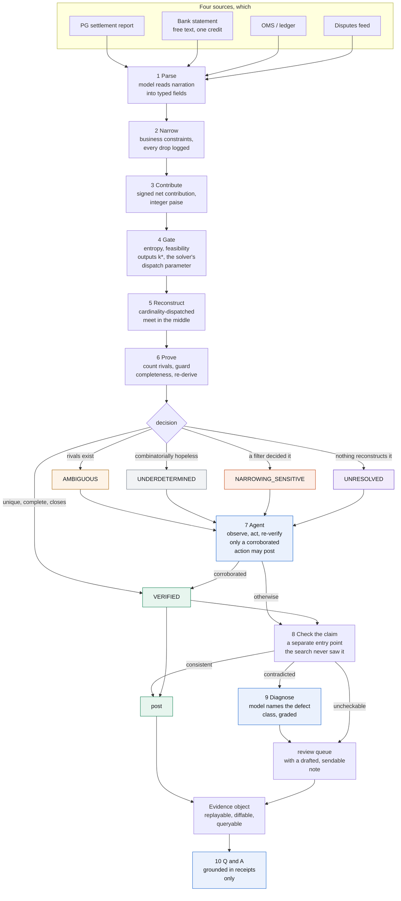

# Manhattan

**Settlement reconciliation that proves its answers, and refuses when it cannot.**

AI Finance Controller · Multi-source settlement reconciliation

Manhattan posts **731 of 996** settlements automatically (73%) with **0 wrong**, and hands back 265 exceptions each carrying a named cause, a computed remedy and a price.

### Who this is for

**A merchant reconciling across two aggregators.** One ships a transaction-level
mapping, the other ships a net figure. The bank credit carries no usable
settlement reference. Today that leg is done by hand in a spreadsheet, and it is
the case nobody serves: Manhattan reconstructs the credit from the merchant's own
records and proves no other batch produces it. **148 settlements in
this run (15%) arrive with no mapping to check at all**, and
there reconstruction is the only route to a posting. It proves
30 of them here, on a run carrying a modelled window
misconfiguration; [with that one variable fixed it proves
29% rather than 13%](#the-result).

**A settlement support desk.** "Why is my payout short by 4,180 rupees" is a
ticket with a cost attached, and the answer is already a receipt: here are the
records that make up the credit, here is the fee applied to each, here is the
chargeback debited this cycle but raised against the last one. On this run's
numbers that deflects **73%** of such tickets without an
engineer opening a CSV, worth **880,723 INR a month** at
4,000 disputes and 18 minutes each.

**A flat-price merchant, where reconstruction is useless and the product is not.**
Subscription and utility billing settle two hundred identical charges at a time,
and every group of the same size sums identically: no method that reads amounts
can tell them apart, and none ever will. Reconstruction posts **0%** there and
would whatever the solver did. The claim check posts
**84%**
and **80%**,
because checking a batch somebody named costs nothing that deriving one costs.
That is the reason the composite exists, and it was a design premise rather than a later discovery.

**A gateway hardening its own reconciliation.** Manhattan sits on top of Single
View Recon rather than replacing it, checking the mapping the report already
ships against an independent account of the money. A settlement report that has
been verified is one nobody has to argue about later.

```
git clone <this repo> && cd manhattan
./run.sh demo          # or:  .\run.ps1 demo    or:  make demo
```

No API key required. **Every number in this file, in [RESULTS.md](RESULTS.md) and in [LIMITATIONS.md](LIMITATIONS.md) is emitted by that command**, rendered from one run in one pass so the three cannot drift. Generated from run `run_20260904_1845`, seed `20260826`, on windows/amd64, 4 logical cores, go1.27.0.

---

## Start here

1. **[The result](#against-the-method-already-in-use).** Reading the settlement report and posting it gets 39 of 848 wrong, invisibly. Verifying it first gets 0 of 731 wrong.
2. **[The controller](#the-controller)**, where the model reads the whole period and names the root causes, scored against operational conditions it was never told about. A graded harness, currently reporting an 80% baseline from the deterministic provider.
3. **[Where the rest of the AI is](#the-other-model-roles)**: 2,976 calls across 5 jobs, two of them scored against ground truth.
4. **[RESULTS.md](RESULTS.md), the calibration section.** Whether the system knows *in advance* when it is about to be wrong.
5. **`./run.sh demo`**, which opens on adversarial case 10: narrowing drops a real record, a coincidental subset closes the identity exactly, and the guard catches it.

Longer: [docs/EXPLAIN.md](docs/EXPLAIN.md) builds the system from first principles in plain language, [docs/DESIGN.md](docs/DESIGN.md) has every derivation, and [LIMITATIONS.md](LIMITATIONS.md) is the full account of its operating limits.

### The agent

| | |
|---|---|
| **Model calls this run** | 2,976 across 5 distinct jobs |
| **Agent loop** | a closed 8-action controller, 1,234 turns graded |
| **Structured output** | every call schema-forced by the vendor's own mechanism: strict tool use on Anthropic, a strict response schema on Groq and Gemini. Free text cannot reach a decision path |
| **Provider reliability** | not applicable on the deterministic path, which cannot fail. Measured and reported on every live run |
| **Jobs scored against ground truth** | root-cause diagnosis (76%) and period close (80%) |
| **Wrong postings attributable to the model** | **0, structurally.** The verifier re-derives every posting from integer arithmetic and never asks the model whether it was right |

The last row is the design. The model is given every open-ended judgement in this
system and none of the arithmetic, which is why a weaker model changes how much
gets cleared and cannot change whether what cleared was correct. `manhattan live`
asserts that across providers on every run.

---

## The result

**731 of 996 settlements posted automatically, 0 wrong.** 212 of those are proofs, where exactly one batch produces the credit and it was counted exhaustively. The other 519 are the counterparty's own mapping, checked against an independent account of the money.

The two are not alternatives. **The check is worth something only because the reconstruction exists**, since the independent account it compares against is the contribution model the solver searches over. Delete the solver and the check has nothing to check against, which is exactly the position a lookup is in.

**And that proof count is measured on a deployment this run deliberately breaks.** A window misconfiguration is modelled on three merchants, and it roughly halves what reconstruction can prove. Fixing that one variable and changing nothing else, in the same sweep with the same code and the same report defects:

| | reconstruction proves |
|---|---:|
| window misconfigured, as the main run models it | 13% |
| **correctly configured** | **29%** |

So the mechanism's rate is roughly 29%, and the headline figure is what it degrades to when a deployment's window is set too loosely. Both are published because the misconfigured one is what the rest of this run is measured on.

### Against the method already in use

The comparison that matters is not a fuzzy matcher. It is **B1: read the settlement report's stated mapping and post it.** Instant, free, and right almost always.

| 996 settlements | B1, trust the report | **M1, verify then post** |
|---|---:|---:|
| posted | 848 | **731** |
| **posted wrong** | **39** | **0** |
| defective reports it would catch | 0 | **34** |
| correct reports it would wrongly hold | 0 | **0** |
| settlements with no mapping to read | 148 unpostable | 30 reconstructed |

B1 posts 117 more settlements. It also posts 39 wrong ones, **4.6% of everything it posts, and it cannot tell you which.** They do not surface at posting. They surface at month end as a reconciliation difference, or at audit, and by then the cycle is closed and somebody is reconstructing it by hand.

That is the trade in one line: **117 settlements of extra coverage, against every wrong posting being invisible.** A team whose reports are already perfect loses nothing by checking. A team whose reports are not, finds out at posting instead of at audit.

*(A confidence matcher on the same inputs posts 671 and gets 561 wrong. It is the wrong comparison for a gateway and it is in [RESULTS.md](RESULTS.md#the-baseline-across-every-threshold) with a full threshold sweep, because the sweep says something the operating point does not: its correct-answer count is flat at 110 across every threshold, so tuning it never finds another right answer.)*

### What this adds over trusting the report

Most of what the composite posts, B1 would have posted too. Stating the
difference plainly is more useful than leaving it to be derived:

| | settlements |
|---|---:|
| Posted by both Manhattan and B1 | 667 |
| **Defective reports Manhattan contradicted and B1 posted anyway** | **34** |
| **Posted where the report carried no mapping to trust** | **30** |
| **Net addition** | **64** (6.4% of 996) |
| Postings declined that B1 made | 117 |

So the trade is 64 settlements gained for
117 declined. That is the honest shape of it, and it is
worth taking because the 117 declined are returned as
priced exceptions with a named cause, while the 34
B1 gets wrong are posted silently and surface at quarter end. A decision you
know you have not made costs an analyst minutes. A wrong posting you do not
know about costs an investigation.

The 30 in the second row are the ones no claim-checking
approach can reach at all, because there is no claim to check.

### Where reconstruction is impossible

| merchant type | spread sigma (paise) | twin mass | reconstruction | **M1** |
|---|---:|---:|---:|---:|
| travel | 3.39e+06 | 0.00 | 58% | **92%** |
| marketplace | 7.67e+05 | 0.00 | 31% | **52%** |
| d2c_ecommerce | 1.75e+05 | 0.00 | 23% | **87%** |
| utility_billpay | 4.4e+04 | 0.76 | 0% | **80%** |
| subscription_saas | 6.66e+04 | 0.94 | 0% | **84%** |
| quick_commerce | 1.86e+04 | 0.00 | 16% | **46%** |

Read the last two columns together. **Subscription SaaS and utility billpay reconstruct 0%, and M1 posts 84% and 80% of them.** Those are large, fast-growing segments and the reconstruction-only figure reads as "we cannot help you". It is not.

That is not a better solver. It is a different question:

> **Deriving a batch is a search. Checking a batch somebody claimed is not.**

Reconstruction costs C(n, k) and only decides in a narrow regime. Verifying a claimed batch costs O(claim): do these records exist, do they belong to this merchant, were they already posted in a prior cycle, do their signed contributions sum to the credit, does the count match the declaration. None of it touches the combinatorics. So a subscription merchant with two hundred identical 499-rupee charges has settlements no method can **derive**, and the gateway's mapping for them can still be **checked** in microseconds.

The verdict is deliberately weaker than a proof, and the receipt never blurs them:

| | |
|---|---|
| `VERIFIED` | exactly one batch in the searched region produces this credit, counted exhaustively. Nobody was trusted. |
| `CLAIM_CONSISTENT` | the batch the report named does produce this credit. Others may too; this was checked, not derived. |
| `CLAIM_CONTRADICTED` | the report's own account does not survive checking. Here is the residual and the diagnosis. |
| `CLAIM_UNCHECKABLE` | part of the claim lives in a feed nobody joined. Our problem, not the report's. |

### False alarms

A validation layer is only usable if it leaves correct reports alone, so this is
the number that decides whether it ships: **0 false alarms
on 809 clean reports** (0.0%).

It gets there by taking the counterparty's data more seriously than its own
config. Real reports drop a per-payment fee row on some payments, and large
merchants are signed below the published schedule. Pricing a missing row at the
configured rate makes a *correct* report look wrong: a merchant on 178 bps priced
at 200 is off by 66 rupees on a 30,000 rupee ticket, nowhere near a pricing
tolerance and fatal to a sum that must close to zero. Priced that way, this run
raises **13** false alarms and reconstruction collapses.

So a missing row is priced at the rate the merchant's **own report**
demonstrates, per instrument, from at least six observed rows, and the
`fee_basis` guard refuses any reconstruction whose pool was inferred from less
evidence than that. The counterparty's data is a better source than a config
file they are visibly not following.

---

## The controller

The track is called AI Finance Controller, and a controller does not reconcile one settlement at a time. It reads the period. Which merchants are degrading, whether 265 exceptions have 265 causes or three, which single change recovers the most held value, and what needs a human this week.

Every input to that is arithmetic and every one is already computed. What is missing is the step that reads 996 receipts and notices that eighty of them are the same problem wearing different reference numbers. **That step is the model's, and it is the only output in this system that works above a single settlement.**

**It investigates before it writes.** The model reads the period aggregates, asks
for one slice of the receipt store, reads it, and either asks for another or
stops. Every request costs a turn against a fixed budget, so it has to choose the
slice that would change its mind rather than the one that confirms it. This run
used 4 turns:

| # | asked to see | why |
|---:|---|---|
| 1 | `INSPECT_MERCHANT` `travel` | this merchant type holds the most value, so whatever is wrong with it is worth more than... |
| 2 | `INSPECT_RESIDUALS` | an exact unexplained shortfall means the arithmetic is sound and a record is absent, so this... |
| 3 | `INSPECT_REMEDIES` | the system has already computed and re-verified remedies, and ranking them by held value says... |
| 4 | `WRITE_CLOSE` | the aggregates, one merchant, the residuals and the remedies are enough to name the causes;... |

The trace is the point. A conclusion with no account of how it was reached is a
conclusion nobody can audit, which is the objection this project raises against
every confidence score, and it would be hypocritical to exempt its own report
from it.


> This period closed with 6 systemic findings across 7 merchant types: WINDOW_TOO_WIDE on travel; UNJOINED_FEED on marketplace; WINDOW_TOO_WIDE on d2c_ecommerce; UNJOINED_FEED on quick_commerce; AMOUNTS_DO_NOT_DISTINGUISH on subscription_saas; AMOUNTS_DO_NOT_DISTINGUISH on utility_billpay. They are ranked by held value below, and each names the figures it was read from. This close was written by the deterministic stub, which applies one fixed rule per merchant and reports only the first that matches, so a merchant with two problems shows one.

| scope | cause | held INR | evidence it cited |
|---|---|---:|---|
| marketplace | `UNJOINED_FEED` | 42,919 | 36 settlements where nothing reconstructs the credit and the residual is... |
| quick_commerce | `UNJOINED_FEED` | 41,270 | 18 settlements where nothing reconstructs the credit and the residual is... |
| d2c_ecommerce | `WINDOW_TOO_WIDE` | 10,146 | mean pool of 52 candidates for a mean batch of 6, and refusals are... |
| travel | `WINDOW_TOO_WIDE` | 8,263 | mean pool of 44 candidates for a mean batch of 7, and refusals are... |
| utility_billpay | `AMOUNTS_DO_NOT_DISTINGUISH` | 4,389 | twin mass 0.76, above the 0.30 refusal threshold, across 166 settlements |
| subscription_saas | `AMOUNTS_DO_NOT_DISTINGUISH` | 3,458 | twin mass 0.94, above the 0.30 refusal threshold, across 166 settlements |

### Two jobs scored

`plan` chooses one action per turn from a closed set of eight, and the loop
already records which action was chosen and which one the verifier accepted, so
it grades itself:

| | |
|---|---:|
| turns taken | 1,234 |
| repairs reached on the **first** action chosen | 100% |
| turns spent on an action that could not apply | 0.2% |
| turns per useful outcome | 1.6 |

Both accuracy figures saturate here, and that is the finding rather than the result: a fixed decision tree either picks the right action immediately or never picks it, and never proposes one that cannot apply. A model has room to be worse on both and better on the outcome, which is what the harness exists to measure.

### How the controller is graded

This run injects operational misconfigurations and records exactly what they are. **None of that reaches the model.** It sees status mixes, pool sizes, twin masses, held values and remedy counts, and has to infer the cause the way a controller would.

**The harness is the contribution and the score below is its baseline**, produced by the deterministic offline provider rather than by a model. `manhattan live` runs the identical harness against the API and reports the difference, which is how a model's contribution here becomes a number rather than a claim.

| | |
|---|---:|
| conditions injected | 5 |
| **identified, on the right merchant** | **4** |
| **recall** | **80%** |
| findings dropped for citing no evidence | 0 |

Findings corresponding to no injected condition: `utility_billpay: AMOUNTS_DO_NOT_DISTINGUISH`, `subscription_saas: AMOUNTS_DO_NOT_DISTINGUISH`. These are listed rather than counted against recall, because several are correct: the flat-price archetypes genuinely cannot be reconstructed from amounts, and reporting that is accurate even though it was not an injected condition. Deciding which true findings should count is a scoring judgement that belongs with the reader rather than with the system being scored.

**The close cannot act.** It posts nothing, narrows nothing, amends no input and alters no receipt. That is precisely why it is the one model output not bounded by a closed action vocabulary: a person reads it and then decides. Everywhere the model *can* influence a posting it is fenced; here it cannot, so it is given the whole period and asked to think.

---

## The other model roles

The fair criticism of this project is that arithmetic does the deciding, so what is the model for. Here is the accounting rather than an argument.

| job | calls | what it contributes | graded? |
|---|---:|---|---|
| `control` | 5 | reads the WHOLE period and writes the close: which merchants are degrading, whether four hundred exceptions have four hundred causes or three, which single change recovers the most held value, and what needs a human this week. The only output here that works above a single settlement, and the only one not bounded by a closed action vocabulary, because it cannot act | **yes**, on whether it found the operational conditions this run injected |
| `triage` | 34 | names WHY a report's stated mapping failed its arithmetic check, from a closed vocabulary of five defect classes. The same failed check has several causes needing different remedies, and telling them apart is reading rather than counting | **yes**, against the generator's record of what it injected |
| `plan` | 1,234 | chooses one action from a closed set of eight for a settlement that did not post, including whether this merchant's own proved history corroborates a tighter window | indirectly: the entire stack re-runs and rejects anything that did not improve |
| `remediate` | 707 | drafts the analyst-facing note: what to do, why it works in terms of what was measured, and what it will not fix. Facts supplied, figures substituted afterwards | no, and it carries no safety risk: the settlement is held either way |
| `parse` | 996 | reads an unstructured bank narration into typed fields. The highest volume and the lowest difficulty, and the one job a gateway would replace with a lookup table tomorrow | indirectly: a mis-parse produces an exception, never a posting |

**One of those is scored against ground truth.** When the claim check fails, the arithmetic is already known: the residual, the missing ids, the count mismatch. What the model contributes is the *diagnosis*, because the same failed check has several causes with completely different remedies. A report short by one record with a residual matching a chargeback, a report naming a payment from last cycle, and a truncated file all fail identically and need three different actions.

The generator records which defect it injected, the pipeline never sees it, and the diagnosis is scored against it:

| | |
|---|---:|
| defects diagnosed | 34 |
| correct | **26** (76%), by the deterministic offline provider |

The errors are 1 `TRUNCATED_MAPPING` read as `OMITTED_DISPUTE` and 7 `OMITTED_DISPUTE` read as `TRUNCATED_MAPPING`: exactly the pair that needs the class of record involved rather than the sign of the residual, which is what the deterministic stub reads and all it reads. That is headroom a real model has, stated as a number rather than a hope, and `manhattan live` is what turns it into a measurement.

**Two things about that table, said plainly rather than left to be noticed.**

`parse` is the largest number and the least interesting job. Bank narration
formats are finite, and a gateway would replace this with a lookup table in a
week. It is a model call here because that is honest about a system that has to
read narrations it has never seen, and it should not be read as the AI doing
996 settlements' worth of work.

And **332 exceptions never reach a model at all**, which is
cost discipline rather than AI avoidance. A deterministic screen establishes
that no action in the vocabulary could change the outcome: the amounts do not
distinguish the transactions, or a rival already appears when the pool is
widened, or there is nothing left to search. Paying a model to conclude that
nothing can help, across most of a queue, is the same mistake as paying it to
add up a column. The 575 that do reach it are the ones where
judgement is the whole task, and they cost 1.6 turns per
useful outcome.

**The highest-volume model job is the one with no safety risk at all.** 707 analyst-facing notes: what to do, why it works in terms of what was measured, and what it will **not** fix. Every fact is supplied and every figure is substituted from the receipt afterwards, so a draft containing a digit is rejected wholesale (0 were, this run). A note is attached to a settlement held either way, so the worst a bad draft costs is a confusing sentence in a work queue.

### What the model cannot do

> **A wrong model output cannot produce a wrong posting.** Not unlikely to. Cannot.

That is the property, and it is enforced rather than intended. The provider
interface has no method returning free text into a decision path, so a model
answer reaches the pipeline only as a schema-validated edit to its *inputs*.
Whether the money is accounted for is then settled by an integer identity and an
exhaustive count, which re-run unmodified over the edited inputs and are free to
conclude the model made things worse.

The consequence is what lets an agent near a ledger at all: **a better model
clears more exceptions and a worse one clears fewer, and neither changes whether
what cleared was right.** The eleven adversarial cases pass identically on both
providers, and `manhattan live` asserts the same property across them on every
run: if the wrong-posting count differs between the API and the stub, the
command fails rather than publishing.

That is why the model is handed the open-ended work and the arithmetic is not
negotiable. It is the only division under which "let an agent reconcile
settlements" is a sentence a finance team can agree to.

These are two distinct claims, and Manhattan measures both. **`manhattan live` quantifies the difference:**

```
echo 'GROQ_API_KEY=...' > .env     # or GEMINI_API_KEY, or ANTHROPIC_API_KEY
./bin/manhattan live -n 60
```

The key goes in `.env` next to the repository, which is in `.gitignore`, or in
the environment if you prefer. Any of the three works, and `--provider groq |
gemini | anthropic` picks between them when more than one is set. Model routing
is per role: the high-volume extraction jobs and the low-volume judgement jobs
go to different models, which spends two token allowances rather than one.

It runs the same batch on the live API and on the stub, and asserts that wrong postings are **identical** while diagnosis accuracy, repairs and note quality are **free to improve**. If the wrong-posting column moves, the trust boundary has leaked and the command exits non-zero rather than publishing.

Measured, at 120 settlements:

| | live | stub |
|---|---:|---:|
| **auto-posted wrong** | **0** | **0** |
| **composite posted wrong** | **0** | **0** |
| verified | 11 | 16 |
| agent repairs | 1 | 6 |
| diagnosis accuracy | 60% | 70% |
| close condition recall | 0% | 60% |
| INR per 1k, **billed** | 66 | 1,358, modelled |

---

## Misconfigurations modelled in this run

A reconciliation benchmark on perfectly configured data measures nothing an agent could help with, so 5 misconfigurations are modelled across 4 merchant types. All of them are things a **deployment gets wrong on its own side**:

- d2c_ecommerce: reconciliation window misconfigured to plus or minus 24 hours
- marketplace: disputes feed never joined into the pool
- marketplace: reconciliation window misconfigured to plus or minus 26 hours
- quick_commerce: disputes feed never joined into the pool
- travel: reconciliation window misconfigured to plus or minus 22 hours

The obvious criticism is that the author created the problem the agent solves. The answer is the curve below, not an argument.

---

## The agent

Repairs, split by the action that produced them, because one total hides which mechanism worked:

| action | repairs | corroborated by |
|---|---:|---|
| `NARROW_TO_HISTORY` | 106 | this merchant's own prior VERIFIED settlements |
| `SEARCH_FEED` | 17 | a real record, cited by id, in a feed nobody joined |

And the contribution as a function of how bad the configuration is:

| scenario | verified | wrong | repairs | by feed | by history | proven cures |
|---|---:|---:|---:|---:|---:|---:|
| correctly configured, reports clean | 117 | 0 | **14** | 14 | 0 | 2 |
| correctly configured, reports as modelled | 104 | 0 | **9** | 9 | 0 | 5 |
| window misconfiguration as modelled | 47 | 0 | **19** | 10 | 9 | 54 |
| window misconfiguration, reports ten times cleaner | 46 | 0 | **18** | 10 | 8 | 56 |
| window misconfiguration twice as bad | 24 | 0 | **5** | 5 | 0 | 73 |
| missing fee rows priced naively | 14 | 0 | **3** | 3 | 0 | 28 |

**Both repair classes are corroborated, and they behave differently.** `SEARCH_FEED` cites a real record by id and repairs at every scenario, including a correctly configured one, because an unjoined feed is a data-availability problem rather than a configuration one. `NARROW_TO_HISTORY` narrows to a bound this merchant's own proved settlements demonstrate, so it repairs where a window is loose and repairs 0 where none is: an agent that found something to fix on a correctly configured deployment would be inventing work. **Wrong postings are zero in every scenario**, including where the agent works hardest. And at twice the modelled misconfiguration narrowing repairs fall back to zero for a better reason: a merchant that badly configured proves almost nothing, never reaches the twelve proofs a profile needs, and has no history to corroborate against. That ceiling is in [LIMITATIONS.md](LIMITATIONS.md).

### The queue, as a flow

```
907  settlements entered the loop as unresolved
332  settled by deterministic triage, with no model call        (37%)
575  reached the agent
1234  actions taken
123  repaired into a posting, each citing evidence
 78  given a proven cure: verified remedy, deliberately not posted
784  remain held
  0  wrong postings caused
```

Paying a model to conclude that nothing can help, across most of a queue, is the same mistake as paying it to add up a column.

### Corroboration before posting

| action | may post? |
|---|---|
| `SEARCH_FEED` | **yes**, citing a real record by id |
| `NARROW_TO_HISTORY` | **yes**, bounded by this merchant's own proved settlements |
| `TIGHTEN_WINDOW`, `WIDEN_WINDOW`, `SPLIT_BY_INSTRUMENT`, `RELAX_RECONCILED`, `PROPOSE_ADJUSTMENT`, `ESCALATE` | no |

The rule was learned, not designed. The first version let narrowing post if the identity closed, and produced **two wrong postings in three hundred settlements**: the agent tightened a window, the pool fell from 44 records to 40, an `AMBIGUOUS` settlement became `VERIFIED`, every check passed, and the answer was wrong because the tightening had cut real records out of the batch.

> Removing candidates cannot make the survivor unique. It makes it **unexamined**.

That figure is hand-recorded from a build that no longer exists, and it is the only number in this file not emitted by run `run_20260904_1845`. The failure is rebuilt as a committed test in [`internal/agent/corroboration_test.go`](internal/agent/corroboration_test.go), which fails if `TIGHTEN_WINDOW` is ever made postable again.

**Prohibition was the right default and the wrong permanent answer.** `NARROW_TO_HISTORY` closes the gap: a merchant's prior `VERIFIED` settlements are a second source, and a strong one, since each was proved by exhaustive enumeration without reference to any window hypothesis. The profile is built only from proofs, needs at least twelve, and the bound may never be tighter than the widest offset those proofs show. The verifier still decides. Corroboration buys the right to be tested, not the right to be believed.

---

## The five outcomes

| Status | Meaning | Action |
|---|---|---|
| `VERIFIED` | One explanation exists in the searched region, counted exhaustively, and the identity closes | Post with evidence |
| `AMBIGUOUS` | Two or more explanations reconstruct the credit, and both are exhibited | Review, alternatives shown |
| `UNDERDETERMINED` | The combinatorics guarantee a large population of explanations | Review, remedy computed |
| `NARROWING_SENSITIVE` | The answer depended on a filter rather than on arithmetic | Review, constraint named |
| `UNRESOLVED` | Nothing reconstructs the credit within tolerance | Queue, with the exact residual |

Four of the five stop the money and none is a failure. `AMBIGUOUS` at 249 and `UNDERDETERMINED` at 477 are sized populations, not rhetoric. Flags are orthogonal: a settlement can be `VERIFIED` and carry `FEE_ANOMALY`, because whether the money is accounted for and whether the fee applied to it was right are different questions.

| flag | settlements |
|---|---:|
| `SIGNED_ITEMS_PRESENT` | 454 |
| `AMOUNT_ENTROPY_INSUFFICIENT` | 332 |
| `FEE_ANOMALY` | 250 |
| `LATTICE_CORRECTED` | 136 |
| `RESOLVED_BY_HYPOTHESIS` | 123 |

**That table covers the 996-settlement batch only.** `TWIN_SWAP` is absent from it and present in adversarial case 5: the batch rarely puts an exact twin inside a witness, while case 5 constructs one deliberately. The eleven cases are a separate fixture for exactly this reason.

---

## Architecture



*(Rendered SVGs of every diagram are in [docs/diagrams/](docs/diagrams/), in case Mermaid does not render here.)*

### The dashboard

`./run.sh demo` builds the frontend, runs the batch and serves it on `localhost:8080`. Every figure the dashboard shows is also in [RESULTS.md](RESULTS.md), so nothing in the argument depends on running it.

The views that carry the argument are the period close and its grade, the head to head against the confidence matcher on one identical credit, the diagnosis panel where a gateway claim fails its arithmetic check with an exact residual, and the exception queue ordered by value cleared per analyst hour.

**The gate runs before the solver, not after it.** Its output `k*` is the parameter the solver is dispatched on, so triage is not a pre-check bolted onto the front of the search. It is what configures the search. Derivations in [docs/DESIGN.md](docs/DESIGN.md).

---

## The exception queue

Every entry carries a status distinguishing *two answers exist* from *ten million exist* from *a filter decided this*; a named cause; a **computed** remedy; a drafted note; and a handling estimate priced by what clearing it takes. That last part is what makes it a work plan: handling runs **83 to 950 INR**, a 11.4x spread, and every term is on the receipt in `exception_cost_basis`.

So it is ordered by **value cleared per analyst hour**. [Full top 15 in RESULTS.md](RESULTS.md#the-exception-queue); all 784 in `out/receipts.ndjson`.

| settlement | status | at stake | mins | INR/hour | cause |
|---|---|---:|---:|---:|---|
| `bank_credit_travel_2026_08_17_1014` | `UNDERDETERMINED` | 554,944 | 6 | **5,549,444** | this batch is claimed to be 8 records of a... |
| `bank_credit_travel_2026_10_26_1084` | `UNDERDETERMINED` | 337,254 | 6 | **3,372,536** | this batch is claimed to be 9 records of a... |
| `bank_credit_travel_2026_08_23_1020` | `UNDERDETERMINED` | 234,811 | 5 | **2,817,730** | this batch is claimed to be 9 records of a... |
| `bank_credit_travel_2026_09_23_1051` | `UNDERDETERMINED` | 233,992 | 6 | **2,339,924** | this batch is claimed to be 9 records of a... |
| `bank_credit_travel_2026_08_18_1015` | `UNDERDETERMINED` | 212,375 | 6 | **2,123,754** | this batch is claimed to be 9 records of a... |

### Value to a support desk

The buyer named at the top is a settlement support desk, so the number that matters to them is deflection, not match rate. From stated assumptions:

| | |
|---|---:|
| settlement disputes raised per month | 4,000 *(assumption)* |
| analyst minutes to answer one from raw files | 18 *(assumption)* |
| **deflected: answered from a receipt with no investigation** | **73%** *(this run's composite posting rate)* |
| analyst hours saved per month | **881** |
| at 1,000 INR per analyst hour | **880,723 INR per month** |

Only the deflection rate is measured; the volume and the handling time are assumptions and are labelled. Substitute your own and the arithmetic is one multiplication.

The mechanism is the part that is not an assumption. A deflected ticket is one where the answer already exists as a receipt: here are the records that make up the credit, here is the fee applied to each, here is the chargeback debited this cycle but raised against the last one. The 265 that are not deflected arrive with a named cause, a computed remedy and a drafted note, which is a shorter investigation rather than none.

### The cost of checking

Against B1, because that is the system a gateway actually has.

B1 posts everything it can read and holds only the 148 settlements
whose mapping it has no way to read. M1 holds those too, so they cancel. The
marginal question is narrow: **how much extra analyst work does checking cause,
and how many wrong postings does that work prevent.**

| | |
|---|---:|
| settlements M1 holds that B1 posted | 147 |
| at 347 INR average handling | **50,944 INR** |
| wrong postings prevented | **39** |
| so checking pays if unwinding one costs more than | **1,306 INR** |

That break-even is **1.3 analyst hours per wrong posting**,
and the question is whether unwinding one costs more than that.

A wrong settlement posting is not corrected by an edit. Nobody notices it at
posting time, because it balanced. It surfaces at month end as a reconciliation
difference, or at audit, and then somebody has to work out which credit it
belonged to, reverse the journal, re-post, and explain the movement to whoever
signs the accounts. Four hours is a floor for that, not a ceiling, and it
excludes every case that reaches an auditor or a merchant dispute.

### Break-even defect rate

The extra work is fixed by the held population. The wrong postings prevented
scale with how often reports are actually wrong. So there is a rate below which
checking does not pay, and it is computable rather than a matter of opinion:

> **If fewer than about 2.1% of your settlement reports
> are defective, checking costs more analyst time than it saves.**

That is a deployment recommendation, not a disclaimer. If your reports are
cleaner than that, run this in shadow: it posts nothing, it costs you nothing
beyond compute, and the first month tells you your real rate. If it contradicts
nothing, that is the most valuable negative result a reconciliation team can
have, and you stop. If it contradicts something, you were wrong about your rate
and you found out from a receipt rather than from an auditor.

The arithmetic is printed rather than the conclusion. Substitute your own
handling cost and unwind cost and the break-even moves with them.

---

## The B0 baseline, in full

561 wrong of 671 posted is a figure produced by this benchmark about a baseline it also implements, so the full scoring function is published for independent checking:

- exact integer hit on the target contribution sum (confidence 0.90)
- near hit within 1 basis point of the target (0.72)
- near hit within 1 per cent of the target (0.45)
- no hit found within the node budget (0.15)
- cardinality agrees with the settlement report's declared count (+0.05)

That is the whole function. It measures how good a match *looks*, never whether it is the only one, and those come apart exactly where the money is, which is why its correct count does not move as the threshold falls. The full sweep is in [RESULTS.md](RESULTS.md#the-baseline-across-every-threshold).

---

## Querying the receipts

4 exchanges from this run, verbatim, showing every path the Q&A side can take.


> **Q. which constraint dropped the most records?**
>
> outside the value-date window removed the most, at 5,620,639 records across 996 settlements, which is 77.0% of everything narrowing looked at.
> 
> The full breakdown:
>   outside the value-date window       5,620,639  (77.0%)
>   a different merchant                1,005,462  (13.8%)
>   already posted in a...
>
> `deterministic, no model call`
> `aggregated across the store · narrowing.dropped.outside_settlement_window = 5,620,639`
> `aggregated across the store · narrowing.dropped.mid_mismatch = 1,005,462`

> **Q. what is the backlog costing us?**
>
> The queue holds 784 settlements worth ₹2,43,75,328.65, and clearing it costs about INR 271,702 at the configured analyst handling time.
> 
> By cause, most expensive first:
>   AMBIGUOUS               249 settlements   INR  178,073
>   UNDERDETERMINED         477 settlements   INR   58,143
>   UNRESOLVED  ...
>
> `deterministic, no model call`
> `aggregated across the store · exception_cost_inr = 271,702`

> **Q. why do the quick commerce settlements behave differently from the travel ones, and what would I change first?**
>
> Across the 12 receipts retrieved for this question, the most common outcome is UNRESOLVED.
> 
>   ambiguous              3
>   unresolved             9
> 
> This is the deterministic stub. It can count what the receipts say and quote a remedy they already carry. It cannot weigh two remedies against each...
>
> `retrieval over receipts, then one grounded model call`
> `bank_credit_travel_2026_09_08_1036 · status`
> `bank_credit_quick_commerce_2026_08_13_1011 · status`

> **Q. which analyst approved settlement 5502?**
>
> The receipts do not record this and I will not infer it.
> 
> There is no approval, reviewer or assignee field on a receipt, because there is no human step in this pipeline to record. A settlement is decided by an integer identity and an exhaustive uniqueness count, and the receipt carries the evidence...
>
> `deterministic, no model call`
> `schema · no approval, reviewer or assignee field exists`

The last one matters most. **An agent that answers every question is not grounded in anything.** The receipts record what the system decided and why; they do not record who approved anything, because no human approval step exists in this pipeline.

---

## Running it

It is a library and a binary, not a platform, and that is the point: the whole
system is one Go module with no runtime dependencies, no database and no
network calls outside the model boundary.

**The integration surface is four feeds and one config.** Payments with their
fee rows, refunds, chargebacks and adjustments, plus the bank credit. Every one
maps onto fields a settlement report already carries:

| Manhattan | Gateway settlement report |
|---|---|
| `payment.gross_paise`, `captured_at`, `instrument` | `amount`, `created_at`, `method` on a settlement's payment rows |
| `payment.fee_observed_paise`, `tax_observed_paise` | `fee`, `tax` per row, which is what makes the fee check independent |
| `payment.settlement_id` | `settlement_id`, treated as a claim to verify rather than an answer |
| `chargeback.disputed_paise`, `fee_paise` | dispute amount and dispute fee from the disputes feed |
| `credit.amount_paise`, `value_date`, `narration` | the bank statement line, which is the only unstructured input |
| `policy.mdr_bps_by_instrument`, `gst_bps` | the merchant's rate card |

Amounts are integer paise throughout because that is how the settlement API
reports them, which is the fact that makes exact verification legitimate rather
than a modelling choice.

**Three ways to run it, in increasing order of commitment:**

```
manhattan recon   one batch, prints receipts, no state         # evaluate
manhattan bench   a period, writes receipts and the close      # pilot
manhattan serve   HTTP API and dashboard over a receipt store  # deploy
```

`serve` exposes the receipt store as JSON and streams a run over SSE, so it
drops behind an existing recon UI rather than replacing one. A receipt is a
flat JSON object with a stable schema: an operations tool consumes it, a
support desk renders it next to a ticket, a data warehouse loads it.

**What a first deployment looks like.** Run it in shadow beside the existing
reconciliation for one settlement cycle. It posts nothing; it produces receipts
and a close. Compare its `CLAIM_CONTRADICTED` list against what the existing
process posted, and the disagreements are the entire evaluation. If it
contradicts nothing, the reports are clean and that is worth knowing. If it
contradicts something, that is a defect nobody would otherwise have seen, and
it arrives with the residual attached.

---

## Track compliance

| requirement | what this run did |
|---|---|
| 50+ record batch | **44,146 source records** across four feeds, driving **996 settlements**. Each settlement's universe reaches **7,549** before narrowing and **109** after |
| one loop, closed | bank credit to posted ledger entry, or to a named and priced exception |
| match rate reported | **731 of 996**, 73%, with **0 wrong** |
| exceptions it could not resolve | **265**, each with a cause, a computed remedy, a price and a drafted note |
| throughput | **37,753 settlements per hour** end to end, 21.7 ms median pipeline time, on windows/amd64, 4 logical cores, go1.27.0 |
| agentic design | a closed 8-action controller loop, a period-close investigation over the receipt store, cross-settlement merchant memory, and three graded jobs. 2,976 model calls across 5 roles, all served by the deterministic offline provider on this run; `manhattan live` runs the same code against the API |

Throughput is end to end: 996 settlements in 95.0 s of wall clock including the agent loop, both baselines and receipt serialisation. That divides to 95.4 ms against a 21.7 ms median pipeline time, and both are published. Memory: **325 MB** deterministic solver peak; **851 MB** sampled process heap, which moves between runs and should never be quoted as a bound.

**Determinism is per commit.** Same seed and same commit gives the same decisions on every settlement. Timings are measurements and move, so receipts are not byte-identical.

### Resource limits

A throughput figure without a pool size is not a measurement, so here is the boundary instead. Enumeration costs C(n/2, at most k) entries at twelve bytes each, which makes the limit exact rather than benchmarked. Inside a 1 GB budget for one settlement:

| free cardinality | largest pool | entries |
|---:|---:|---:|
| 3 | **1,126** | 59.5 M |
| 4 | **328** | 59.6 M |
| 5 | **164** | 58.3 M |
| 6 | **108** | 58.7 M |
| 7 | **82** | 55.7 M |
| 8 | **68** | 50.4 M |

Cost tracks cardinality, not pool size: a 164-record pool at k=5 costs what a 1,126-record pool at k=3 does. Narrowing is what keeps a real merchant inside this, and the pools in this run land between 18 and 109 candidates.

**Beyond the limit nothing crashes.** The feasibility gate checks the projected allocation *before* allocating and refuses, so an oversized pool becomes an `UNDERDETERMINED` with a computed remedy rather than an out-of-memory. And the claim-check path is unaffected at any size, because checking a batch somebody named is linear in the batch: **a merchant too large to reconstruct is still a merchant whose settlement report can be verified.** That is the second reason the composite matters and not just the first.

---

## Scope and limits

Stated once, in proportion. The full treatment is in [LIMITATIONS.md](LIMITATIONS.md).

**Synthetic data.** The pathology mix follows documented documented Indian payment gateway mechanics
(paise amounts, T+2 cycles, MDR with 18% GST, netted refunds, chargeback debits,
zero-MDR UPI). Reports are generated defective at a configured
6.0%, which lands 39 defects across
996 settlements, and that knob is a modelling choice rather
than an observation of any gateway. If a real rate is lower, the
composite's volume advantage scales down with it; the structural property does
not move, because an unchecked report is undetectably wrong at any rate.

**Uniqueness is scoped.** Attainable at free cardinality of roughly 3 to 7.
Outside that band `UNDERDETERMINED` is the honest answer and no solver
improvement changes it, which is why the claim-check path exists.

**A checked claim is not a proof.** 519 postings are the
counterparty's batch verified to produce this credit; another batch may also
produce it. Undetectable by either path: a report wrong in a way that still
balances, such as a substituted record of identical contribution.

**Fee divergence is modelled, not exhausted.** Negotiated rates and missing fee
rows are handled by calibration. Slab boundaries, per-network card rates and
mid-period rate changes are not.

**No live model run at batch scale.** Every figure comes from the deterministic
provider, and the cost is priced at published rates rather than billed.
`manhattan live` runs the same harness against the API and reports the delta; it
needs a key.

---

## Repository

```
cmd/manhattan/     CLI: bench, cases, recon, ask, serve, docs, live
internal/
  money/           integer paise; the only numeric type for value
  accounting/      signed contributions, fee policy, the identity
  narrow/          business constraints, with a full drop log
  entropy/         twin classes, twin mass, lattice gcd, zero contributions
  feasibility/     the collision index, k*, both estimators
  solver/          cardinality-dispatched meet in the middle
  guards/          neighbourhood probe, cross-checks, run-level drift
  pipeline/        the stages, the decision, and CheckClaim
  agent/           parser, action space, controller, memory, diagnosis,
                   note drafting, Q and A
  llm/             the model boundary: Gemini, Anthropic, cassette, offline stub
  baseline/        B0 and B1, implemented to the same standard as the system
  bench/           the benchmark, calibration sweep, sensitivity, envelope
web/               the dashboard: Vite, React, TypeScript, Tailwind
docs/              DESIGN, EXPLAIN, DEMO-SCRIPT, templates, diagrams
```

**The documents are tested like the settlements.** `cmd/manhattan/doclint_test.go`
reads the rendered README, RESULTS and LIMITATIONS and fails the build on a
hardcoded count that contradicts a generated list, one quantity printed under
two labels, a malformed number, a dangling anchor, a broken link, or a
provider-dependent figure quoted without saying what produced it.
`derive_test.go` walks the document generator's AST and fails if any derived
figure is read before it is assigned, which is the bug that once published a
business case worth nothing per month. Each check has been probed by
introducing the defect it exists to catch and confirming it fails.

**Three tests worth reading.** `internal/solver/solve_test.go` verifies 400 randomised configurations against a 2ⁿ brute-force oracle and caught two real bugs before anything was built on it. `internal/bench/cases_test.go` runs all eleven adversarial cases and **fails if B0 posts nothing wrong**, because a suite the baseline survives is not adversarial. `internal/agent/corroboration_test.go` is the posting rule as an assertion rather than an anecdote.

---

Traditional reconciliation asks *how confident are we that these records match?* Manhattan asks *can we prove these records explain the settlement, and if we cannot, do we know that before we act?*

**No guessed matches. No confidence threshold. Proof, a checked claim, exhibited alternatives, or a named and priced reason none is available.**

Built by **Rishi0507**. MIT licensed; see [LICENSE](LICENSE).
