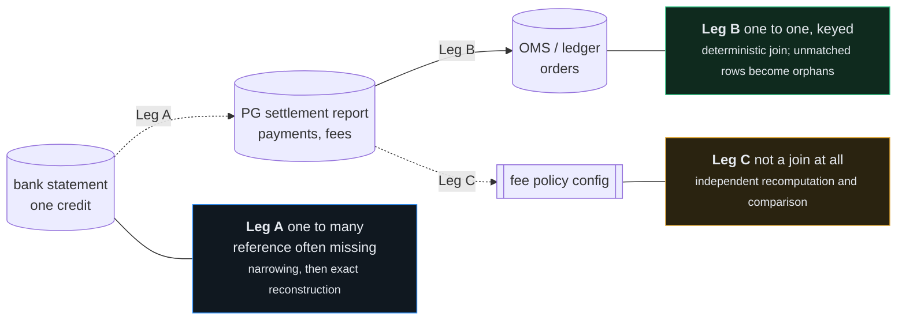

# Design notes

The README says what Manhattan does. This says why it is shaped the way it is, what was rejected, and what changed once the thing was actually running.

---

## Contents

1. [Data modes, and why they decide everything](#1-data-modes-and-why-they-decide-everything)
2. [The three reconciliation legs](#2-the-three-reconciliation-legs)
3. [Rounding: the two ways to get it wrong](#3-rounding-the-two-ways-to-get-it-wrong)
4. [Rejected alternatives](#4-rejected-alternatives)
5. [What running it changed](#5-what-running-it-changed)
6. [Trust boundary, stated as a contract](#6-trust-boundary-stated-as-a-contract)
7. [What was cut, and why](#7-what-was-cut-and-why)

---

## 1. Data modes, and why they decide everything

How much of the gateway's own report is available determines whether the solver is needed at all, and separately whether the fee check carries any information. Conflating those two questions is the most common way this kind of system ends up reporting assurance it does not have.

| Mode | Available | Leg A, bank credit to batch | Leg C, fee check |
|---|---|---|---|
| 1 · full report, mapping trusted | payments, fees, `settlement_id → payment_id` | a lookup; the solver is idle | independent |
| 2 · report present, mapping withheld | payments and fees, no trusted mapping | **the solver is required** | **independent** |
| 3 · lump credit only | a bank credit and the merchant's own orders | the solver is required | **circular** |

**Mode 2 is the demo posture**, and it is the only configuration in which the solver is genuinely necessary *and* the fee check is genuinely independent. It is also realistic: a bank credit whose narration carries no usable settlement reference, a merchant reconciling their own OMS, a multi-gateway merchant where one aggregator ships a mapping and another ships a net figure.

The mode is not a free choice made by the caller. `pipeline.New` derives it from the dataset, so it is impossible to accidentally configure a circular fee check into apparent independence:

```go
cfg.Accounting.UseObservedFees = ds.Mode.FeesObserved()
```

That one line is doing more work than it looks. In modes 1 and 2 contributions follow the observed fee rows, because those are what actually came out of the bank credit, and the policy figure is then a genuinely independent second opinion. In mode 3 contributions are necessarily policy-derived, the fee comparison becomes the policy compared against itself, and the system emits `FEE_CHECK_CIRCULAR` and makes no anomaly claim.

Without that split, a settlement could never both reconstruct exactly *and* carry a fee anomaly, which is precisely the case the detector exists for.

---

## 2. The three reconciliation legs

"Multi-source" means several files and three joins of quite different character.



Leg B is easy and was built first, because it is quick to get right and it produces the gross amounts Leg A needs. Leg A is where the interesting work is. Leg C is a secondary finding and the README is deliberately blunt that *detecting* fee drift does not require the solver at all; what the solver adds is attribution.

Note the dependency that is easy to miss: **Leg A exists precisely when Leg C's preferred input is missing.** A design that ignores that will contradict itself, which is why the mode table above comes first.

---

## 3. Rounding: the two ways to get it wrong

MDR is rounded to paise, then GST on the rounded MDR is rounded again. Where the convention is declared, every contribution is an exact integer and the tolerance is zero. Where it is not, each contribution becomes an interval and a tolerance is unavoidable.

There are two failure modes and they are symmetric.

**Demand exact equality with zero tolerance.** Matches nothing on realistic data, because per-transaction rounding across a large batch accumulates a few hundred paise of drift.

**Allow a band of `n · δ` across the whole pool.** Matches everything, which is worse. A 400-candidate pool gives a 400-paise band, inside which essentially every value is reachable, so inferred mode returns `AMBIGUOUS` on everything above trivial pool sizes and the system looks careful while being useless.

The bug in the second is that **only items inside the witness accumulate drift**, not every item in the pool. The correct band is `|S| · δ`.

In a dynamic-programming design that requires an entire second cardinality-tracked pass. Here it requires nothing at all, because every enumerated entry already carries its own cardinality, since cardinality is what the enumeration is indexed by:

```
accept the pairing of a left entry at cardinality c_L with a right entry at c_R
exactly when   | (s_L + s_R) − T |  ≤  (c_L + c_R) · δ
```

which is a range query on an already-sorted array. Since the exact probe *is* a range query, exact matching is simply the case `δ = 0`. Inferred mode is not a second algorithm, it is a wider window on the same call.

**One subtlety, and it was a real bug.** On the complement probe the enumerated cardinality is that of the *excluded* set, so the band must be scaled by `n − |C|` rather than by `|C|`. Applying the excluded set's own cardinality silently under-widens the band for exactly the large-batch settlements the complement probe exists to solve. The failure presents as a clean `UNRESOLVED` rather than as a crash, which is why it was caught by a brute-force oracle and not by reading the code.

---

## 4. Rejected alternatives

### Bitset dynamic programming over the value range

The obvious first choice, and wrong here for four separate reasons.

The array must span the pool's positive and negative mass, which for a realistic 52-record pool is roughly 68 million bits. It needs one shift-and-or pass per item, then a checkpointed backtrack to recover the witness, then a **separate uniqueness sweep of up to `n` re-solves, each a full solve**. That sweep dominates: the reachability pass alone is competitive, and the proof it still owes costs `n` times as much again.

Worse, it breaks on signed items in two specific ways. The bitset cannot be truncated at the target, because a partial sum that overshoots can come back. And the standard uniqueness shortcut, *a proper superset of S would exceed T so only exclusions need testing*, is simply false once an item is negative. Any uniqueness procedure built on it reports a false unique on exactly the batches that contain a chargeback, which is the worst possible place to be wrong.

Its memory also grows with pool *mass*, so it gets worse for a high-value merchant with no gain in what it can prove.

### FFT and generating-function convolution

Bringmann's Õ(n+t) and Koiliaris and Xu's deterministic Õ(√n·t) both beat meet-in-the-middle asymptotically. Both are also indifferent to `k`, both need gigabyte-scale padded arrays at paise granularity, and both compute *reachability*, so uniqueness would still have to be bolted on afterwards. Crossover in the operating regime never arrives.

The general point is worth stating: **the constraint that makes this problem solvable is the cardinality, not the value range.** Choosing the primitive that exploits the constraint you actually proved is a better decision than importing the one with the better headline complexity.

### Re-running the solver for the completeness probe

The natural way to test narrowing sensitivity is to widen the pool and solve again at some reduced cardinality bound. It does not work, and the reason is a genuine conceptual trap.

**Substitution depth and free cardinality are different quantities.** A rival differing from the witness by a single record still has free cardinality `min(|S'|, |P'| − |S'|)`, which for a six-record witness in a fifty-six-record pool is six, not one. A probe restricted to `k_max = 3` searches `{S : k(S) ≤ 3}` and never reaches it. The guard would be silently unable to fire on precisely the case it exists for, and a probe that cannot reach the rival looks identical to a probe that found none.

The neighbourhood formulation is indexed by depth directly, so it is cardinality-agnostic. It finds a one-record substitution in a six-record witness and in a three-hundred-record witness at the same cost, and it costs less than the broken version did.

### An embedding index for the question-answering agent

Considered and not built. The corpus is small, highly structured, and the questions are about categories the receipts already carry as fields. Keyword and status scoring gets the same answers with less machinery, and five aggregate question shapes are answered by querying the store directly without a model at all.

---

## 5. What running it changed

Five things in this system are different from the original design, and every one was found by running it rather than by reasoning about it. They are listed here because the difference between a design and a system is exactly this list.

### Zero-contribution records

A UPI payment carries no MDR under Indian regulation, so a UPI payment refunded in full before settlement nets to *precisely zero*. A single such record destroys uniqueness outright: any witness plus or minus a zero has an identical sum. Two give four reconstructions, three give eight, every one arithmetically perfect and differing only in membership, which is exactly what a ledger posting cares about.

This was not in the design. It presented as unexplained rival witnesses in two adversarial cases, and brute-force enumeration confirmed the rivals were real. Such records are now removed before the search, named individually on the receipt, and reconciled against the declared count as *witness plus zeros*.

### The neighbourhood probe's multiple-comparisons problem

The probe searches for a coincidence, so it has a multiple-comparisons problem, and a severe one. At depth two, a witness of size `|S|` against `m` spare records compares roughly `|S|² m² / 4` pairs. For a six-record witness that is about forty thousand and a chance collision is negligible. For a 138-record witness it is over 10⁸ and a chance collision is a near certainty.

Before this was noticed the probe fired on **every** large batch, which would have held every large settlement for review forever. A guard that fires on a coincidence it was always going to find is not a guard.

It now estimates its own expected chance collisions using the same collision-index reasoning the feasibility gate uses, reduces depth until that is small, and reports itself `inconclusive` rather than `stable` when even depth one cannot distinguish. The guard is held to the same honesty standard as the gate.

### The collision index was wrong by an order of magnitude

The closed form assumes subset sums are locally uniform near the target, with a density read off a moment-matched normal. Real ticket amounts are close to lognormal, and a sum of three of those is nothing like a normal distribution in its body.

Measured on a 313-record travel pool at `k = 3`: the closed form predicted **0.38** rivals, brute force found **three**, on all sixty seeds tried. Not sampling noise.

The density is now measured by sampling subset sums from the actual pool. Validated against exhaustive enumeration: mean absolute log-ratio 0.09 against the analytic form's 0.72. Both numbers ride on every receipt, because the published model and what the pool actually does disagree, and hiding that would be the failure this project argues against.

### The gross-ratio guard was a duplicate

It compared the witness's implied fee rate against *policy*, which made it a second copy of the fee anomaly detector. The consequence was that a merchant whose gateway genuinely overcharges failed a completeness check and could not post at all, conflating the two questions the whole design insists on separating.

It now compares against the rate prevailing across the pool the witness was drawn from. A uniform drift cancels out, and the guard asks what it is actually for: does this subset look like it came from this population, or was it assembled by coincidence?

### Narrowing geometry

The window was centred on the capture day's midnight and widened by 36 hours, which swept in most of both adjacent capture days and roughly tripled the candidate pool. Since the collision index grows like `C(n, k)`, tripling `n` moved almost every settlement from verifiable to ambiguous: **0 of 25 verified**. Centring on the capture day's midpoint with a 14-hour half-width takes it to 16 of 25, with zero wrong postings.

Narrowing geometry is not a detail. It is the single largest determinant of how many settlements can be verified at all.

---

## 6. Trust boundary, stated as a contract

The boundary is enforced by the type system, not by discipline. `llm.Provider` has exactly one method that produces output, and it returns a schema-validated object:

```go
type Provider interface {
    Name() string
    Model(Role) string
    Structured(ctx context.Context, req Request) (*Result, error)
}
```

Note what is absent: no `Complete`, no `Chat`, no method returning a string. Adding one would create a path by which model output could reach a posting decision without passing through a schema.

| The model may | It may never |
|---|---|
| read a narration into typed fields | decide that a reconstruction is correct |
| name the class of event behind a residual | supply the citation that justifies its own hypothesis |
| reorder which constraints to relax | add a constraint, remove one, or change what any does |
| answer questions from stored receipts | re-run a reconciliation or change a status |
| render a verified derivation into English | source a fact it renders |

Three properties make this testable rather than merely asserted.

**Hypotheses are executable data, not hints.** An overlay is a concrete edit to the pool or the target. The entire gate, solver, completeness and recomputation stack then runs over the edited inputs completely unchanged.

**The citation search is deterministic and is not the model's to make.** The agent contributes the judgement about what *class* of event to look for; the system contributes the evidence that such an event occurred, and tries every candidate of that class against the verifier rather than only the one whose amount the model guessed. Letting the model supply the citation too would collapse the two.

**An uncited hypothesis can never post**, however well the arithmetic closes. Its best outcome is an exception routed to review with a named, arithmetically consistent suggestion.

The strongest evidence is that **the entire eleven-case suite passes on a deliberately unintelligent offline stub** that proposes from a fixed list in a fixed order. Proposer quality changes recall. It cannot change correctness.

---

## 7. What was cut, and why

**The escalation ladder.** Climbing `k_max` through 2, 4, `k*` would find small-`|S|` answers sooner. But the enumeration at `k*` already contains every entry at every lower cardinality, so nothing is missed by dispatching straight to `k*`. It is a latency optimisation worth roughly a factor of two on easy settlements and it buys no additional correctness, so it waits until the correctness surface is finished.

**Probabilistic residual matching.** Fellegi and Sunter with EM for calibrated, label-free match weights, plus distribution-free risk control on any probabilistic path, are both well motivated and both out of scope.

The deterministic path needs no statistical gate, because a closed integer identity is not a probabilistic claim. Those techniques govern the *residual*, and after this design the residual is large, measured, and segmented by merchant archetype, because `UNDERDETERMINED` is now an explicit population with a known shape rather than a hidden one.

A calibrated probabilistic layer over the `UNDERDETERMINED` and `AMBIGUOUS` buckets, with a distribution-free error guarantee, is the obvious next thing to build. Being able to name what was left out, why, and exactly which population it would serve is worth more than a diagram with eight techniques on it.

**Per-role model tiering.** The interface supports pointing the high-volume parse role at a smaller model, and the field exists so the decision can be made deliberately. It is not made silently on an operator's behalf: a misread narration produces a pool for the wrong merchant, and that is not a place to economise by default.
