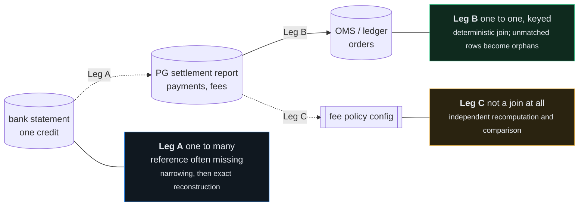
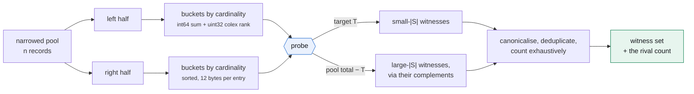
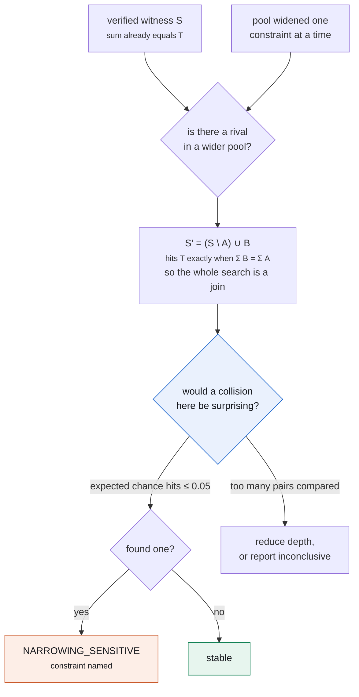
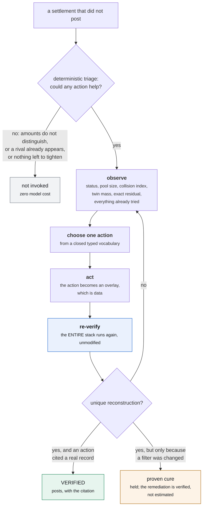
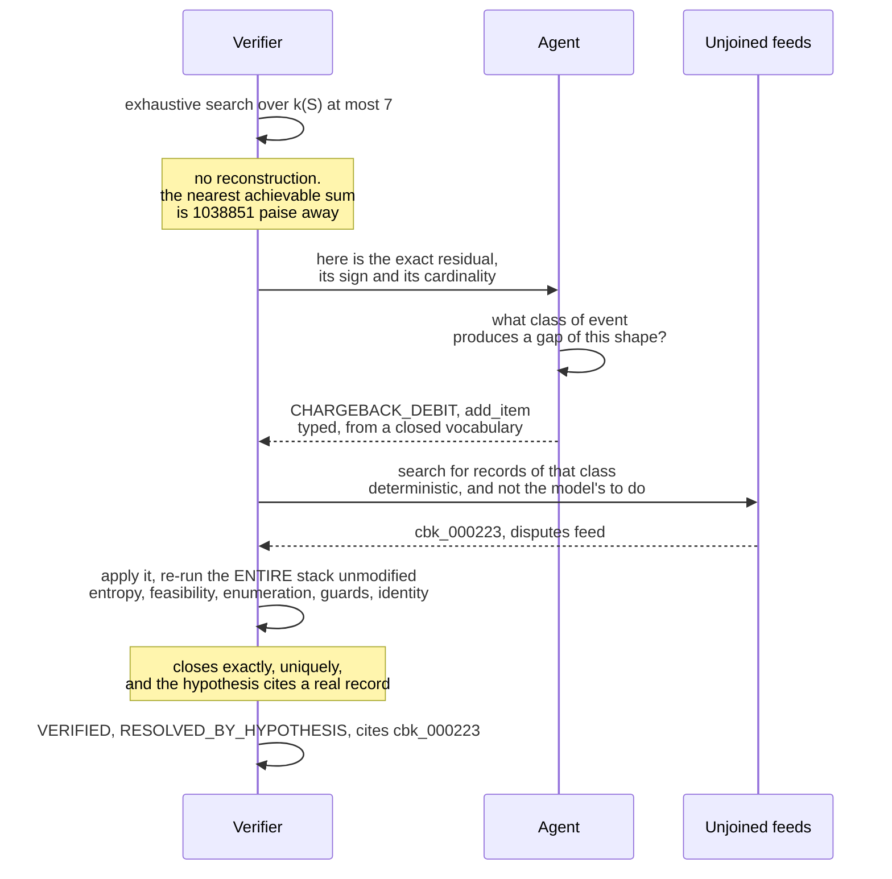

# Design notes

The README says what Manhattan does. This says why it is shaped the way it is, what was rejected, and what changed once the thing was actually running.

---

## Contents

1. [Data modes, and why they decide everything](#1-data-modes-and-why-they-decide-everything)
2. [The three reconciliation legs](#2-the-three-reconciliation-legs)
3. [Rounding: the two ways to get it wrong](#3-rounding-the-two-ways-to-get-it-wrong)
4. [Rejected alternatives](#4-rejected-alternatives)
5. [What running it changed](#5-what-running-it-changed)
6. [Trust boundary, stated as a contract](#6-trust-boundary-stated-as-a-contract)
7. [What was cut, and why](#7-what-was-cut-and-why)

---

## 1. Data modes, and why they decide everything

How much of the gateway's own report is available determines whether the solver is needed at all, and separately whether the fee check carries any information. Conflating those two questions is the most common way this kind of system ends up reporting assurance it does not have.

| Mode | Available | Leg A, bank credit to batch | Leg C, fee check |
|---|---|---|---|
| 1 · full report, mapping trusted | payments, fees, `settlement_id → payment_id` | a lookup; the solver is idle | independent |
| 2 · report present, mapping withheld | payments and fees, no trusted mapping | **the solver is required** | **independent** |
| 3 · lump credit only | a bank credit and the merchant's own orders | the solver is required | **circular** |

**Mode 2 is the demo posture**, and it is the only configuration in which the solver is genuinely necessary *and* the fee check is genuinely independent. It is also realistic: a bank credit whose narration carries no usable settlement reference, a merchant reconciling their own OMS, a multi-gateway merchant where one aggregator ships a mapping and another ships a net figure.

The mode is not a free choice made by the caller. `pipeline.New` derives it from the dataset, so it is impossible to accidentally configure a circular fee check into apparent independence:

```go
cfg.Accounting.UseObservedFees = ds.Mode.FeesObserved()
```

That one line is doing more work than it looks. In modes 1 and 2 contributions follow the observed fee rows, because those are what actually came out of the bank credit, and the policy figure is then a genuinely independent second opinion. In mode 3 contributions are necessarily policy-derived, the fee comparison becomes the policy compared against itself, and the system emits `FEE_CHECK_CIRCULAR` and makes no anomaly claim.

Without that split, a settlement could never both reconstruct exactly *and* carry a fee anomaly, which is precisely the case the detector exists for.

---

## 2. The three reconciliation legs

"Multi-source" means several files and three joins of quite different character.



Leg B is easy and was built first, because it is quick to get right and it produces the gross amounts Leg A needs. Leg A is where the interesting work is. Leg C is a secondary finding and the README is deliberately blunt that *detecting* fee drift does not require the solver at all; what the solver adds is attribution.

Note the dependency that is easy to miss: **Leg A exists precisely when Leg C's preferred input is missing.** A design that ignores that will contradict itself, which is why the mode table above comes first.

---

## 3. Rounding: the two ways to get it wrong

MDR is rounded to paise, then GST on the rounded MDR is rounded again. Where the convention is declared, every contribution is an exact integer and the tolerance is zero. Where it is not, each contribution becomes an interval and a tolerance is unavoidable.

There are two failure modes and they are symmetric.

**Demand exact equality with zero tolerance.** Matches nothing on realistic data, because per-transaction rounding across a large batch accumulates a few hundred paise of drift.

**Allow a band of `n · δ` across the whole pool.** Matches everything, which is worse. A 400-candidate pool gives a 400-paise band, inside which essentially every value is reachable, so inferred mode returns `AMBIGUOUS` on everything above trivial pool sizes and the system looks careful while being useless.

The bug in the second is that **only items inside the witness accumulate drift**, not every item in the pool. The correct band is `|S| · δ`.

In a dynamic-programming design that requires an entire second cardinality-tracked pass. Here it requires nothing at all, because every enumerated entry already carries its own cardinality, since cardinality is what the enumeration is indexed by:

```
accept the pairing of a left entry at cardinality c_L with a right entry at c_R
exactly when   | (s_L + s_R) − T |  ≤  (c_L + c_R) · δ
```

which is a range query on an already-sorted array. Since the exact probe *is* a range query, exact matching is simply the case `δ = 0`. Inferred mode is not a second algorithm, it is a wider window on the same call.

**One subtlety, and it was a real bug.** On the complement probe the enumerated cardinality is that of the *excluded* set, so the band must be scaled by `n − |C|` rather than by `|C|`. Applying the excluded set's own cardinality silently under-widens the band for exactly the large-batch settlements the complement probe exists to solve. The failure presents as a clean `UNRESOLVED` rather than as a crash, which is why it was caught by a brute-force oracle and not by reading the code.

---

## 4. Rejected alternatives

### Bitset dynamic programming over the value range

The obvious first choice, and wrong here for four separate reasons.

The array must span the pool's positive and negative mass, which for a realistic 52-record pool is roughly 68 million bits. It needs one shift-and-or pass per item, then a checkpointed backtrack to recover the witness, then a **separate uniqueness sweep of up to `n` re-solves, each a full solve**. That sweep dominates: the reachability pass alone is competitive, and the proof it still owes costs `n` times as much again.

Worse, it breaks on signed items in two specific ways. The bitset cannot be truncated at the target, because a partial sum that overshoots can come back. And the standard uniqueness shortcut, *a proper superset of S would exceed T so only exclusions need testing*, is simply false once an item is negative. Any uniqueness procedure built on it reports a false unique on exactly the batches that contain a chargeback, which is the worst possible place to be wrong.

Its memory also grows with pool *mass*, so it gets worse for a high-value merchant with no gain in what it can prove.

### FFT and generating-function convolution

Bringmann's Õ(n+t) and Koiliaris and Xu's deterministic Õ(√n·t) both beat meet-in-the-middle asymptotically. Both are also indifferent to `k`, both need gigabyte-scale padded arrays at paise granularity, and both compute *reachability*, so uniqueness would still have to be bolted on afterwards. Crossover in the operating regime never arrives.

The general point is worth stating: **the constraint that makes this problem solvable is the cardinality, not the value range.** Choosing the primitive that exploits the constraint you actually proved is a better decision than importing the one with the better headline complexity.

### Re-running the solver for the completeness probe

The natural way to test narrowing sensitivity is to widen the pool and solve again at some reduced cardinality bound. It does not work, and the reason is a genuine conceptual trap.

**Substitution depth and free cardinality are different quantities.** A rival differing from the witness by a single record still has free cardinality `min(|S'|, |P'| − |S'|)`, which for a six-record witness in a fifty-six-record pool is six, not one. A probe restricted to `k_max = 3` searches `{S : k(S) ≤ 3}` and never reaches it. The guard would be silently unable to fire on precisely the case it exists for, and a probe that cannot reach the rival looks identical to a probe that found none.

The neighbourhood formulation is indexed by depth directly, so it is cardinality-agnostic. It finds a one-record substitution in a six-record witness and in a three-hundred-record witness at the same cost, and it costs less than the broken version did.

### An embedding index for the question-answering agent

Considered and not built. The corpus is small, highly structured, and the questions are about categories the receipts already carry as fields. Keyword and status scoring gets the same answers with less machinery, and five aggregate question shapes are answered by querying the store directly without a model at all.

---

## 5. What running it changed

Five things in this system are different from the original design, and every one was found by running it rather than by reasoning about it. They are listed here because the difference between a design and a system is exactly this list.

### Zero-contribution records

A UPI payment carries no MDR under Indian regulation, so a UPI payment refunded in full before settlement nets to *precisely zero*. A single such record destroys uniqueness outright: any witness plus or minus a zero has an identical sum. Two give four reconstructions, three give eight, every one arithmetically perfect and differing only in membership, which is exactly what a ledger posting cares about.

This was not in the design. It presented as unexplained rival witnesses in two adversarial cases, and brute-force enumeration confirmed the rivals were real. Such records are now removed before the search, named individually on the receipt, and reconciled against the declared count as *witness plus zeros*.

### The neighbourhood probe's multiple-comparisons problem

The probe searches for a coincidence, so it has a multiple-comparisons problem, and a severe one. At depth two, a witness of size `|S|` against `m` spare records compares roughly `|S|² m² / 4` pairs. For a six-record witness that is about forty thousand and a chance collision is negligible. For a 138-record witness it is over 10⁸ and a chance collision is a near certainty.

Before this was noticed the probe fired on **every** large batch, which would have held every large settlement for review forever. A guard that fires on a coincidence it was always going to find is not a guard.

It now estimates its own expected chance collisions using the same collision-index reasoning the feasibility gate uses, reduces depth until that is small, and reports itself `inconclusive` rather than `stable` when even depth one cannot distinguish. The guard is held to the same honesty standard as the gate.

### The collision index was wrong by an order of magnitude

The closed form assumes subset sums are locally uniform near the target, with a density read off a moment-matched normal. Real ticket amounts are close to lognormal, and a sum of three of those is nothing like a normal distribution in its body.

Measured on a 313-record travel pool at `k = 3`: the closed form predicted **0.38** rivals, brute force found **three**, on all sixty seeds tried. Not sampling noise.

The density is now measured by sampling subset sums from the actual pool. Validated against exhaustive enumeration: mean absolute log-ratio 0.09 against the analytic form's 0.72. Both numbers ride on every receipt, because the published model and what the pool actually does disagree, and hiding that would be the failure this project argues against.

### The gross-ratio guard was a duplicate

It compared the witness's implied fee rate against *policy*, which made it a second copy of the fee anomaly detector. The consequence was that a merchant whose gateway genuinely overcharges failed a completeness check and could not post at all, conflating the two questions the whole design insists on separating.

It now compares against the rate prevailing across the pool the witness was drawn from. A uniform drift cancels out, and the guard asks what it is actually for: does this subset look like it came from this population, or was it assembled by coincidence?

### Narrowing geometry

The window was centred on the capture day's midnight and widened by 36 hours, which swept in most of both adjacent capture days and roughly tripled the candidate pool. Since the collision index grows like `C(n, k)`, tripling `n` moved almost every settlement from verifiable to ambiguous: **0 of 25 verified**. Centring on the capture day's midpoint with a 14-hour half-width takes it to 16 of 25, with zero wrong postings.

Narrowing geometry is not a detail. It is the single largest determinant of how many settlements can be verified at all.

---

## 6. Trust boundary, stated as a contract

The boundary is enforced by the type system, not by discipline. `llm.Provider` has exactly one method that produces output, and it returns a schema-validated object:

```go
type Provider interface {
    Name() string
    Model(Role) string
    Structured(ctx context.Context, req Request) (*Result, error)
}
```

Note what is absent: no `Complete`, no `Chat`, no method returning a string. Adding one would create a path by which model output could reach a posting decision without passing through a schema.

| The model may | It may never |
|---|---|
| read a narration into typed fields | decide that a reconstruction is correct |
| name the class of event behind a residual | supply the citation that justifies its own hypothesis |
| reorder which constraints to relax | add a constraint, remove one, or change what any does |
| answer questions from stored receipts | re-run a reconciliation or change a status |
| render a verified derivation into English | source a fact it renders |

Three properties make this testable rather than merely asserted.

**Hypotheses are executable data, not hints.** An overlay is a concrete edit to the pool or the target. The entire gate, solver, completeness and recomputation stack then runs over the edited inputs completely unchanged.

**The citation search is deterministic and is not the model's to make.** The agent contributes the judgement about what *class* of event to look for; the system contributes the evidence that such an event occurred, and tries every candidate of that class against the verifier rather than only the one whose amount the model guessed. Letting the model supply the citation too would collapse the two.

**An uncited hypothesis can never post**, however well the arithmetic closes. Its best outcome is an exception routed to review with a named, arithmetically consistent suggestion.

The strongest evidence is that **the entire eleven-case suite passes on a deliberately unintelligent offline stub** that proposes from a fixed list in a fixed order. Proposer quality changes recall. It cannot change correctness.

---

## 7. What was cut, and why

**The escalation ladder.** Climbing `k_max` through 2, 4, `k*` would find small-`|S|` answers sooner. But the enumeration at `k*` already contains every entry at every lower cardinality, so nothing is missed by dispatching straight to `k*`. It is a latency optimisation worth roughly a factor of two on easy settlements and it buys no additional correctness, so it waits until the correctness surface is finished.

**Probabilistic residual matching.** Fellegi and Sunter with EM for calibrated, label-free match weights, plus distribution-free risk control on any probabilistic path, are both well motivated and both out of scope.

The deterministic path needs no statistical gate, because a closed integer identity is not a probabilistic claim. Those techniques govern the *residual*, and after this design the residual is large, measured, and segmented by merchant archetype, because `UNDERDETERMINED` is now an explicit population with a known shape rather than a hidden one.

A calibrated probabilistic layer over the `UNDERDETERMINED` and `AMBIGUOUS` buckets, with a distribution-free error guarantee, is the obvious next thing to build. Being able to name what was left out, why, and exactly which population it would serve is worth more than a diagram with eight techniques on it.

**Per-role model tiering.** The interface supports pointing the high-volume parse role at a smaller model, and the field exists so the decision can be made deliberately. It is not made silently on an operator's behalf: a misread narration produces a pool for the wrong merchant, and that is not a place to economise by default.

---

# Appendix: the parts moved out of the README

These three sections and the reference list lived in the README until it grew
past the length a judge will read. They are the derivations behind the claims
the README makes, and nothing in them has been shortened.

---

## Why the solver is the shape it is

Reconstruction is subset sum, which is NP-complete in the number of items, so everything depends on which escape hatch is taken.

The binding constraint here is not the value range. It is the **cardinality**. Define free cardinality:

```
k(S) = min(|S|, n − |S|)
```

A 312-transaction batch drawn from a 315-record pool is almost the entire pool, so `k = 3`. A 6-transaction batch from a 52-record pool has `k = 6`. The feasibility gate establishes that uniqueness is only attainable when `k` is small, roughly 3 to 7 for realistic pools.

A pseudopolynomial dynamic program over the value range is indifferent to `k`. It costs the same whether the answer has 3 items or 300, which means it spends its entire budget in a dimension the problem does not vary along and none in the dimension that decides everything.

**Manhattan dispatches on `k` and uses cardinality-restricted meet-in-the-middle.** Split the pool, enumerate every subset of each half up to cardinality `k*`, bucket by cardinality, sort each bucket, then range-query.



Four properties follow, and together they are why this is the right primitive.

**Uniqueness is the search, not a sweep after it.** The probe returns every match, so `count == 1` *is* the proof. There is no exclusion sweep, no forced-inclusion sweep, no re-solve budget, and therefore no way for the proof to be abandoned half-finished. `count >= 2` is `AMBIGUOUS` with both rivals already in hand.

**Sign is irrelevant.** Sums are integers and integers sort. Chargebacks need no special case, no window derivation, no positivity certificate. A truncating bitset DP needs all three, and the standard uniqueness shortcut ("a proper superset of S would exceed T") is simply false once an item is negative, so any uniqueness procedure that tests only exclusions reports a false unique on exactly the batches that contain a chargeback. The sign model stays *accountingly* essential while becoming *computationally* irrelevant.

**Cardinality is native.** The inferred-mode rounding band, the declared-count cross-check and the complement's size all read straight off the enumeration.

**Witness and complement come from one enumeration.** Probing for `T` finds small-`|S|` answers; probing for `Σpool − T` finds large-`|S|` ones as their complements. Both sides for about 1.1× the cost of one, with no need to guess in advance which is smaller.

### Measured envelope

Predicted from the cost model and measured on the same run, in
[RESULTS.md](../RESULTS.md#resource-envelope-modelled-against-measured). Every
timing there includes the uniqueness proof; these are not solve times with a
proof still owed.

Cost tracks `k`, not `n`. A 100-record pool is more expensive than a 320-record
pool, because the gate permits `k = 5` at 100 and only `k = 3` at 320. That
inversion is the signature of an algorithm matched to the constraint that
actually binds.

**Not implemented, and why.** Bringmann's Õ(n+t) and Koiliaris and Xu's deterministic Õ(√n·t) both beat this asymptotically. Both are also indifferent to `k`, both need gigabyte-scale padded arrays at paise granularity, and both compute *reachability*, so uniqueness would still have to be bolted on afterwards. The constraint that makes this problem solvable is the cardinality, not the value range, and choosing the primitive that exploits the constraint you actually proved is a better decision than importing the one with the better headline complexity.

---

---

## The gate that keeps it honest

Uniqueness is not something to hope for. It is a function of how many candidate subsets exist relative to how many distinct sums they can produce, and both are computable from the pool before any search.

The number of subsets at free cardinality `k` is `C(n, k)`. Their sums concentrate into a distribution with some local density near the target. The expected number of subsets colliding at any one target is the **collision index**:

```
E  ≈  C(n, k) · d / (σ · √(2πk))          d = lattice spacing, σ = contribution spread
```

Read the values honestly and they say something uncomfortable: **verification by reconstruction is only decisive when narrowing leaves an excess of roughly three to seven records over the true batch.** Beyond that, uniqueness is not merely expensive to establish, it does not exist. So the gate does not pretend, and it does not merely triage: `k*`, the largest cardinality still inside the threshold, is the parameter the solver is dispatched on. **The boundary the gate accepts and the region the solver searches are the same boundary.**

### Two estimators, and a finding

The closed form assumes subset sums are locally uniform near the target, with a density read off a moment-matched normal. On realistic data that is measurably wrong.

Real ticket amounts are close to lognormal: most transactions small, a thin tail very large. A sum of three of those is nothing like a normal distribution in its body. Measured on a 313-record travel pool at `k = 3`, the closed form predicted **0.38** rival reconstructions; brute-force enumeration found **three**, on every one of sixty seeds tried. That is not sampling noise, it is the wrong model.

The direction of the error is the saving grace and it was designed for: an index that is too low makes the gate accept a slightly larger region, and the exhaustive count inside that region finds the rivals anyway. Precision is untouched; the cost is recall. But a gate off by an order of magnitude is a poor gate, so Manhattan now **measures** the density by sampling subset sums from the actual pool instead of assuming it. Validated against exhaustive enumeration on a lognormal pool:

| estimator | mean absolute log-ratio, single lognormal pool |
|---|---:|
| measured, by sampling the pool | **0.09** |
| analytic, moment-matched normal | 0.72 |

Those two figures describe **one lognormal pool**, the fixture in
`internal/feasibility/empirical_test.go`, checked against exhaustive
enumeration of every 3-subset. They are not the swept result. The figure across
every configuration in the calibration sweep is in
[RESULTS.md](../RESULTS.md), it is larger for both estimators because the sweep
includes regimes neither model was built for, and the ordering is what the
claim rests on: the sampled estimator is closer to the counted truth than the
closed form is, everywhere it has been measured.

Both numbers are carried on every receipt. Where the published model and the
actual pool disagree, the receipt shows the disagreement rather than quietly
picking a winner.

### Before the index: structural refusals

Two properties make uniqueness impossible outright, and both are detectable in `O(n log n)`, which is less time than it takes to allocate the enumeration they would have wasted.

**Twin classes.** If a witness contains a proper subset of a class of identical contributions, swapping a member in for a member out produces a distinct witness with an identical sum. Ambiguity is then *proved by construction*, in linear time, with the rival exhibited. Above 30% twin mass the pool is refused before anything is enumerated. This is the honest answer for a subscription merchant with two hundred identical ₹499 charges: those settlements are genuinely not reconstructable from amounts, and saying so in eleven milliseconds is more useful than saying so slowly.

**Zero-contribution records.** A UPI payment carries zero MDR under Indian regulation, so a UPI payment refunded in full before settlement nets to *precisely nothing*: gross in, gross out, no fee retained. A single such record destroys uniqueness outright, because any witness plus or minus a zero has the same sum. Two give four reconstructions, three give eight, every one arithmetically perfect and differing only in membership, which is exactly what a ledger posting cares about. They are removed before the search, named individually on the receipt, and reconciled against the declared count as *witness plus zeros*.

This one was not in the original design. It was found by running the thing.

---

---

## The failure nobody demos

Suppose narrowing is slightly too aggressive and drops a record that genuinely belonged to the batch. The true witness is now unavailable, but the surviving pool happens to contain some *other* subset that sums to the target. The system returns a unique witness, the identity closes, and it posts a confidently wrong answer **with a proof attached**. That is strictly worse than an exception, because the audit trail lends it credibility.

This is adversarial case 10, and it is what the demo opens with.



Two things about this guard are worth stating.

**It is indexed by substitution depth, not by cardinality.** Re-running the solver over the widened pool at a reduced cardinality bound does not work, and the reason is easy to get wrong: a rival differing from `S` by a single record still has free cardinality `min(|S'|, |P'| − |S'|)`, which for a six-record witness in a fifty-six-record pool is six, not one. A cardinality-restricted probe never reaches it, so the guard would be silently unable to fire on precisely the case it exists for.

**It estimates its own false-positive rate first.** The probe searches for a coincidence, so it has a multiple-comparisons problem, and a severe one. At depth two, a witness of size `|S|` against `m` spare records compares roughly `|S|²m²/4` pairs. For a six-record witness that is about forty thousand and a chance collision is negligible; for a 138-record witness it is over 10⁸ and a chance collision is a near certainty. A guard that fires on a coincidence it was always going to find is not a guard, it is a false-alarm generator, and it would hold every large batch for review forever. So the probe computes its expected chance collisions, reduces depth until that is small, and reports itself **inconclusive** rather than *stable* when even depth one cannot distinguish. Same honesty standard as the gate.

This was also found by running it: before the fix, the probe was firing on every large batch.

---

---

## References

1. Horowitz, E. and Sahni, S. (1974). *Computing Partitions with Applications to the Knapsack Problem.* JACM 21(2), 277–292. The meet-in-the-middle construction. **This is the primitive shipped here**, restricted by cardinality and extended to exhaustive match counting.
2. Bringmann, K. (2017). *A Near-Linear Pseudopolynomial Time Algorithm for Subset Sum.* SODA 2017. Cited and deliberately not implemented; see the solver section.
3. Koiliaris, K. and Xu, C. (2019). *A Faster Pseudopolynomial Time Algorithm for Subset Sum.* ACM Trans. Algorithms 15(3). Same reasoning: it computes reachability, leaving uniqueness still owed.
4. Ye, X., Chen, Q., Dillig, I. and Durrett, G. (2023). *SatLM: Satisfiability-Aided Language Models Using Declarative Prompting.* NeurIPS 2023. Let the model parse and propose, let the solver decide. The pattern this follows.
5. Razorpay Docs, *Settlements Webhook Events* and *Settlement Recon API*. Establishes that settlement amounts are reported in paise, which is what makes exact integer arithmetic legitimate, and that the UTR is issued by the banking partner rather than by Razorpay, which is why `settlement_id` and not the UTR is the correct join key against a bank credit.
6. Razorpay Blog, *Optimizer Single View Reconciliation.* Directly relevant to the anticipated question above.

Deferred, and cited in `LIMITATIONS.md` as the intended next layer over the `UNDERDETERMINED` population: Fellegi and Sunter (1969); Winkler (1988); Bates et al. (2021), *Distribution-Free Risk-Controlling Prediction Sets*; Angelopoulos et al. (2021), *Learn then Test*.

---

# Appendix: the agent loop and the receipt

Moved out of the README when it was cut to the length a judge will read.

## The loop, as a diagram



The loop is bounded at four iterations, three hypotheses each, five citation
candidates apiece. There is no unbounded agent loop anywhere in this system.

## The loop closed end to end, as a sequence

Adversarial case 9. A chargeback exists in a disputes feed nobody wired into the
candidate pool, so nothing reconstructs the credit.



**The posting rule is the whole safety argument.** A hypothesis citing a real
record in a real feed can yield `VERIFIED` with the citation attached. A
hypothesis with no source reference is speculative and can never produce a
posting under any circumstances, however well the arithmetic closes. Its best
outcome is an exception routed to review with a named, arithmetically consistent
suggestion, which is a real improvement over a bare residual and still not a
decision.

## The receipt

Every decision emits one, including every refusal. It is the audit trail, it is
replayable, and it is what the question-answering agent reads.

```json
{
  "settlement_ref": "bank_credit_2026_08_26_1042",
  "status": "VERIFIED",
  "flags": ["SIGNED_ITEMS_PRESENT"],
  "data_mode": "report_present_mapping_withheld",
  "target_paise": 48638155,

  "pool": { "n": 34, "contribution_sigma_paise": 3310000, "signed_items": 1 },

  "amount_entropy": {
    "distinct_contribution_values": 34, "twin_classes": 0,
    "twin_mass": 0.0, "twin_mass_threshold": 0.30,
    "lattice_gcd_paise": 1, "pass": true
  },

  "feasibility": {
    "k_star": 7,
    "collision_index_at_k_star": 0.087,
    "collision_index_estimator": "empirical_subset_sampling",
    "collision_index_analytic_at_k_star": 0.61,
    "threshold_underdetermined": 10.0,
    "decision": "enumerate"
  },

  "uniqueness": {
    "method": "cardinality_restricted_meet_in_the_middle",
    "scope": "every subset with free cardinality at most 7",
    "scope_source": "feasibility_k_star",
    "matches_found": 1,
    "rivals_found": 0,
    "alternative_witnesses": []
  },

  "narrowing": {
    "pool_before": 217,
    "pool_after": 34,
    "dropped": { "merchant": 168, "value_date_window": 12, "already_reconciled": 3 },
    "neighbourhood_probe": {
      "stable": true,
      "max_substitution_depth": 2,
      "widened_pool_n": 61,
      "expected_spurious_collisions": 3.1e-4
    },
    "completeness_checks": [
      { "name": "cardinality_cross_check", "state": "pass" },
      { "name": "gross_ratio", "state": "pass" },
      { "name": "feed_completeness", "state": "pass" }
    ]
  },

  "accounting": { "identity_closes": true, "residual_paise": 0 },
  "fee_check": { "applicable": true, "observed_bps": 206, "policy_bps": 200,
                 "band_bps": 27, "anomaly": false },
  "exception_cost_inr": 0
}
```

The refusal shapes carry the same blocks plus the ones that explain the refusal.
An `UNRESOLVED` receipt carries `solver.nearest_miss` with the exact residual,
its sign and the cardinality it was achieved at. A `NARROWING_SENSITIVE` receipt
carries the rival witness and the constraint that admitted it. An
`UNDERDETERMINED` receipt carries the collision index at every cardinality and a
`remediation` block whose `projected_collision_index` is what the named change
would produce.

The last of those is the difference between a refusal and a useful one.
