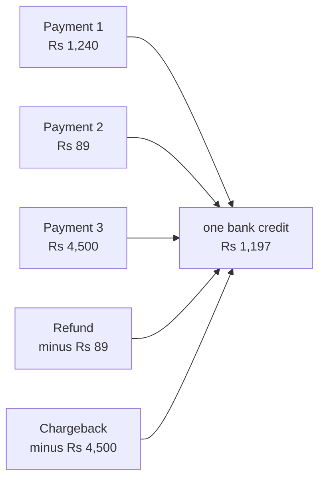
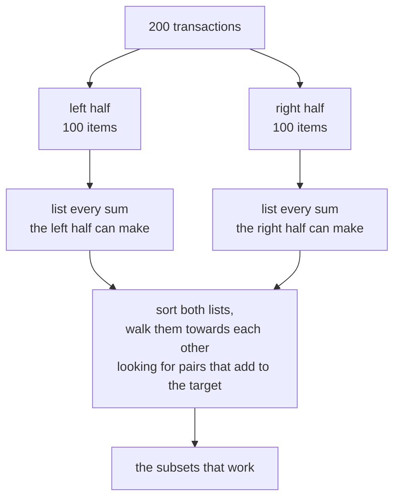
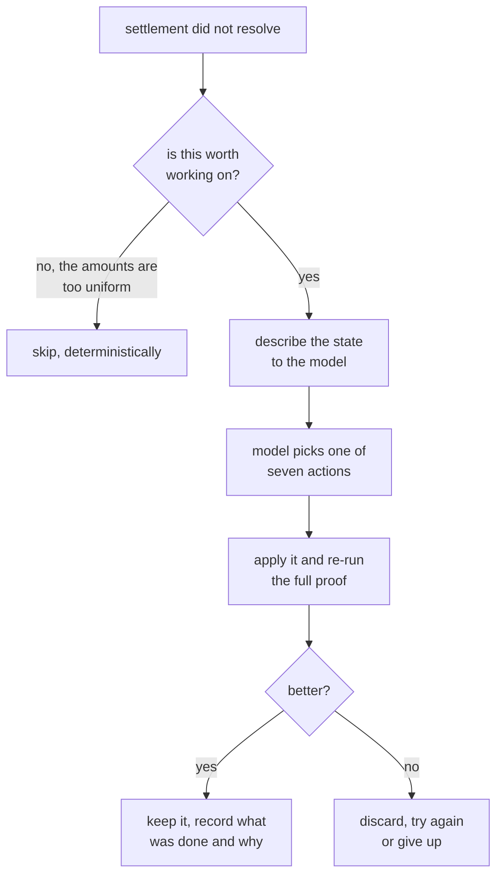
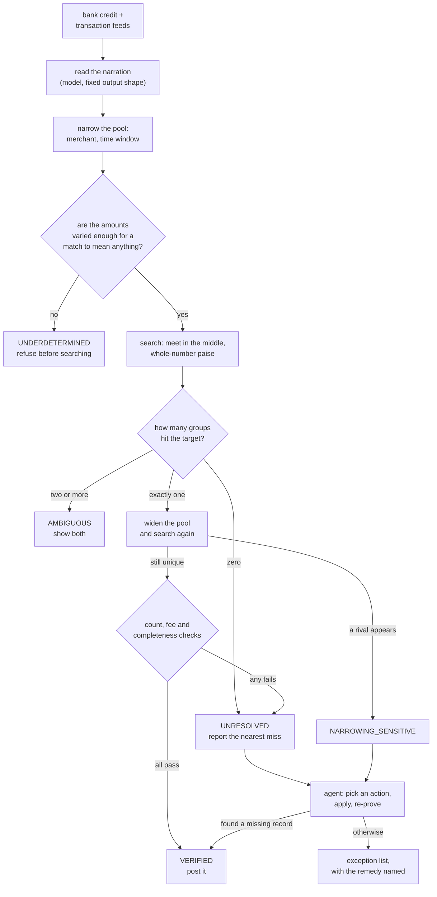

# Manhattan, explained from scratch

This document assumes you know nothing about payments, nothing about the code,
and nothing about the maths. It builds the whole thing up from the beginning in
ordinary words. If you want the formal version, read `docs/DESIGN.md` instead.

---

## 1. The problem, in one picture

A merchant sells things online. Over a day, a few hundred customers pay. Some
of them ask for refunds. A few of them dispute a charge with their bank, which
is called a chargeback.

At the end of the day the payment company adds all of that up, takes its fee,
and sends the merchant **one bank transfer**.

The merchant's accountant now has a bank statement line that says
**Rs 1,197 received** and a list of hundreds of transactions. Their job is to
answer one question:

> Which transactions make up this one number?

That is the whole problem. It is called **settlement reconciliation**, and
finance teams do it by hand, every day, forever.

---

## 2. Why this is genuinely hard

It looks like simple addition. It is not, for four reasons.

**Reason one: the bank does not tell you.** The credit arrives with a reference
number and an amount. It does not come with a list. You have to work out the
list yourself.

**Reason two: fees.** The merchant sold Rs 1,240 of goods but does not receive
Rs 1,240. The payment company keeps a cut, and the cut is different for
different payment methods. A card might cost 2%, UPI might cost nothing. So you
are not adding up the amounts the customer paid; you are adding up the amounts
that survive after fees, and you have to work out those fees yourself.

**Reason three: some numbers are negative.** A refund takes money away. A
chargeback takes money away. So you are not just adding, you are adding and
subtracting, and a batch can contain a transaction that contributes exactly
nothing at all.

**Reason four, and this is the real one: there can be more than one right
answer.** Suppose a subscription business charges everyone Rs 499 a month. Two
hundred customers pay. The bank sends a credit that works out to exactly 143
customers' worth of Rs 499.

Which 143 customers?

Every group of 143 adds up to the same number. There is nothing in the
arithmetic that can tell them apart. The information simply is not there.

This is the point most reconciliation tools miss. They pick a group, show it to
you, and it looks like an answer. It is not an answer. It is one of
astronomically many equally valid groups, and there is no reason to believe it
is the right one.

---

## 3. The one idea the whole project is built on

> **Finding an answer and proving it is the only answer are two different
> things, and only the second one is worth anything.**

Everything else follows from this.

If you have proved that exactly one group of transactions produces this credit,
you can post it to the ledger without a human looking at it. If more than one
group works, you must not post it, no matter how confident anything feels,
because posting the wrong one puts wrong numbers in a company's books.

So Manhattan does not try to be right most of the time. It tries to **know when
it is right**, and to refuse clearly the rest of the time.

That is why the headline number is not "we matched 90%". It is:

| | Manhattan | Typical LLM-only approach |
| --- | ---: | ---: |
| Posted automatically | 731 of 996 | 671 of 996 |
| Of those, **wrong** | **0** | **561** |

The second column looks comparable until you read the second row. 561 wrong
postings is 561 corrections a finance team has to find and unwind later, and
they will not know which 226.

---

## 4. How it finds the answer

### 4.1 Turning the problem into arithmetic

First, every transaction is converted into a single number: **how much this
transaction contributes to the bank credit**, in paise, as a whole number.

- A card payment of Rs 1,240 with a 2% fee contributes +1,21,520 paise.
- A refund contributes a negative number.
- A chargeback contributes a negative number plus a penalty fee.
- A UPI payment with no fee that was fully refunded contributes exactly zero.

Everything is whole-number paise. There are **no decimals anywhere** in the part
of the code that decides whether something is proved. Decimals in a computer are
slightly inaccurate, and a fraction of a paisa of inaccuracy repeated across two
hundred transactions is how you end up trusting a match that does not actually
add up. Whole numbers cannot drift.

Now the question is purely mathematical:

> Given a list of numbers, which subset of them adds up to the target?

### 4.2 Why you cannot just try every combination

With 200 transactions there are 2^200 possible subsets. That is a number with 61
digits. You could run a computer until the sun burns out and not finish.

So Manhattan uses a trick from 1974 called **meet in the middle**.

Splitting the problem in half and matching the two halves turns an impossible
amount of work into a manageable amount. It is the difference between 2^200 and
roughly 2^100, and with a further restriction (see below) it comes down to
something that finishes in milliseconds.

Two more speed tricks matter:

**Only search the sizes that are plausible.** The payment company usually tells
you roughly how many transactions are in the batch. So instead of searching
every subset, search only subsets of about that size. That is a much smaller
space.

**Search the small side.** If a batch of 200 contains 190 transactions, do not
search for the 190 that are in. Search for the **10 that are out**, then flip
the answer. Same result, vastly less work. A single search handles both cases at
once.

### 4.3 Doing it fast

The sums are packed into 12 bytes each (an 8-byte number plus a 4-byte label
saying which subset produced it) and sorted with a **radix sort**, which sorts by
looking at the digits rather than by comparing pairs. On a batch of a few hundred
transactions this all runs in about 26 milliseconds at the median, and the whole
996-settlement benchmark finishes in 114 seconds on one laptop.

---

## 5. How it knows whether the answer is the only one

This is the part that matters, and it has several independent layers. Each one
catches a different way of being wrong.

### 5.1 Predict the trouble before searching

Before doing any work, Manhattan estimates: **how likely is it that some random
group of these transactions happens to hit this target by coincidence?**

This depends on how spread out the amounts are. If every transaction is
Rs 499, coincidences are guaranteed. If the amounts are all over the place, from
Rs 12 to Rs 84,000, coincidences are nearly impossible.

Originally this estimate used a textbook statistics formula. Testing showed it
was wrong by a factor of eight on realistic data, because real payment amounts
are lumpy and the formula assumes they are not. It was replaced by **actually
sampling**: draw a few thousand random groups, see how their sums scatter, and
measure the answer instead of assuming it.

If the estimate says coincidences are likely, Manhattan **refuses to search at
all** and says so. For one of the six merchant types in the benchmark, a flat
subscription business, this fires on all 83 settlements. It reports zero matches
for that merchant, on purpose. The naive approach reports a 75% match rate there,
of which 73 percentage points are wrong.

### 5.2 Prove ambiguity by showing the other answer

The search does not stop at the first subset that works. It keeps going and
counts them. If it finds a second subset that also hits the target exactly, the
settlement is marked **AMBIGUOUS**, and the receipt shows you both.

That is not a failure message. It is a proof, by construction, that the question
does not have a single answer. A human can then decide using information the
system does not have.

### 5.3 Check the filters were not doing the work

Before searching, Manhattan narrows the candidate pool: only this merchant, only
transactions inside a time window around the settlement date, and so on. This is
necessary, but it is also dangerous, because **a tight enough filter can
manufacture a unique answer**. Throw away enough transactions and whatever is
left will look unique.

So after finding a unique answer, the pool is deliberately **widened** and the
search is run again. If a rival answer appears the moment the filter is loosened,
the settlement is marked **NARROWING_SENSITIVE**, which means: the answer came
from the filter, not from the arithmetic, and a human needs to confirm the filter
was right.

This probe reports its own error rate. On a big pool, a wide search will find
coincidental rivals no matter what, so the probe measures how far it can widen
before its own findings become meaningless, and stops there rather than crying
wolf.

### 5.4 Cross-check against facts the search never used

Three separate checks, each using information the search itself did not touch:

**Count check.** The payment company said the batch has 143 transactions. Does
the answer contain 143? (With an allowance for transactions that contribute
exactly zero, which are invisible to arithmetic but still real.)

**Fee check.** Given the transactions in the answer, what fee rate does that
imply? Does it match the merchant's contracted rate?

This one had a subtle bug worth describing, because fixing it was the single
biggest improvement in the project. The original version compared the answer's
blended fee rate against the whole pool's blended fee rate. But the blended rate
depends on the payment method mix, and UPI costs 0% while cards cost 2%. So a
perfectly correct answer that happened to contain more UPI than average looked
like a fee anomaly. It produced **80 false alarms** and blocked 80 correct
postings.

The fix was to stop comparing rates and start comparing **deviation from the
contracted rate**: not "is this 114 bps or 179 bps" but "is the fee that was
actually charged different from the fee that should have been charged". That is
mix-independent, so it fires when something is genuinely wrong and stays quiet
otherwise. Auto-posting went from 74 to 161 with wrong postings still at zero.

**Feed completeness check.** This one was found by five wrong postings, and it is
the most instructive bug in the project.

Some merchants had a disputes feed that was never connected to the pipeline. So a
chargeback that genuinely belonged to a batch was **not in the data at all**.
Manhattan searched the transactions it could see, found a different group that
summed to the credit exactly and uniquely, and every other check passed, because
none of them could see the record that was missing.

Note that the widening probe in 5.3 structurally cannot catch this. It widens by
loosening filters, so it can only recover a transaction that reached the filters
in the first place. One sitting in a feed nobody joined never did.

The fix is the same principle applied to data instead of arithmetic:

> A pool you know is incomplete cannot support a claim that the money is fully
> accounted for. Not because the sum is wrong, but because you asked the question
> of the wrong set.

So the settlement is held, and the receipt names the remedy: connect the feed.
Wrong postings went back to zero.

---

## 6. The five possible outcomes

Every settlement ends in exactly one of these. Only the first one posts.

| Outcome | Meaning |
| --- | --- |
| **VERIFIED** | Exactly one group works, and every cross-check agrees. Post it. |
| **AMBIGUOUS** | More than one group works. Here is a second one, so you can see for yourself. |
| **UNDERDETERMINED** | The amounts are too uniform for any group to be meaningful. Refused before searching. |
| **NARROWING_SENSITIVE** | A unique answer exists, but only because of a filter. Confirm the filter. |
| **UNRESOLVED** | Nothing adds up, or a completeness check failed. Here is the nearest miss and what to fix. |

Four of these five stop the money. **None of them is a failure.** They are four
different, specific reasons why a human should look, each with the evidence
attached. That is the actual product: not a match rate, but an exception list you
can act on.

---

## 7. Where the AI actually goes

This matters, because the obvious thing to do with a language model here is the
wrong thing.

**The model never decides whether a settlement is proved.** Arithmetic decides
that. A model that is right 97% of the time is, in this context, a machine that
puts wrong numbers in a general ledger 3% of the time, and nobody can tell which
3%.

The model does three things it is genuinely good at:

**Reading messy text.** Bank narration strings are chaos:
`NEFT-RZPX0092-SETTL/AB12/MRCH883`. Pulling a reference number and a date out of
that is a language problem, and the model is better at it than a regular
expression. Its output is forced into a fixed shape by the API so it cannot
return prose where a number is expected.

**Explaining a refusal.** When a settlement is held, the model writes the
sentence a human reads. It is describing a decision that was already made, not
making one.

**Being an agent that repairs things.** This is the interesting part.

### 7.1 The agent

When a settlement fails to resolve, a controller loop runs. It looks at the
state, chooses an action from a **fixed list of seven**, applies it, and checks
whether the situation improved. It cannot invent an action; it picks from a menu.

The seven actions include tightening or widening the time window, splitting by
payment method, searching an unconnected feed for a missing record, and
escalating to a human.

**The corroboration rule.** Only one of those seven actions is allowed to result
in an automatic posting: searching an unjoined feed and **finding a specific
missing record**. The others can improve a receipt but can never turn a refusal
into a posting.

The reason is worth stating plainly, because it was learned the hard way after
the agent produced two wrong postings:

> Removing candidates cannot make the survivor unique. It makes it unexamined.

If you narrow a pool until one answer is left, you have not proved anything. You
have hidden the rivals. But if you **find a record that was genuinely missing**,
you have added information, and a proof built on more information is a real
proof. So the agent can post only when it has something new to cite.

There is a further rule: if the feed holds more candidate records than the agent
can afford to test, and exactly one of the tested ones verifies, that still does
not post. An untested record might have verified too. One success out of a
partial search is not a unique answer.

On the benchmark the agent is invoked on 152 settlements, deterministically
skipped on 203 where nothing it could do would help, **repairs 18**, and of those,
5 are proven cures where it found the actual missing record.

### 7.2 Cost

Because the agent skips cases it cannot help, and because the state it shows the
model is a fixed-size summary rather than a dump of every candidate, the token
cost per settlement is flat rather than growing with batch size.

Cost per 1,000 settlements: **Rs 497**, against Rs 959 for the ask-the-model-
everything baseline. Half the cost, and zero wrong postings instead of 226.

---

## 8. What comes out

Every settlement, including every refused one, produces a **receipt**: a
structured record containing the target, the group that was found, the sums
re-derived independently, every check that ran and its result, the alternative
answer if there was one, what the agent did and why, and the exact steps to
resolve it if it was held.

The receipt is the deliverable. The match rate is a summary of the receipts. A
number without the receipts behind it is a claim, and this project's entire
argument is that claims are not good enough when the output is somebody's books.

---

## 9. The whole thing, end to end

---

## 10. The measured result

996 settlements, six merchant types, one fixed seed, reproducible from a clean
checkout.

| | Manhattan | Baseline |
| --- | ---: | ---: |
| VERIFIED | 161 | |
| AMBIGUOUS | 109 | |
| UNDERDETERMINED | 208 | |
| NARROWING_SENSITIVE | 3 | |
| UNRESOLVED | 17 | 114 |
| **posted automatically** | **161** | 384 |
| **of those, wrong** | **0** | **226** |
| median time per settlement | 14 ms | 4 ms |
| cost per 1,000 settlements | Rs 497 | Rs 959 |
| throughput | ~95,000 per hour | |

The core search is checked against a brute-force method that tries every single
combination, across 400 randomised tests. Where they disagree, the brute force is
right by definition, and every disagreement found this way was a real bug that
got fixed.

---

## 11. If you remember one thing

A reconciliation system that matches 90% of settlements and is quietly wrong on
some of them is worse than useless, because a finance team cannot tell which ones
and has to check all of them anyway.

A system that proves 32% and refuses the rest **with a specific reason and a
specific remedy for each** is something a team can build a process around. The
32% needs no human at all. The other 68% arrives sorted into four buckets, each
one telling you what is actually wrong.

That is the trade Manhattan makes, deliberately, everywhere.
