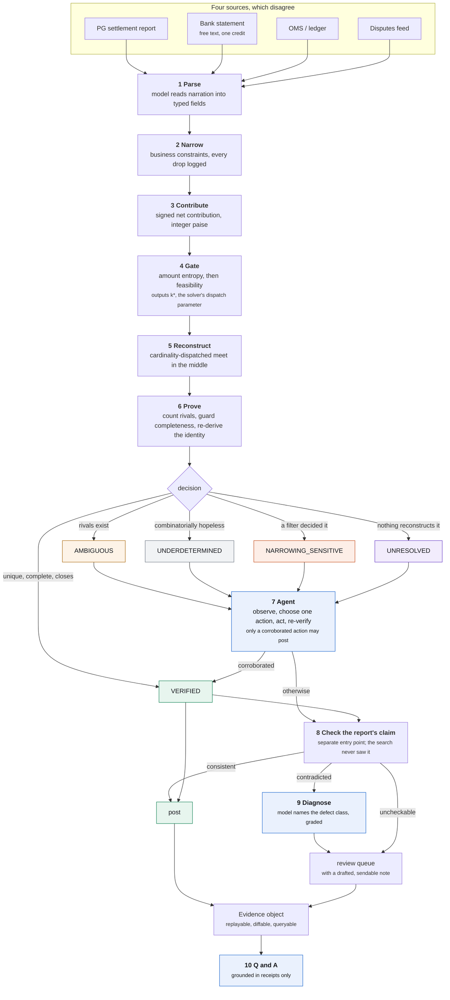

# Manhattan

**Settlement reconciliation that proves its answers, and refuses when it cannot.**

Razorpay AI Buildathon · Track 04, AI Finance Controller · Multi-source reconciliation

Manhattan posts **{{ .D.M1Posted }} of {{ .S.Settlements }}** settlements automatically ({{ pct .D.M1PostRate }}) with **{{ .D.M1Wrong }} wrong**, and hands back {{ .D.M1Held }} exceptions each carrying a named cause, a computed remedy and a price.

### Who this is for

Three readers, and the middle one is the buyer.

**A gateway's support desk.** "Why is my payout short by 4,180 rupees" is a ticket with a cost attached. Manhattan answers it from a receipt: here are the records that make up the credit, here is the fee applied to each, here is the chargeback debited this cycle but raised against the last one. That is a settlement dispute closed without an engineer reading a CSV.

**A gateway's own reconciliation, made provable.** Manhattan does not replace Single View Recon. It sits on top of it, checking the mapping the report already ships against the money that actually moved. In this run it contradicted **{{ .D.M1Contradicted }} of {{ .D.Defects }}** defective reports while raising **{{ .D.M1FalseAlarms }} false alarms on {{ .D.M1CleanChecked }} clean ones**. A report you can prove is a report support never has to argue about.

**A merchant reconciling independently**, where the mapping is absent or unverified: no settlement reference on the narration, a lump credit, two aggregators shipping different formats, historical backfill.

```
git clone <this repo> && cd manhattan
./run.sh demo          # or:  .\run.ps1 demo    or:  make demo
```

No API key required. **Every number in this file, in [RESULTS.md](RESULTS.md) and in [LIMITATIONS.md](LIMITATIONS.md) is emitted by that command**, rendered from one run in one pass so the three cannot drift. Generated from run `{{ .S.RunID }}`, seed `{{ .S.Seed }}`, on {{ .D.Host }}.

---

## For a judge, in four minutes

1. **The table below.** {{ .D.M1Posted }} posted, {{ .D.M1Wrong }} wrong, against a lookup's {{ .D.B1Posted }} posted and {{ .D.B1Wrong }} wrong on identical data.
2. **[Where the AI is](#where-the-ai-actually-is)**, the honest accounting: {{ n .S.ModelCalls }} model calls across {{ len .S.CallsByRole }} jobs, one of them graded at {{ pct (mul .S.DiagnosisAccuracy 100) }} against ground truth.
3. **[RESULTS.md](RESULTS.md), the calibration section.** Whether the system knows *in advance* when it is about to be wrong. This is what separates it from a solver demo.
4. **`./run.sh demo`**, which opens on adversarial case 10: narrowing drops a real record, a coincidental subset closes the identity exactly, and the guard catches it.

Longer: [docs/EXPLAIN.md](docs/EXPLAIN.md) is the system from first principles in plain language. [docs/DESIGN.md](docs/DESIGN.md) has every derivation. [LIMITATIONS.md](LIMITATIONS.md) is what it cannot do, and it is the document I would read first if I were judging this.

---

## The result

Three comparison systems, identical inputs, identical narrowing.

| {{ .S.Settlements }} settlements | B0, fuzzy matcher | B1, trust the report | Manhattan alone | **M1, the composite** |
|---|---:|---:|---:|---:|
| posted | {{ .S.B0Posted }} | {{ .D.B1Posted }} | {{ .S.AutoPosted }} | **{{ .D.M1Posted }}** ({{ pct .D.M1PostRate }}) |
| **posted wrong** | **{{ .S.B0PostedWrong }}** | **{{ .D.B1Wrong }}** | **{{ .S.AutoPostedWrong }}** | **{{ .D.M1Wrong }}** |
| held | {{ sub .S.Settlements .S.B0Posted }} | 0 | {{ .S.Exceptions }} | {{ .D.M1Held }} |
| defective reports flagged | 0 | 0 of {{ .D.Defects }} | | **{{ .D.M1Contradicted }} of {{ .D.Defects }}** |
| false alarms on {{ .D.M1CleanChecked }} clean reports | | | | **{{ .D.M1FalseAlarms }}** |

**M1 is the product.** {{ .D.M1FromProof }} postings are Manhattan's own proofs; {{ .D.M1FromClaim }} are the gateway's claim, checked. It posts {{ .D.ClaimUplift }} more than reconstruction alone and {{ sub .D.B1Posted .D.M1Posted }} fewer than the lookup, and the ones it holds back are the ones the lookup gets wrong.

### And it works where reconstruction cannot

| merchant type | spread sigma (paise) | twin mass | reconstruction | **M1** |
|---|---:|---:|---:|---:|
{{- range .S.ByArchetype }}
| {{ .Archetype }} | {{ f3g .MeanSigmaPaise }} | {{ f2 .MeanTwinMass }} | {{ rate .AutoPostRate }} | **{{ rate .M1PostRate }}** |
{{- end }}

Read the last two columns together. **Subscription SaaS and utility billpay reconstruct 0%, and M1 posts {{ range .S.ByArchetype }}{{ if eq .Archetype "subscription_saas" }}{{ rate .M1PostRate }}{{ end }}{{ end }} and {{ range .S.ByArchetype }}{{ if eq .Archetype "utility_billpay" }}{{ rate .M1PostRate }}{{ end }}{{ end }} of them.** Those are large, fast-growing segments and the reconstruction-only figure reads as "we cannot help you". It is not.

That is not a better solver. It is a different question:

> **Deriving a batch is a search. Checking a batch somebody claimed is not.**

Reconstruction costs C(n, k) and only decides in a narrow regime. Verifying a claimed batch costs O(claim): do these records exist, do they belong to this merchant, were they already posted in a prior cycle, do their signed contributions sum to the credit, does the count match the declaration. None of it touches the combinatorics. So a subscription merchant with two hundred identical 499-rupee charges has settlements no method can **derive**, and the gateway's mapping for them can still be **checked** in microseconds.

The verdict is deliberately weaker than a proof, and the receipt never blurs them:

| | |
|---|---|
| `VERIFIED` | exactly one batch in the searched region produces this credit, counted exhaustively. Nobody was trusted. |
| `CLAIM_CONSISTENT` | the batch the report named does produce this credit. Others may too; this was checked, not derived. |
| `CLAIM_CONTRADICTED` | the report's own account does not survive checking. Here is the residual and the diagnosis. |
| `CLAIM_UNCHECKABLE` | part of the claim lives in a feed nobody joined. Our problem, not the report's. |

---

## Where the AI actually is

The fair criticism of this project is that arithmetic does the deciding, so what is the model for. Here is the accounting rather than an argument.

| job | calls | what it contributes | graded? |
|---|---:|---|---|
{{- range .D.RoleRows }}
| `{{ .Role }}` | {{ n .Calls }} | {{ .What }} | {{ .Graded }} |
{{- end }}

**One of those is scored against ground truth.** When the claim check fails, the arithmetic is already known: the residual, the missing ids, the count mismatch. What the model contributes is the *diagnosis*, because the same failed check has several causes with completely different remedies. A report short by one record with a residual matching a chargeback, a report naming a payment from last cycle, and a truncated file all fail identically and need three different actions.

The generator records which defect it injected, and the pipeline never sees it, so the model can be graded:

| | |
|---|---:|
| defects diagnosed | {{ .S.DiagnosedDefects }} |
| **correct** | **{{ .S.DiagnosisCorrect }}** ({{ pct (mul .S.DiagnosisAccuracy 100) }}) |

{{ if .D.Confusions }}The errors are {{ .D.Confusions }}: exactly the pair that needs the class of record involved rather than the sign of the residual, which is what the deterministic stub reads and all it reads. {{ end }}That is headroom a real model has, stated as a number rather than a hope, and `manhattan live` is what turns it into a measurement.

**The highest-volume model job is the one with no safety risk at all.** {{ n .S.NotesDrafted }} analyst-facing notes: what to do, why it works in terms of what was measured, and what it will **not** fix. Every fact is supplied and every figure is substituted from the receipt afterwards, so a draft containing a digit is rejected wholesale ({{ .S.NotesRejected }} were, this run). A note is attached to a settlement held either way, so the worst a bad draft costs is a confusing sentence in a work queue.

### What the model must not do, and how that is enforced

**The model never decides whether a settlement is correctly posted.** That is settled by an integer identity and an exhaustive count, both of which run unmodified regardless of what the model proposed. The eleven-case suite passes on a deliberately unintelligent stub, which proves the boundary holds and simultaneously proves no published result *requires* a model.

Those are two different claims and this repository owes both. **`manhattan live` measures the difference:**

```
export ANTHROPIC_API_KEY=sk-ant-...
./bin/manhattan live -n 60
```

It runs the same batch on the live API and on the stub, and asserts that wrong postings are **identical** while diagnosis accuracy, repairs and note quality are **free to improve**. If the wrong-posting column moves, the trust boundary has leaked and the command exits non-zero rather than publishing.
{{ if .D.HasLive }}
Measured, at {{ .D.LiveSettlements }} settlements:

| | live | stub |
|---|---:|---:|
| **auto-posted wrong** | **{{ .D.LiveWrong }}** | **{{ .D.StubWrong }}** |
| **composite posted wrong** | **{{ .D.LiveM1Wrong }}** | **{{ .D.StubM1Wrong }}** |
| verified | {{ .D.LiveVerified }} | {{ .D.StubVerified }} |
| agent repairs | {{ .D.LiveRepairs }} | {{ .D.StubRepairs }} |
| diagnosis accuracy | {{ pct (mul .D.LiveDiagAcc 100) }} | {{ pct (mul .D.StubDiagAcc 100) }} |
| INR per 1k, **billed** | {{ ni .D.LiveINR }} | {{ ni .D.ModelledINR }}, modelled |
{{ else }}
**This has not been run yet**, because it needs an API key. Every published figure comes from `{{ .S.Provider }}` ({{ .S.ProviderModels }}) and the cost column is modelled at published rates rather than billed. That is stated here, in [LIMITATIONS.md](LIMITATIONS.md#no-live-model-run-at-batch-scale) and in [RESULTS.md](RESULTS.md), because it is the most attackable sentence in the repository and burying it would be worse than having it.
{{ end }}
---

## What this run deliberately gets wrong

A reconciliation benchmark on perfectly configured data measures nothing an agent could help with, so two misconfigurations are modelled. Both are things a **deployment gets wrong on its own side**:

{{ range .D.Conditions }}- {{ . }}
{{ end }}
The obvious criticism is that the author created the problem the agent solves. The answer is the curve below, not an argument.

---

## The agent

Repairs, split by the action that produced them, because one total hides which mechanism worked:

| action | repairs | corroborated by |
|---|---:|---|
{{- range .D.RepairsByAction }}
| `{{ .Flag }}` | {{ .Count }} | {{ if eq .Flag "SEARCH_FEED" }}a real record, cited by id, in a feed nobody joined{{ else if eq .Flag "NARROW_TO_HISTORY" }}this merchant's own prior VERIFIED settlements{{ else }}nothing; this action cannot post{{ end }} |
{{- end }}

And the contribution as a function of how bad the configuration is:

| scenario | verified | wrong | repairs | of which narrowing | proven cures |
|---|---:|---:|---:|---:|---:|
{{- range .Sensitivity }}
| {{ .Scenario }} | {{ .Verified }} | {{ .Wrong }} | {{ .Repaired }} | {{ index .RepairedBy "NARROW_TO_HISTORY" }} | {{ .Cures }} |
{{- end }}

**At zero misconfiguration the narrowing action repairs {{ .D.ControlNarrow }}.** That is the loop being unnecessary, not failing. **Wrong postings are zero in every scenario**, including where the agent works hardest. And at twice the modelled misconfiguration narrowing repairs fall back to zero for a better reason: a merchant that badly configured proves almost nothing, never reaches the twelve proofs a profile needs, and has no history to corroborate against. That ceiling is in [LIMITATIONS.md](LIMITATIONS.md).

### The queue, as a flow

```
{{ .D.ExceptionsEntered }}  settlements entered the loop as unresolved
{{ printf "%3d" .S.AgentSkipped }}  settled by deterministic triage, with no model call        ({{ pct .D.TriagePct }})
{{ printf "%3d" .S.AgentInvoked }}  reached the agent
{{ printf "%3d" .S.AgentSteps }}  actions taken
{{ printf "%3d" .S.AgentRepaired }}  repaired into a posting, each citing evidence
{{ printf "%3d" .S.AgentProvenCures }}  given a proven cure: verified remedy, deliberately not posted
{{ printf "%3d" .S.Exceptions }}  remain held
  {{ printf "%d" .S.AutoPostedWrong }}  wrong postings caused
```

Paying a model to conclude that nothing can help, across most of a queue, is the same mistake as paying it to add up a column.

### Only a corroborated action may post

| action | may post? |
|---|---|
| `SEARCH_FEED` | **yes**, citing a real record by id |
| `NARROW_TO_HISTORY` | **yes**, bounded by this merchant's own proved settlements |
| `TIGHTEN_WINDOW`, `WIDEN_WINDOW`, `SPLIT_BY_INSTRUMENT`, `RELAX_RECONCILED`, `PROPOSE_ADJUSTMENT`, `ESCALATE` | no |

The rule was learned, not designed. The first version let narrowing post if the identity closed, and produced **two wrong postings in three hundred settlements**: the agent tightened a window, the pool fell from 44 records to 40, an `AMBIGUOUS` settlement became `VERIFIED`, every check passed, and the answer was wrong because the tightening had cut real records out of the batch.

> Removing candidates cannot make the survivor unique. It makes it **unexamined**.

That figure is hand-recorded from a build that no longer exists, and it is the only number in this file not emitted by run `{{ .S.RunID }}`. The failure is rebuilt as a committed test in [`internal/agent/corroboration_test.go`](internal/agent/corroboration_test.go), which fails if `TIGHTEN_WINDOW` is ever made postable again.

**Prohibition was the right default and the wrong permanent answer.** `NARROW_TO_HISTORY` closes the gap: a merchant's prior `VERIFIED` settlements are a second source, and a strong one, since each was proved by exhaustive enumeration without reference to any window hypothesis. The profile is built only from proofs, needs at least twelve, and the bound may never be tighter than the widest offset those proofs show. The verifier still decides. Corroboration buys the right to be tested, not the right to be believed.

---

## The five outcomes

| Status | Meaning | Action |
|---|---|---|
| `VERIFIED` | One explanation exists in the searched region, counted exhaustively, and the identity closes | Post with evidence |
| `AMBIGUOUS` | Two or more explanations reconstruct the credit, and both are exhibited | Review, alternatives shown |
| `UNDERDETERMINED` | The combinatorics guarantee a large population of explanations | Review, remedy computed |
| `NARROWING_SENSITIVE` | The answer depended on a filter rather than on arithmetic | Review, constraint named |
| `UNRESOLVED` | Nothing reconstructs the credit within tolerance | Queue, with the exact residual |

Four of the five stop the money and none is a failure. `AMBIGUOUS` at {{ .D.StatusAmbiguous }} and `UNDERDETERMINED` at {{ .D.StatusUnderdetermined }} are sized populations, not rhetoric. Flags are orthogonal: a settlement can be `VERIFIED` and carry `FEE_ANOMALY`, because whether the money is accounted for and whether the fee applied to it was right are different questions.

| flag | settlements |
|---|---:|
{{- range .D.FlagRows }}
| `{{ .Flag }}` | {{ .Count }} |
{{- end }}

{{ if and .D.TwinSwapInCases (not .D.TwinSwapInBatch) }}**That table covers the {{ .S.Settlements }}-settlement batch only.** `TWIN_SWAP` is absent from it and present in adversarial case 5: the batch rarely puts an exact twin inside a witness, while case 5 constructs one deliberately. The eleven cases are a separate fixture for exactly this reason.{{ end }}

---

## Architecture



*(Rendered SVGs of every diagram are in [docs/diagrams/](docs/diagrams/), in case Mermaid does not render here.)*

### The dashboard

`./run.sh demo` builds the frontend, runs the batch and serves it on `localhost:8080`. **Nobody should have to run it to judge this**, so the views carrying the argument are below and every figure in them is also in [RESULTS.md](RESULTS.md).

| | |
|---|---|
|  | **Head to head.** One credit, identical inputs. B0 proposes six records at 0.95 confidence and posts, and is wrong. Manhattan closes the identity to zero, then widens the pool, finds a rival, and holds. |
|  | **The model at work.** The gateway's claim fails its arithmetic check with an exact residual. The model names the defect class, the system owns the remedy for that class, and a drafted note tells an analyst what to do and what it will not fix. |
|  | **A consistent claim.** `consistent` is not `verified` and the panel says so: the named batch does produce this credit, others may too, and none was searched for. |
|  | **Calibration.** Outcome mix against the collision index predicted *before* any search ran, in bands of equal population. Wrong-posting rate stays at zero across every band. |
|  | **The queue**, grouped by cause and ordered by value cleared per analyst hour. |
|  | **At 390px.** Every view is usable on a phone; wide tables scroll inside their own panel. |

**The gate runs before the solver, not after it.** Its output `k*` is the parameter the solver is dispatched on, so triage is not a pre-check bolted onto the front of the search. It is what configures the search. Derivations in [docs/DESIGN.md](docs/DESIGN.md).

---

## The exception queue

Every entry carries a status distinguishing *two answers exist* from *ten million exist* from *a filter decided this*; a named cause; a **computed** remedy; a drafted note; and a handling estimate priced by what clearing it takes. That last part is what makes it a work plan: handling runs **{{ .D.ExceptionCostMin }} to {{ .D.ExceptionCostMax }} INR**, a {{ f1 .D.CostSpreadRatio }}x spread, and every term is on the receipt in `exception_cost_basis`.

So it is ordered by **value cleared per analyst hour**. [Full top {{ len .S.TopExceptions }} in RESULTS.md](RESULTS.md#the-exception-queue); all {{ .S.Exceptions }} in `out/receipts.ndjson`.

| settlement | status | at stake | mins | INR/hour | cause |
|---|---|---:|---:|---:|---|
{{- range first 5 .S.TopExceptions }}
| `{{ .Ref }}` | `{{ .Status }}` | {{ ni (div (float .ValuePaise) 100) }} | {{ .Minutes }} | **{{ ni .INRPerHour }}** | {{ clip .Cause 52 }} |
{{- end }}

### What refusing is worth

| | |
|---|---:|
| money sitting unposted | {{ ni .D.ExceptionValueINR }} INR |
| analyst time to clear it | {{ f0 .D.ExceptionHours }} hours |
| the queue, at the configured rate | **{{ n .D.ExceptionCostINR }} INR** |
| B0's {{ .S.B0PostedWrong }} wrong postings at {{ n .D.RemediationEachINR }} INR each to unwind | **{{ n .D.WrongPostingCostINR }} INR** |
| difference | **{{ n .D.NetINR }} INR in Manhattan's favour** |

The {{ n .D.RemediationEachINR }} INR is an assumption, printed so it can be replaced: roughly two hours of a mid-level analyst noticing the error at month end, finding the credit, reversing the journal, re-posting, and explaining the movement. Substitute your own; B0 only wins if unwinding costs under {{ ni .D.BreakEvenINR }} INR. **And that break-even is conservative in our favour**, because it charges B0 nothing for its own {{ sub .S.Settlements .S.B0Posted }} held settlements.

---

## The baseline, published so it can be attacked

{{ .S.B0PostedWrong }} wrong of {{ .S.B0Posted }} posted is a number my own code produced about my own code, so here is everything B0 scores on:

{{ range .S.B0Features }}- {{ . }}
{{ end }}
[RESULTS.md sweeps its threshold](RESULTS.md#the-baseline-across-every-threshold) across the same {{ .S.Settlements }} decisions. **Its right-hand column is flat at {{ .D.B0MaxRight }} correct from 0.10 to 0.90, and that is the sharpest fact in the table.** B0's correct proposals are exact integer hits, which score at or above 0.90 under its own function, so every lower threshold admits only additional *wrong* postings. The score carries no information about correctness anywhere a team would tune.

> **At no threshold does B0 produce more correct postings than Manhattan.** Its maximum is {{ .D.B0MaxRight }}, against M1's {{ .D.M1Posted }}. Every extra posting it appears to offer is a wrong one it cannot identify.

---

## Ask the receipts

{{ len .D.QATranscript }} exchanges from this run, verbatim, showing every path the Q&A side can take.

{{ range .D.QATranscript }}
> **Q. {{ .Question }}**
>
{{ indent "> " (clip .Answer 300) }}
>
> `{{ .Path }}`{{ range first 2 .Citations }}
> `{{ . }}`{{ end }}
{{ end }}
The last one matters most. **An agent that answers every question is not grounded in anything.** The receipts record what the system decided and why; they do not record who approved anything, because no human approval step exists in this pipeline.

---

## Track compliance

| requirement | what this run did |
|---|---|
| 50+ record batch | **{{ n .S.Pools.TotalRecords }} source records** across four feeds, driving **{{ .S.Settlements }} settlements**. Each settlement's universe reaches **{{ n .S.Pools.RawMax }}** before narrowing and **{{ .S.Pools.NarrowedMax }}** after |
| one loop, closed | bank credit to posted ledger entry, or to a named and priced exception |
| match rate reported | **{{ .D.M1Posted }} of {{ .S.Settlements }}**, {{ pct .D.M1PostRate }}, with **{{ .D.M1Wrong }} wrong** |
| exceptions it could not resolve | **{{ .D.M1Held }}**, each with a cause, a computed remedy, a price and a drafted note |
| throughput | **{{ ni .S.PerHour }} settlements per hour**, {{ f1 .S.MedianLatencyMS }} ms median pipeline time |
| agentic design | {{ n .S.ModelCalls }} model calls across {{ len .S.CallsByRole }} jobs, a closed 8-action controller loop, cross-settlement merchant memory, and a graded diagnosis |

Throughput is end to end: {{ .S.Settlements }} settlements in {{ f1 .S.WallClockS }} s of wall clock including the agent loop, both baselines and receipt serialisation. That divides to {{ f1 .D.MsPerSettlement }} ms against a {{ f1 .S.MedianLatencyMS }} ms median pipeline time, and both are printed rather than the flattering one. Memory: **{{ i .D.PeakSolverMB }} MB** deterministic solver peak; **{{ i .D.PeakSampledMB }} MB** sampled process heap, which moves between runs and should never be quoted as a bound.

**Determinism is per commit.** Same seed and same commit gives the same decisions on every settlement. Timings are measurements and move, so receipts are not byte-identical.

---

## What this cannot do

The full list is [LIMITATIONS.md](LIMITATIONS.md). The four that matter:

**Reconstruction has a narrow regime.** Uniqueness is attainable only when free cardinality is roughly 3 to 7. Outside it, `UNDERDETERMINED` is the honest answer and no solver improvement changes that. The claim check is what reaches past it.

**The claim check's false-alarm rate is optimistic by construction.** The generator's fee model and the verifier's contribution model are the same model, so a defect-free report that disagrees with our arithmetic over a fee slab or a rounding convention is a failure this benchmark cannot produce.

**The report defect rate is a modelling choice.** {{ pct1 .D.DefectRatePct }}, chosen here, not observed. The sensitivity sweep varies it down to a tenth so the volume argument does not rest on it. The structural point does not move at all, because a reconciliation whose only check on the report is the report detects a defective one at no rate.

**No live model run at batch scale.** Every figure is offline-stub and the cost is modelled. `manhattan live` exists to close this and needs a key.

Benchmarked on synthetic data throughout. The pathology mix reflects documented Razorpay mechanics (paise amounts, T+2 cycles, MDR with 18% GST, netted refunds, chargeback debits, zero-MDR UPI), but real merchant data will contain things the generator does not model.

---

## Repository

```
cmd/manhattan/     CLI: bench, cases, recon, ask, serve, docs, live
internal/
  money/           integer paise; the only numeric type for value
  accounting/      signed contributions, fee policy, the identity
  narrow/          business constraints, with a full drop log
  entropy/         twin classes, twin mass, lattice gcd, zero contributions
  feasibility/     the collision index, k*, both estimators
  solver/          cardinality-dispatched meet in the middle
  guards/          neighbourhood probe, cross-checks, run-level drift
  pipeline/        the stages, the decision, and CheckClaim
  agent/           parser, action space, controller, memory, diagnosis,
                   note drafting, Q and A
  llm/             the model boundary: Anthropic, cassette, offline stub
  baseline/        B0 and B1, both built honestly
  bench/           the benchmark, calibration sweep, sensitivity, envelope
web/               the dashboard: Vite, React, TypeScript, Tailwind
docs/              DESIGN, EXPLAIN, DEMO-SCRIPT, templates, diagrams
```

**Three tests worth reading.** `internal/solver/solve_test.go` verifies 400 randomised configurations against a 2ⁿ brute-force oracle and caught two real bugs before anything was built on it. `internal/bench/cases_test.go` runs all eleven adversarial cases and **fails if B0 posts nothing wrong**, because a suite the baseline survives is not adversarial. `internal/agent/corroboration_test.go` is the posting rule as an assertion rather than an anecdote.

---

Traditional reconciliation asks *how confident are we that these records match?* Manhattan asks *can we prove these records explain the settlement, and if we cannot, do we know that before we act?*

**No guessed matches. No confidence threshold. Proof, a checked claim, exhibited alternatives, or a named and priced reason none is available.**

Built by **Rishi0507** for the Razorpay AI Buildathon, Track 04. MIT licensed; see [LICENSE](LICENSE).
